## Introduction and Scope

There are some misconceptions that Plasma is only a graphical environment. While it is
true that Plasma is an outstanding desktop environment, the Unix heritage of command
line and scripting is also well supported by Plasma. In particular, KDE applications can
be controlled from the command line, and shell scripts can make use of some of the KDE
widget set.

To use this tutorial, you'll need to have some basic familiarity with command line
fundamentals, and be at least aware of shell scripting. Like any other programming
environment, effective shell scripting requires solid knowledge of the environment.
However, you should be able to make sense of the examples with only basic understanding.
The downside to this is that if you are very familiar with shell scripting, some of
the explanation is likely to be redundant.

This tutorial assumes that you are using the GNU bash shell, or something directly
compatible. Users of other shells (especially fish and variants) may need to modify
the examples.

Shell scripting techniques and usage varies a lot. Sometimes a script is only meant to
be run by the system (e.g. as cron job), and other times scripts are really applications
intended to be run by users. Plasma includes features that allow you to use some KDE
functionality from a shell script, which can save work, and can also make your script
feel like it is part of a nicely integrated application set.

As an example, consider something like a password dialog. If you need a user to enter
a password, you can easily generate a dialog from your script that looks like the following:

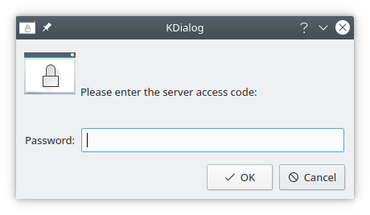

## kdialog Usage

### Password Dialog

The key to using KDE dialogs in shell scripts is an application named `kdialog`. To
generate a password dialog as shown above, you could use the following command line.

```bash
kdialog --password "Please enter the server access code:"
```

Let's look at the code in a bit more detail. The arguments passed to kdialog are used to control
the type of dialog that is produced and the parameter or parameters of that dialog box.
In the case of the password dialog, you use `--password` to specify the dialog type, and
then follow that with the parameter, which is the text that appears in the dialog box.

### Shell Script Return Values

Each time you run kdialog (or any other application), there is a return value that indicates
whether the application ran as expected, or failed in some way. You can access this return
value as `$?`, as shown in the following example.

```bash
kdialog --password "Some Text"
echo $?      # for Bash, 0 means successful
echo $status # for fish, 0 also means successful
```


The $? variable is updated when each foreground process exits. If you need to use that
variable later, you need to save it away.


In this example, the return value is 0. It would be 1 if the Cancel button had been
selected instead of the OK button. 


This is different from the convention used by the underlying widgets. If you are familiar
with Qt widgets, this might be a bit confusing, however it is important
to conform to the standard approach to shell scripting.


### Shell Script Return Value with Error

The convention is that negative numbers indicate failure, however the shell normally
subtracts them from 256. This means that if you fail to specify a required argument,
the system returns -2, and $? returns 254.

```bash
kdialog --password "Press Cancel to cause an error"
echo $? # or `echo $status` for fish
254
```

### Password Dialog, with Return Value Check

In a shell script, you might choose to test the return value after each invocation. 

```bash
kdialog --password "Please enter the server access code:"
if [ $? = 0 ]; then
    echo "You selected: OK"
else
    echo "You selected: Cancel"
fi
```

In addition to the return value, you also get the password itself (assuming that you
selected OK). After all, what is the point of a password dialog unless you can use
the result? 

### Password Dialog Showing Redirection

For the password dialog, and other kdialog dialogs that provide input capabilities,
the output is sent to standard output. This allows you to redirect the input to a file,
or pipe it to another program. In the case of the password dialog, the text that is
entered will be echoed as shown in 

```bash
kdialog --password "Enter the password" > password.file
cat password.file
```

### Password Dialog Using a Shell Variable

Instead of saving the result in a file, you can also use a shell variable. Note that
you need to use the "backtick" notation - this key is normally found on the top left
of English (British or American) layout keyboards, above the "7" key on French layout
keyboards, and on the top right of German layout keyboards.

```bash
password=`kdialog --password "Enter the password"`
echo $password
```

### Password Dialog with Title

While not shown in the previous examples, you can also use the `--title` option to specify
the title of the dialog box, as shown in the following example. 

```bash
kdialog --title "ACAP entry" --password "Please enter the server access code:"
```

Which results in:

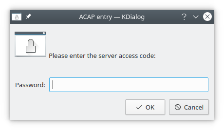

## kdialog Dialog Types

The password dialog is just one of the many dialogs that kdialog can provide. This section
provides an overview of each type, and describes the arguments you need to provide for each
dialog type. 

### Basic message boxes

Basic message boxes are intended to provide status type information. There are variations
to indicate the importance of the information (information, warnings, or errors). In each
case, the argument is the text to provide, as shown in the following examples. 

### Information level message box

```bash
kdialog --msgbox "Password correct.\n About to connect to server"
```

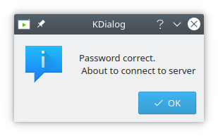

### Sorry level message box

```bash
kdialog --sorry "Password incorrect.\n Will not connect to server"
```

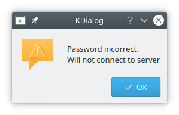

### Error level message box

```bash
kdialog --error "Server protocol error."
```

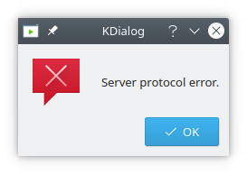

The return value for these basic message boxes is zero.

While not used in these examples, you can use `--title` to set the window title
as well. This option can be used with any of the dialog types.

## Non-Interrupting Notifications

kdialog supports the concept of a popup dialog that does not grab focus,
called a passive popup. 

### --passivepopup dialog box

`--passivepopup` takes a text label to display, and a timeout in seconds. The display will be
automatically removed when the timeout has elapsed, or when
the user clicks on the popup. 

```bash
kdialog --title "This is a passive popup" --passivepopup \
"It will disappear in about 10 seconds" 10
```

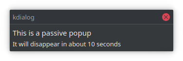


## More Message Boxes

Sometimes you need more than the basic message box allows. Perhaps you have a
potentially dangerous action, and you need to give the user a second chance. Or
perhaps you just need a decision based on some information. kdialog provides some
of the tools you might need.


### --yesno message box

A `--yesno` type dialog is probably the simplest of this type, as shown below.
Like the simple message boxes previously, it requires a text string, which is
shown in the message box.

```bash
kdialog --title "Example YesNo dialog" --yesno "System is not \
currently connected.\n Do you want to connect now?"
```

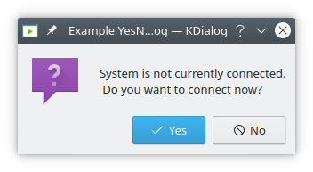


### --warningyesno message box

A variation on the `--yesno` dialog type is the `--warningyesno`, which modifies
the dialog box appearance a bit. 

```bash
kdialog --title "Example YesNo warning dialog" --warningyesno "Are \
you sure you want to delete all that hard work?"
```

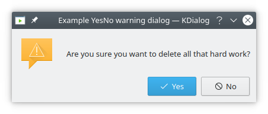

### --warningcontinuecancel message box

A further variation is to use a `--warningcontinuecancel` dialog type, which
has the same usage, but has different button labels, and may fit some situations
better. 

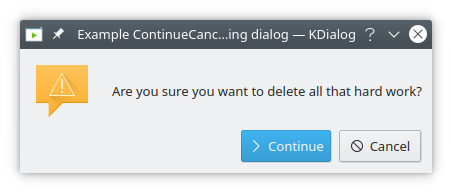

### --yesnocancel message box

Another variation on the `--yesno` dialog type is to add a third option, as shown
in the `--yesnocancel` dialog type. 

```bash
kdialog --title "YesNoCancel dialog" --yesnocancel "About to exit.\n \
Do you want to save the file first?"
```

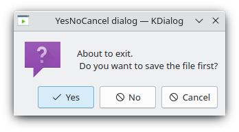

### --warningyesnocancel message box

There is also a `--warningyesnocancel` variation, as shown below. 

```bash
kdialog --title "YesNoCancel warning dialog" --warningyesnocancel \
"About to exit.\nDo you want to save the file first?"
```

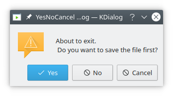

## Suppressing the display of a dialog

Sometimes you will be using kdialog in a loop, or another situation where a
message may be repeated. For example, you might be iterating through a list
of files, and you raise an error for each file you cannot open because of
permission problems. This can produce a really bad user experience because
the error is repeated over and over. 

The normal KDE way to deal with this is to allow the user to suppress the
display of a message in the future by selecting a checkbox, and kdialog allows
you to do this with the `--dontagain` option. This option takes a file name and
an entry name, and if the user selects the checkbox, then an entry is written
to the specified file, with the specified entry name.

### Information level message box, with --dontagain

As an example, consider an information level message box for display of a file
missing message. 

```bash
kdialog --dontagain myscript:nofilemsg --msgbox "File not found."
```

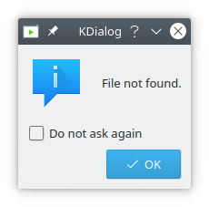

As noted above, an entry is written to a file when the user selects the checkbox.

```bash
cat ~/.kde/share/config/myscript
[Notification Messages]
nofilemsg=false
```

The effect of this entry is to suppress future display of dialogs using that filename.
In the example above, this means myscript:nofilemsg. This will take effect across all
KDE applications, so be careful with the filename you use. 

## User Input dialogs

There are two basic free-form user input dialog types - the `--inputbox` type and the
`--password` type. The password dialog was covered in depth in a previous section - see
the Section called kdialog Usage. 

### --inputbox dialog box

The `--inputbox` dialog type requires at least one parameter, which is used as the text
in the dialog box. 

```bash
kdialog --title "Input dialog" --inputbox "What name would you like to use?"
```

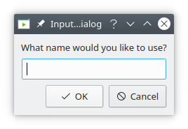

### --inputbox dialog box with default parameter

```bash
kdialog --title "Input dialog" --inputbox "What name would you like to
use" "default Name"
```

The return value depends on the button used. OK returns 0. Cancel returns 1.

The string that is entered (or modified / accepted if default text is used) is returned
on standard output. If the user chooses Cancel, no output is sent. 

## Displaying files

### --textbox dialog box

A common requirement for shell scripts is the ability to display a file. kdialog supports
this with the `--textbox` dialog type. This dialog type has one mandatory parameter, which
is the name of the file to be displayed. There are also two optional parameters which
specify the width and height of the dialog box in pixels. If these are not specified,
100 pixels by 100 pixels is used.

```bash
kdialog --textbox GPL-3.txt
```

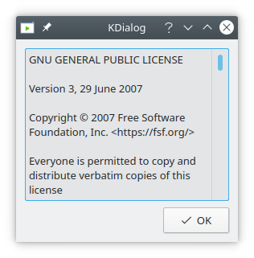

### --textbox dialog box with dimensions

```bash
kdialog --textbox GPL-3.txt 512 256
```

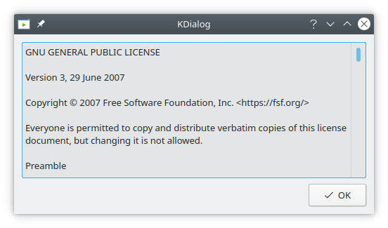

## Menu and Selection Dialogs

### --menu dialog box

This section covers simple menus, checklists, radio buttons and combo-boxes. These are
typically used for providing a choice of options. The menu is used to select one of a
range of options. Each option is defined using two arguments, which you might like to
think of as a key and a label. An example of the usage is shown below.

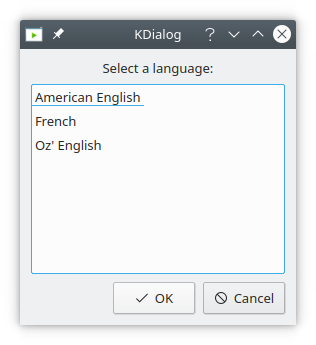

If you select the first option (in this case American English and press OK, then kdialog
will send the associated key (in this case the letter a) to standard output. Note that
the keys do not need to be lower case letters - you can equally use numbers, upper case
letters, strings or the contents of shell variables.

As with the other examples we've seen, the return value depends on the button used. OK
returns 0. Cancel returns 1. 

### --checklist dialog box

A checklist is similar to a menu, except that the user can select more than one option.
In addition, a reasonable set of default selections can be provided. To do this, each
option is defined using three arguments, which you might like to think of as a key, a
label and a default state. An example of the usage is shown below. 

```bash
kdialog --checklist "Select languages:" 1 "American English" off \
2 French on 3 "Oz' English" off
```

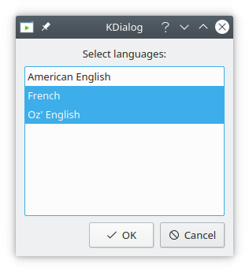

Clearly the result can contain more than one string, since the user can select more than
one label. By default, the results are returned on a single line, however you can use the
`--separate-output` to get a carriage return between each result. These two cases are
shown in the example below, where all of the options were selected in each case.

```bash
kdialog --checklist "Select languages:" 1 "American English" off \
2  French on 3 "Oz' English" off
"1" "2" "3"
kdialog --separate-output --checklist "Select languages:" \
1 "American English" off 2  French on 3 "Oz' English" off
1
2
3
```

As for the menu example, the return value depends on the button used. OK returns 0.
Cancel returns 1. 

### --radiolist dialog box

The radiolist is very similar to the checklist, except that the user can only select one
of the options. An example is shown below: 

```bash
kdialog --radiolist "Select a default language:" 1 "American \
English" off  2  French on 3 "Oz' English" off
```

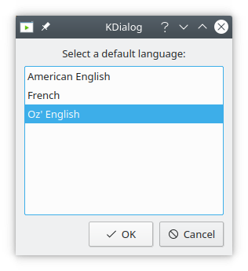

Note that if you try to turn on more than one option by default, only the last option
turned on will be selected. If you don't turn on any of the options, and the user doesn't
select any, kdialog will raise an assertion, so don't do this. 

### --combobox dialog box

A combobox is slightly different to the previous menu options in that it doesn't use
keys, but instead just returns the selected text. An example is shown below: 

```bash
kdialog --combobox "Select a flavour:" "Vanilla" "Chocolate" "Strawberry" "Fudge"
Chocolate
```

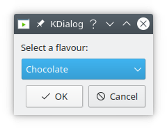

### --slider dialog box

A slider allows you to select a value within a range. You can use arrow keys to move
left or right by one `<step>`.

```bash
# syntax: --slider <text> <min> <max> <step>
kdialog --slider "Select a Value" 0 100 10
```

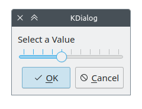

## File Selection Dialogs

This section covers dialogs to select files to open and save. The file dialogs are
provided by your system. They can be provided with either paths or URLs and could
utilize name or MIME type filtering.

###  --getopenfilename dialog box

The dialog to select a file to open is invoked with `--getopenfilename` or `--getopenurl`.
These two commands are used in the same way - only the format of the result changes,
so every example shown here can be applied to either format. You have to specify a
starting directory, and can optionally provide a filter. Here is a simple example that
filter out all `.ogg` files and accesses `/usr/share/sounds/`:

```bash
kdialog --getopenfilename /usr/share/sounds/ '*.ogg'
```

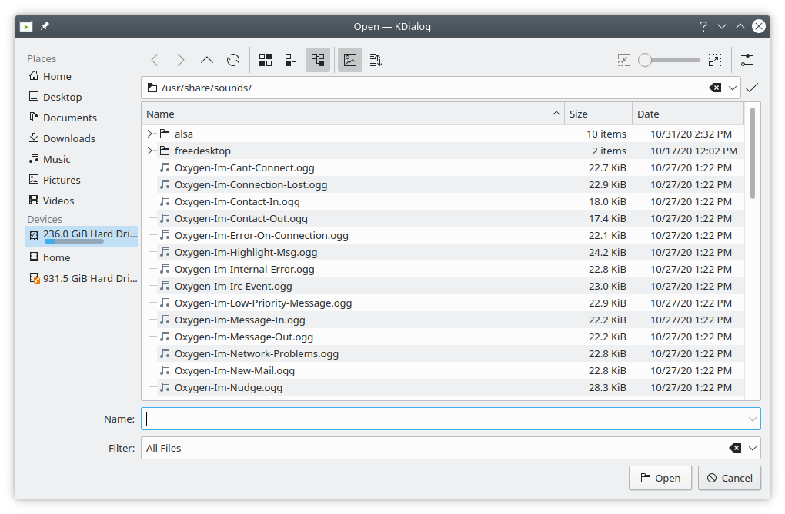

As for previous examples, the return value depends on the button used. OK returns 0.
Cancel returns 1. 

As mentioned previously, the result format varies between the two variations. This is
shown below, in each case selecting the same file:

```bash
kdialog --getopenfilename .
/home/watson/a_file_name.xt
kdialog --getopenurl .
file:///home/watson/a_file_name.xt
```

Note that the user can only select an existing file with these options. When you are opening 
many files, this can be useful to open the dialog in the directory that was
navigated to last time. While you can potentially do this by extracting the directory
from the filename, you can use a special KDE feature based on labels, as shown below:

```bash
kdialog --getopenfilename :label1
kdialog --getopenfilename :label1
```

Each time you use the same label (with the colon notation), the last used directory
will be used as the starting directory. This will normally improve the user experience.
If that label hasn't been used before, the user's home directory will be used.

Note that the colon notation selects the last used directory for that label for the
kdialog application. If you use two colons instead of one, the labeling scope becomes
global and applies to all applications. This global scope is rarely what you want,
and is mentioned only for completeness. Since not all files are applicable, it can be
useful to restrict the files displayed. This is done using the optional filter argument.
The best way to do this is with MIME types, as shown below:

### --getopenfilename dialog box with MIME filter

```bash
kdialog --getopenfilename /usr/share/sounds/ 'audio/ogg audio/mp3 audio/wav'
```

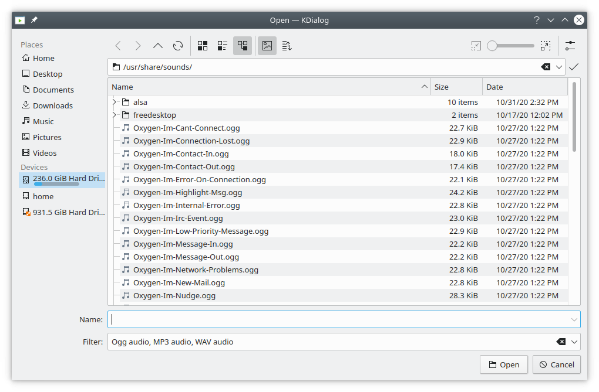

### --getopenfilename dialog box with name filter

You can also specify a range of name filters as shown below: 

```bash
kdialog --getopenfilename . "C and C++ Source Files(*.cpp *.cc *.c)"
# Not specifying the filter's name also works.
kdialog --getopenfilename . "*.cpp *.cc *.c"
```
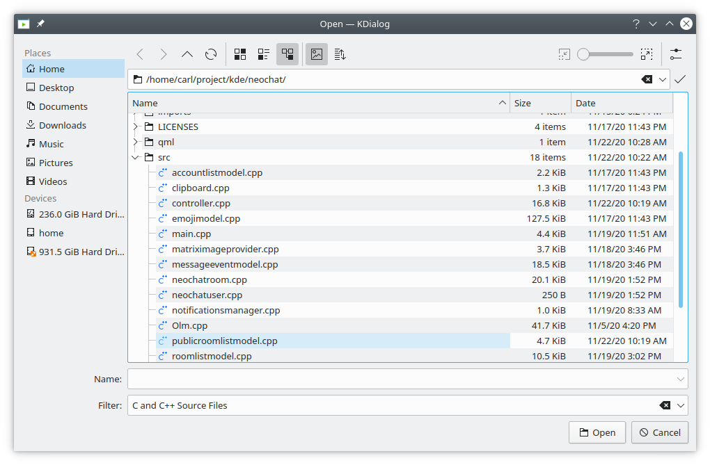

### --getsavefilename dialog box

The `--getsavefilename` and `--getsaveurl` commands are directly analogous to the file
opening dialogs. A simple example is shown below:

```bash
kdialog --getsavefilename .
```

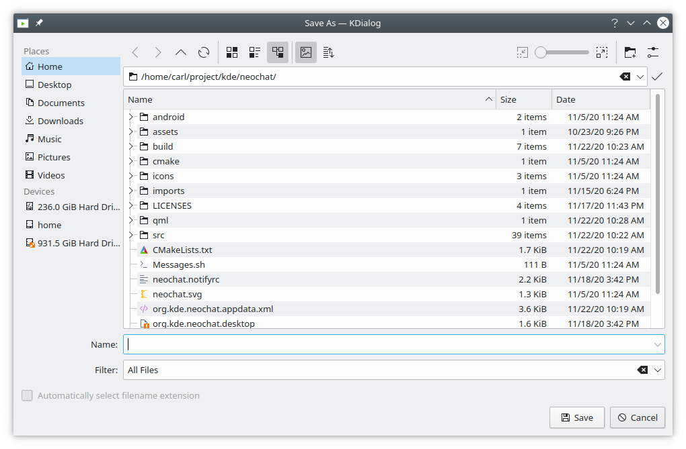

Unlike the file opening dialogs, the file saving dialogs allow the user to specify a filename
that doesn't yet exist. 

### --getsavefilename dialog box with filter

As for the file opening dialogs, the file saving dialogs allow use of the colon notation,
and also allow using MIME type filters and name filters, as shown below: 

```bash
kdialog --getsavefilename :label1 "C and C++ Source Files (*.cpp *.cc *.c)"
```

### --getexistingdirectory dialog box

Sometimes you don't want to specify a filename, but instead need a directory. While you can specify
an "inode/directory" filter to a file open dialog, it is sometimes better to use 
`--getexistingdirectory`, as shown below: 

```bash
kdialog --getexistingdirectory .
```

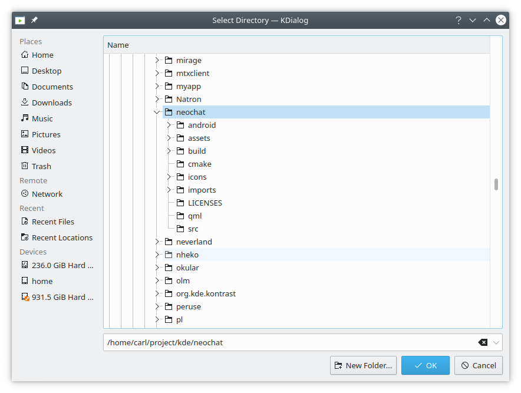

`--getexistingdirectory` does not provide any filtering, but it does provide
the same starting directory options, including the colon notation. 

## Progress Dialogs

A progress bar dialog is a useful GUI element when you have a process that will take a
long time, and you want to reassure the user that things are happening correctly, rather
than having the user believe that the machine may have locked up. If you ever find yourself
thinking about writing an information dialog that says something like "..., this may
take a while", it may be appropriate to use a progress bar dialog.

Because you need to make the progress bar change, you can't use kdialog in the normal
way. Instead, you set up the dialog, and use the `qdbus` tool to make the required changes.

### --progressbar dialog box example

A simple use of the `--progressbar` flag is shown below.

```bash
dbusRef=`kdialog --progressbar "Initializing" 4`
qdbus $dbusRef Set "" value 1
qdbus $dbusRef setLabelText "Thinking really hard"
sleep 2
qdbus $dbusRef Set "" value 2
sleep 2
qdbus $dbusRef setLabelText "Thinking some more"
qdbus $dbusRef Set "" value 3
sleep 2
qdbus $dbusRef Set "" value 4
sleep 2
qdbus $dbusRef close
```

Line 1 runs kdialog, with an initial label of "Initialising", and a progress bar with
four elements. We capture the return value in a variable (which can be named just about
anything - I chose "dbusRef") for later use with the `qdbus` command. Line 2 sets the bar
to one stage along, and line 3 changes the label to "Thinking really hard". Line 4 is
just a delay (which would be when your script would perform the first part of the lengthy
task in a real application). Line 5 then increases the progress bar, followed by another
delay (representing more processing) in line 6. Line 7 changes the label, while lines 8
through 11 further increase the progress bar over a few seconds. Line 12 closes the progress
bar dialog - without this, it will remain displayed. If you'd prefer that the progress
bar dialog closed as soon as the bar gets to 100%, you can pass the `setAutoClose true`
argument to `qdbus`. If a task is taking a very long time, the user may decide that it
is better cancelled. kdialog can assist with this too, as shown in the example below.


The `qdbus` binary might be called `qdbus-qt5` depending on your distribution.


###  --progressbar dialog box example, with Cancel

```bash
dbusRef=`kdialog --progressbar "Press Cancel at Any time" 10`
qdbus $dbusRef showCancelButton true

until test "true" = `qdbus $dbusRef wasCancelled`; do
 sleep 1
 inc=$((`qdbus $dbusRef Get "" "value"` + 1))
 qdbus $dbusRef Set "" "value" $inc;
done

qdbus $dbusRef close
```

As in the previous example, the first line executes kdialog with some initial text, this
time with 10 segments; and again we capture the return value in a variable for later
use with DBus. Line 2 turns on the display of the Cancel button, which is off by default. 

Lines 3 through 7 are a loop. Line three runs qdbus to check if the Cancel button has
been pressed, and if it hasn't been pressed yet, runs lines 4 through 6. Line 4 is again
a delay, representing processing in a real application. Line 5 runs a `qdbus` command to get the
current progress bar setting, and adds one to the count (this could have just been kept as a
counter variable, but this approach shows a different `qdbus` usage). Line 6 then sets the
progress bar to the incremented value. Line 8 closes the progress bar dialog if the
Cancel button has been pressed. 
