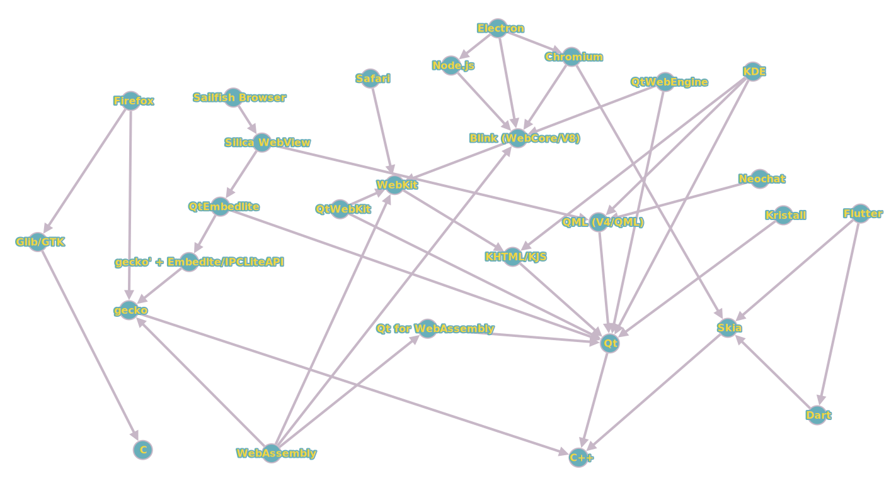

## Abstract

*The intersection of the tasks of a browser as a platform for web applications and Qt middleware for native KDE applications could be confusing for the beginners. This document is an attempt to highlight details for better understating and propose a motivation for better integration between fragmented technologies*.

## Fragmentation

[Fragmentation](https://en.wikipedia.org/wiki/Market_fragmentation) is the opposite of, and is solved by, standardization. Operating systems also follow standards ([POSIX](https://en.wikipedia.org/wiki/POSIX), for example).

There're shared software layers for the driver's solutions. And there're shared components and services that could be reused among different end-user applications. One of the layers is provided by the [Qt framework](https://doc.qt.io/).

These are Qt libraries that create an abstraction over the launched OS. KDE libraries and services, also written with Qt: for menus, sensors, contacts, notifications, etc. (See also: [KDE Frameworks](https://api.kde.org/frameworks/index.html)). Qt framework is designed to share application code between different operating systems.

Considering existing operating systems in relation to applied applications, there are also edge cases. For example, instead of a rich middleware in the firmware of some TV set-top box, you can find just one end-user application which shows a TV signal. The situation is opposite to desktop OSes: many similar layers and applications could co-exist at the same time (built with GTK, and Java, and Qt, and Electron, etc).

One of the indications that we're dealing not with a regular application but with such a middleware system is that the application is complex enough to itself provide abstractions for both application software or hardware. In approximately the same way, operating systems were born from platform-specific firmwares.

P.S.: Notably, below the hardware abstraction  level, the situation with the Linux kernel and the Android HAL for smartphones is also quite muddled and could compete with the relationship complexity between Qt, KDE and the browser engines and web technologies.

Due to the fact that the Android HAL (which is designed for mobile chip hardware) begins to solve the tasks of the linux kernel, the driver's implementation approach is changed for mobile devices. In response to this, libhybris approach from the Mer Project, Halium and Waydroid software has also appeared.

(See also: ["Porting a new device to Plasma Mobile"](https://develop.kde.org/docs/build/plasma-mobile/porting/)). 

## Web browser as a platform

### Complexity

While browsers are launching as a regular application, no surprises their codebases are huge and could be compared with codebases of an operating system:

> And its not a stretch to call chrome an OS. By lines of code, chrome is about the same size as the linux kernel. Like the linux kernel it has APIs for all sorts of hardware, including opengl, VR, MIDI. It has an embedded copy of SQLite, memory management and its own task manager. On MacOS it even contains a userland USB driver for xbox360 controllers. (I know its there because I wrote it. Sorry.)

Source: [Seph: Electron is flash for the desktop](https://josephg.com/blog/electron-is-flash-for-the-desktop/)

> Currently, browsers are more and more comparable to a standard low-level userland API like POSIX [...] POSIX is currently used to implement browsers in POSIX systems.

Source: ["Quora: What is the difference between a web browser and an OS?"](https://www.quora.com/What-is-the-difference-between-a-web-browser-and-an-OS/answer/Ciro-Santilli)

Modern browsers also provide its own application development tools. Not talking about rich developer tools embedded with Firefox and Chromium, Microsoft Visual Studio Code and GitHub Atom are built with Electron. Electron and Node.js platform are both using V8 JS engine from Blink.

New standards are being implemented for the Web. For example, WebGL for graphics, WebRTC for voice and video. BigBlueButton, Jitsi — such projects are developed for the web as a platform from the beginning.

Not talking about ChromeOS, an additional example of a browser as a platform is KaiOS (and its ancestors in the Mozilla Gecko family). There, the browser stack is the main environment for mobile applications.

### Fork's history

Building a competing browser engine from scratch is now very difficult: they have invested hundreds of labour hours in the development of existing technologies.

> [...] Implementing a browser engine from scratch was a lot of work in 1999/2000, it’s close to impossible today.

Source: [Twitter: Lars Knoll](https://twitter.com/LarsKnoll/status/1421121639845187585)

Of course, nothing is impossible if you are brave enough. While worth to mention existing experience with WebKit: 

> Hi,
> I'm the engineering manager of Safari, Apple Computer's new web browser 
built upon KHTML and KJS.  I'm sending you this email to thank you for 
making such a great open source project and introduce myself and my 
development team.  I also wish to explain why and how we've used your 
excellent technology.  It's important that you know we're committed to 
open source and contributing our changes, now and in the future, back 
to you, the original developers.  Hopefully this will begin a dialogue 
among ourselves for the benefit of both of our projects.

Source: [kfm-devel: Greetings from the Safari team at Apple Computer](https://marc.info/?l=kfm-devel&m=104197092318639&w=2)

Even though both sides wanted to contribute back to KHTML/KJS (and Apple's employees even worked at their free time to follow it) it was hard to keep the requirements and release cycles by Apple and spend an additional time with KDE. So right now only WebKit is maintained, not KHTML.

Source: [froglogic: The KHTML Future FAQ](https://www.froglogic.com/blog/the-khtml-future-faq/)

The final code of the project was published under a free license, KHTML was renamed to WebCore, and KJS to JavaScriptCore, the new project was named WebKit.

At the same time, WebKit itself received a fork by Google with a few developers from Mozilla. It also had Windows support and JavaScriptCore was replaced by a new V8 engine. Chromium project is built on top of this technology.

Currently, Qt provides [QtWebEngine](https://doc.qt.io/qt/qtwebengine-index.html) APIs for Chromium integration.

Previously, it was WebKit integration, and the community revived it even after Qt switched to WebEngine. See also: [QtWebKit](https://github.com/qtwebkit/qtwebkit/wiki), [QtWebKit Developer Journal: QtWebKit: I'm back!](http://qtwebkit.blogspot.com/2016/08/qtwebkit-im-back.html), [QtWebKit Github: Investigate what should be done for Qt 6](https://github.com/qtwebkit/qtwebkit/issues/880).

### Vendor locking

Fragmentation, as expected, could cause concerns about vendor locking. For example, the Gecko browser engine represented by Firefox has been losing user positions lately:

> Across all devices, the browser has slid to less than 4 percent of the market — on mobile it’s a measly half a percent. “Looking back five years and looking at our market share and our own numbers that we publish, there's no denying the decline,” says Selena Deckelmann, senior vice president of Firefox. Mozilla’s own statistics show a drop of around 30 million monthly active users from the start of 2019 to the start of 2022. “In the last couple years, what we've seen is actually a pretty substantial flattening,” Deckelmann adds.

Source: [WIRED: Is Firefox OK?](https://www.wired.com/story/firefox-mozilla-2022/)

Anyway, free software and Linux enthusiasts are no strangers to being in the market minority, and big players like Valve could have a significant impact on the consumer landscape:

> The steam deck is a custom PC hardware from Valve that is focused on gaming. It can, however, also be used as a regular PC, and comes with a customized Plasma session. Also, it is completely unlocked, so one could install any OS they wish on it, including Arch Linux. 

Source: [ArchWiki: Steam Deck](https://wiki.archlinux.org/title/Steam_Deck)

> Valve Is Funding Improvements To KDE's KWin & More Work On X.Org

Source: [Phoronix: Valve Is Funding Improvements To KDE](https://www.phoronix.com/news/Valve-Funding-KWin-Work)

### WebAssembly

Browser's virtual machine for JS support is even having its own internal language standard called WebAssembly:

> WebAssembly (abbreviated Wasm) is a binary instruction format for a stack-based virtual machine. Wasm is designed as a portable compilation target for programming languages, enabling deployment on the web for client and server applications.

So, user applications could be ported to WebAssembly too and be launched directly a web browser. For example, Figma is written for WebAssembly:

> Because our product is written in C++, which can easily be compiled into WebAssembly, Figma is a perfect demonstration of this new format’s power. If you haven’t used Figma before, it’s a browser-based interface design tool with a powerful 2D WebGL rendering engine that supports very large documents

Source: [Figma Blog: Figma is powered by WebAssembly](https://www.figma.com/blog/webassembly-cut-figmas-load-time-by-3x/)

### Worth to Mention Internet Projects

Web ≠ Internet:

> On the anniversary of the Web, a reminder: [Tim Berners-Lee
](https://twitter.com/timberners_lee) invented the Web and [Vint Cerf](https://twitter.com/vgcerf) invented the Internet

Source: [Twitter: The World Wide Web Consortium (W3C)](https://twitter.com/w3c/status/1105453516154433536)

Standards development does not stand still. For example, Tim Berners-Lee is working on a so-called Solid project for decentralized services for identity, authentication, login, permissions:

>  Solid (derived from "social linked data") is a proposed set of conventions and tools for building decentralized social applications based on Linked Data principles. Solid is modular and extensible and it relies as much as possible on existing W3C standards and protocols.

Source: [Solid](https://solid.mit.edu/)

Matrix project developers are also watching his progress: 

> [...] the punchline is that you could genuinely tell that this is the beginning of a new era of the internet - whether it's using Merkle DAGs (like Matrix) or Blockchain or similar technologies: we are about to see a major shift in the balance of power on the internet back towards its users.
> [...]
> It was particularly interesting for us to get to know Tim Berners-Lee's latest project at MIT: Solid - which shares quite a lot of the same goals as Matrix, and subsequently seeing Tim pop up on Matrix via Vector.  We're really looking forward to working out how Matrix & Solid can complement each other in future.

Source: [Matrix blog: Decentralised Web Summit](https://matrix.org/blog/2016/07/04/the-matrix-summer-special)

## Qt and KDE Middleware

Remarkably, as you could see, the roots of several web engines lie under the same roof as Qt and KDE:

> Waldemar Thranes gate 98 was home to not just one, but two of the rendering engines that power our browsers. In the history of the web, Geneva is the birthplace, Urbana–Champaign is the kindergarten, and Oslo is the racetrack where two ultra-fast competing rendering engines were developed. Opera developed Presto there, which enabled Opera to put browsers into mobile phones, TVs and kitchen sinks. It’s also the site where the neighboring company, TrollTech, developed the groundbreaking Qt tool, with one of its employees spearheading the KHTML engine. This engine was later renamed by Apple to WebKit. Together, Presto and WebKit made the internet possible on mobile devices.

Source: [Opera: Oslo is where two of the world’s browser engines were born](https://blogs.opera.com/news/2019/10/world-browser-day-oct-16-oslo-plaque/). See also: [Behind KDE: Lars Knoll](https://behindkde.org/node/145/) and [Chromium: Which webkit revision is Blink forking from?](https://groups.google.com/a/chromium.org/g/blink-dev/c/J41PSKuMan0/m/gD5xcqicqP8J)

In turn, the Qt stack solves in many respects the same tasks as the browser stack: platform independence, interfaces for application software. Qt also has interfaces for graphics, and for the network, etc. There is also an engine for declarative scripts based on the [ECMAScript standard](https://doc.qt.io/qt/qtqml-javascript-hostenvironment.html):

> QML provides a JavaScript host environment tailored to writing QML applications. This environment is different from the host environment provided by a browser or a server-side JavaScript environment such as Node.js. For example, QML does not provide a window object or DOM API as commonly found in a browser environment.

In the case of a GUI, web-related HTML / CSS / JS stack is not used, but [QML](https://doc.qt.io/qt/qtqml-index.html) markup language developed specifically for the nested structures like GUI and work with the declaratively:

> Note that while the Qt QML module provides the language and infrastructure for QML applications, the Qt Quick module provides many visual components, model-view support, an animation framework, and much more for building user interfaces.

So, QML language could be used not only for the UI with [Qt Quick](https://doc.qt.io/qt/qtquick-index.html), but also for other nested structures (for example, with [QBS](https://doc.qt.io/qtcreator/creator-project-qbs.html) for the build systems).

Notable mix of web and Qt environment was [Tizen OS](https://en.wikipedia.org/wiki/Tizen) from Samsung. It tried to bundle Qt libraries, but focused on HTML5-based environment for consumer applications. Same with WebOS by LG: system interfaces with Qt and web environment for consumer applications:

> webOS Open Source Edition (webOS OSE) is an open-source edition of LG’s webOS, a web-centric and usability-focused software platform for smart devices. It supports development using both modern web application frameworks as well as native technologies including Qt and the QML language.

Source: [Qt for webOS](https://doc.qt.io/qt/webos.html)

## Interoperability

When a developer faces the mentioned fragmentation issues for the first time, it could be very tempting to force rewrite everything with favorite languages and frameworks. It may seem that this will make it easier to understand and maintain existing technologies. Recommendation to use an appropriate tool for an appropriate task could sound boring if you're a fan of one of the competing technologies.

For example, a developer may want to rewrite all the software with C/GTK or Rust, C++/Qt/QML, HTML/JS/CSS or Dart/Flutter. At the same time, technologies are sharing stacks between them. For example, while Flutter is written with Dart, the library behind all the rendering for Flutter called Skia is written in C++. Not to mention such a project as LLVM.

The key to controversy better understanding is probably the communication mechanisms. All the technologies are available for the developer and better communication mechanisms between them could help with better [interoperability](https://en.wikipedia.org/wiki/Interoperability).

See also: [Inter-Process Communication in Qt](https://doc.qt.io/qt/ipc.html) and [freedesktop.org project](https://www.freedesktop.org).

## State of Art

To sum up, there're several modern web browser engines:

- WebKit (started at KDE from khtmlw and KHTML/KJS, right now is maintained by Apple for Safari)
- Gecko (by Mozilla; additional Servo engine started as Mozilla's experiment is not maintained by them now; the engine of Firefox)
- Blink (by Google; WebKit's fork; internal JS engine is called V8; the engine of Chromium and many other Web-related projects)

So, all the web browser projects one way or another are having Qt wrappers:

- [QtWebEngine](https://doc.qt.io/qt/qtwebengine-index.html) from Qt provides chromium integration 

[Angelfish](https://invent.kde.org/plasma-mobile/angelfish), [Falkon](https://invent.kde.org/network/falkon) and [Konqueror](https://invent.kde.org/network/konqueror) are using it.

Previous WebKit integration is outdated but supported by the community:

- [QtWebKit](https://github.com/qtwebkit/qtwebkit) — by the community

Mozilla's gecko engine from Firefox integration is also doable but quite hard, since Mozilla declined the so-called EmbedLite/IPCLiteAPI component and focused on Android/iOS for mobile; Currently, Sailfish OS devs are maintaining it with Qt wrapper:

- [QtMozEmbed](https://github.com/sailfishos/sailfish-browser#engine-and-adaptation):
  - sailfish-browser — browser app (Sailfish OS specific UI)
  - sailfish-components-webview — Sailfish WebView (QML component)
  - qtmozembed — Qt wrapper for Embedlite component (with a nice history from good old Nokia's Meego times)
  - embedlite-components — the Embedlite component
  - gecko-dev — gecko engine fork to maintain Embedlite integration

See also: [YouTube: QtMozEmbed: Embedding Gecko with Qt5](https://www.youtube.com/watch?v=fksXutzD5hk)

In theory, all the engines could be abstracted by a by [Qt WebView](https://doc.qt.io/qt/qtwebview-index.html). While in practice it's not implemented. For example, QtMozEmbed is wrapped by platform-specific Sailfish WebView.

Mainstream browsers like Chromium and Firefox have [Plasma integration plugins](https://invent.kde.org/plasma/plasma-browser-integration).

Talking about WebAssembly, there's [Qt for WebAssembly project](https://doc.qt.io/qt/wasm.html):

> WebAssembly is a binary format that allows sand-boxed executable code in web pages. This format is nearly as fast as native machine code, and is now supported by all major web browsers.
>
> Qt for WebAssembly is a platform plugin that lets you build Qt applications, which can be integrated into your web pages. It doesn't require any client-side installations and reduces the server-side resource usage.

So, the circle is closed. Not talking about [Boot to Qt](https://doc.qt.io/Boot2Qt/) project, you could launch a Blink-based web browser written with QtWebEngine wrapper and load a Qt-based application compiled with Qt for WebAssembly inside it.

As mentioned before, internet projects could not necessary follow the web standards, while still could be supported by KDE or Qt enthusiasts. See also: [KDE Neochat](https://invent.kde.org/network/neochat) client for Matrix. Even quite exotic internet protocols like [Gemini](https://en.wikipedia.org/wiki/Gemini_(protocol)) could be supported with Qt on the client side by clients like [Kristall](https://kristall.random-projects.net/).

The mentioned technologies could be roughly represented in the next scheme; Very complex and very small projects are together here, and it's not supposed to cover all the complexity, just a mind-map draft:

(scheme was made with [graphonline](http://graphonline.ru/en/?graph=PtrtlHntRFDITrTp) tool) 

## Conclusion

Besides of competing with other technologies like web browser and operating systems, KDE software could also provide interoperability mechanisms for all interesting projects. Currently there're several ways of interaction with internet and web-related technologies:

- Qt provides Chromium integration (Blink), [QtWebEngine](https://doc.qt.io/qt/qtwebengine-index.html)
- QtWebkit is supported by the community and provides WebKit integration ([downstream](https://github.com/qtwebkit/qtwebkit))
- Sailfish OS developers [maintain](https://github.com/sailfishos/sailfish-browser#engine-and-adaptation) downstream for Mozilla's Gecko (Firefox) with Embedlite/IPCLiteAPI integration component with QtMozEmbed wrappers
- [QtWebView](https://doc.qt.io/qt/qtwebview-index.html) to abstract out engine is there, but is not all the engines are upstreamed
- [Qt for WebAssembly](https://doc.qt.io/qt/wasm.html) proposes an option to run existing Qt applications in a web browser
- [Angelfish](https://invent.kde.org/plasma-mobile/angelfish), [Falkon](https://invent.kde.org/network/falkon) and [Konqueror](https://invent.kde.org/network/konqueror) browsers are using QtWebEngine, mainstream browsers have [Plasma integration plugins](https://invent.kde.org/plasma/plasma-browser-integration)
- Projects like [Neochat](https://invent.kde.org/network/neochat/) and [Kristal](https://kristall.random-projects.net/) could support non-web internet technologies
