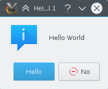

## Abstract

Your first program shall greet the world with a friendly "Hello World!", what else? For that, we will use a [KMessageBox](docs:kwidgetsaddons;KMessageBox) and customise one of the buttons. 




To get more information about any class you come across, you can use the ‘kde’ search engine. For example, to look for information about KMessageBox, just type "kde:kmessagebox" into Konqueror, or KRunner, and you’ll be taken to the documentation.



## The Code

All the code we need will be in one file, `main.cpp`. Create that file with the code below: 



First we need to create a [QApplication](https://doc.qt.io/qt-5/qapplication.html) object. This needs to be done exactly once in each program since it is needed for things such as [Internationalization](../i18n/). It also should be created before any other KDE Framework or Qt object. A call to [KLocalizedString::setApplicationDomain](docs:ki18n;KLocalizedString::setApplicationDomain) is required to properly set the translation catalog and must be done before the next step happens.

The first KDE Framework specific object we create in this program is [KAboutData](docs:kcoreaddons;KAboutData). This is the class used to store information about the program such as a short description, authors or license information. Pretty much every KDE application should use this class. We then call [KAboutData::setApplicationData](docs:kcoreaddons;KAboutData::setApplicationData) to initialize the properties of the [QApplication ](https://doc.qt.io/qt-5/qapplication.html) object.

Then we come to [QCommandLineParser ](https://doc.qt.io/qt-5/qcommandlineparser.html). This is the class one would use to specify command line switches to, for example, open the program with a specific file. However, in this tutorial, we simply initialise it with the [KAboutData](docs:kcoreaddons;KAboutData) object we created so we can use the --version or --author switches.

Now we've done all the necessary setup, we can move on to doing interesting things with our application. We're going to create a popup box but we're going to customise one of the buttons. To do this customisation, we need to use a [KGuiItem](docs:kwidgetsaddons;KGuiItem) object. The first argument in the [KGuiItem](docs:kwidgetsaddons;KGuiItem) constructor is the text that will appear on the item (in our case, a button). Then we have an option of setting an icon for the button but we don't want one so we just give it `QString()`. We then set the tooltip (what appears when you hover over an item) and finally the "What's This?" (accessed through right-clicking or Shift-F1) text.

Now we have our item, we can create our popup. We call the [KMessageBox::questionYesNo](docs:kwidgetsaddons;KMessageBox::questionYesNo) function which, by default, creates a message box with a "Yes" and a "No" button. The second argument is the text that will appear in the message box above the buttons. The third is the caption the window will have and finally, we set the KGuiItem for (what would normally be) the "Yes" button to the KGuiItem yesButton we created.

Note that all user-visible text is passed through the `i18n()` function; this is necessary for the UI to be translatable. More information on internalization can be found in the [i18n](https://techbase.kde.org/Localization) tutorial. 

We're all done as far as the code is concerned. Now to build it and try it out.

## Build

You want to use :doc:`cmake` for your build environment. You provide a file `CMakeLists.txt`, CMake uses this file to generate all Makefiles out of it. 

### CMakeLists.txt

Create a file named `CMakeLists.txt` in the same directory as `main.cpp` with this content: 



The `find_package()` function locates the package that you ask it for (in this case ECM, Qt5, or KF5) and sets some variables describing the location of the package's headers and libraries. ECM, or Extra CMake Modules, is required to import special CMake files and functions for building KDE applications.

Here we try to find the modules for Qt 5 and KDE Frameworks 5 required to build our tutorial. The necessary files are included by CMake so that the compiler can see them at build time. Minimum version numbers are set at the very top of `CMakeLists.txt` file for easier reference.

Next we create a variable called `helloworld_SRCS` using the `set()` function. In this case we simply set it to the name of our only source file. 

Then we use `add_executable()` to create an executable called `helloworld` from the source files listed in our `helloworld_SRCS` variable. Afterwards, we link our executable to the necessary libraries using `target_link_libraries()` function. The line starting with install writes a default "install" target into the Makefile. 

Make And Run
------------

To compile, link and install your program, you must have several software installed, e.g. cmake, make and gcc-c++, and the Qt 5 and KDE Frameworks development files. To be sure you have everything, best follow [this install guide](https://community.kde.org/Get_Involved/development#One-time_setup:_your_development_environment).

While you can run **CMake** directly inside the source code directory itself, it is a best practice, and actually enforced in some KDE software, to use a separate build directory and run **CMake** from there: 

```bash
mkdir build && cd build
```

You can invoke CMake and make manually:

```bash
cmake .. && make
```

And launch it with: 

```bash
./helloworld
```
    
Moving On
---------

Now you can move on to using [Creating the Main Window](../main_window).
