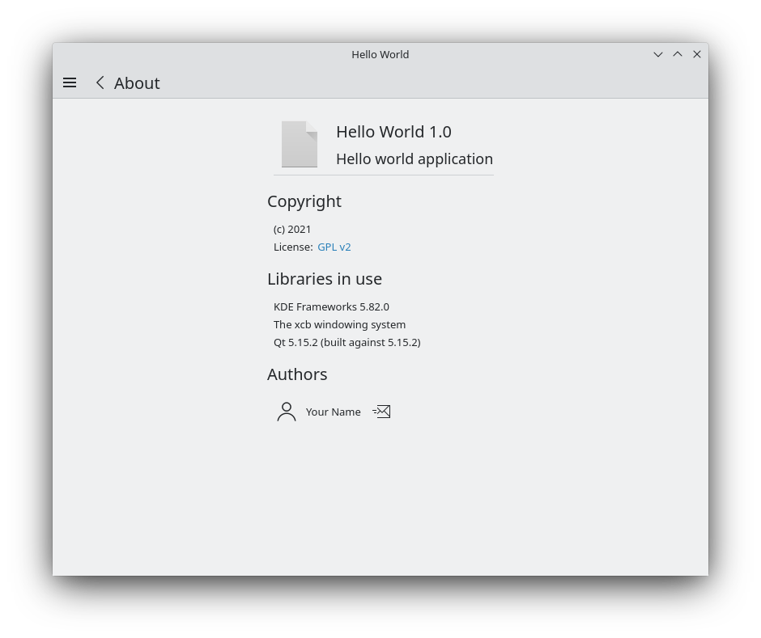

[Kirigami.AboutPage](docs:kirigami2;AboutPage) allows you to have a page that shows the copyright notice of the application together with the list of contributors and some information of which platform it's running on.

First, we are going to edit our `main.cpp` file from previous tutorials.

### main.cpp



In the `main.cpp` file we include [KAboutData](docs:kcoreaddons;KAboutData), a core KDE frameworks component that lets us store information about our application. This information can then be reused by many other KDE Frameworks components. We instantiate a new `aboutData` object with its fairly complete default constructor and add author information.

After all the required information has been set, we call [KAboutData::setApplicationData](docs:kcoreaddons;KAboutData::setApplicationData) to initialize the properties of the [QApplication ](docs:qtwidgets;QApplication) object.

We then create a [qmlRegisterSingletonType()](docs:qtqml;QQmlEngine::qmlRegisterSingletonType). This is used to allow us to import the C++ code as a module in our `main.qml` with `import org.kde.example 1.0`.

Its first argument is the URI that will be used for the import, the second and third arguments are major and minor versions respectively, the fourth is the type name, the name that we will call when accessing our `About` type, and the last is a reference to the C++ object that is exposed to QML. In the latter's case, we use a [lambda](https://en.cppreference.com/w/cpp/language/lambda) to instantiate the `aboutData` of our application in place.

### main.qml



First, we use the import we defined in the `main.cpp` file, namely `org.kde.example`. We then add a [Kirigami.Action](docs:kirigami2;Action) to our [global drawer](docs:kirigami2;GlobalDrawer) that will send us to the About page, and create a component with a [Kirigami.AboutPage](docs:kirigami2;AboutPage) in it, which expects a [KAboutData::applicationData()](docs:kcoreaddons;KAboutData::applicationData) object. We exposed precisely that in our `main.cpp` and called it `About`, so we can pass it here.

### CMakeLists



In the `CMakeLists.txt` file in our top-level folder, be sure to have `CoreAddons` in your [find_package()](https://cmake.org/cmake/help/latest/command/find_package.html) call. It is needed for [KAboutData](docs:kcoreaddons;KAboutData).



In the `CMakeLists.txt` file in the `src/` directory, nothing is needed since we instantiated out `aboutData` in place.

## Running the application

Now if you run your application and trigger the "About" action in the global drawer you should see our about page.

