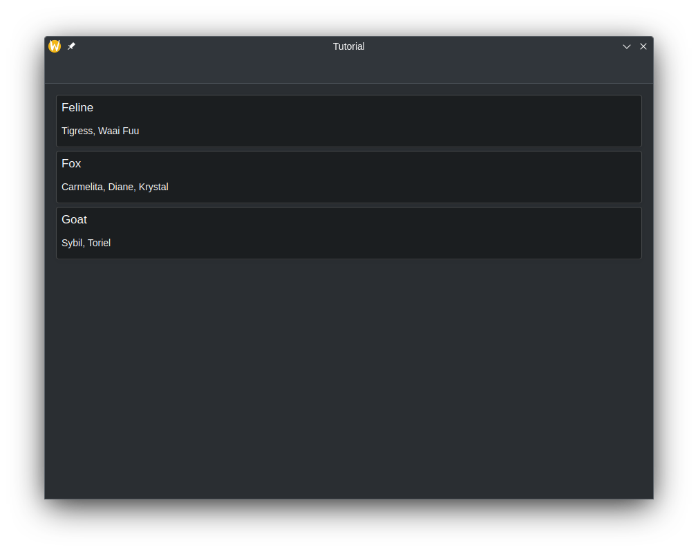

As shown from the [previous
tutorial](/docs/getting-started/kirigami/advanced-connect_backend/), you can
connect C++ code to QML by creating a class that will be treated as just
another component in QML. However, you may want to represent more complicated
data, such as if your data needs to act as a custom
[ListModel](docs:qtquick;qml-qtqml-models-listmodel.html) or in some way needs
to be delegated from a [Repeater](docs:qtquick;qml-qtquick-repeater.html).

We can create our own [models](docs:qtcore;qabstractlistmodel.html) from
the C++ side, and declare how the data from that model should be represented on
the QML frontend.

## Preparing the Class

In this tutorial, we will create a class that contains a QMap, where a QString
is used as a key and QStringList objects is used as a value. The frontend will
be able to read and display the keys and values, and as if it was a
one-dimensional array similar to the ListModel component.

To do this, we need to declare a class that inherits from
[QAbstractListModel](docs:qtcore;qabstractlistmodel.html). Let's also add in
some add data to the QMap. These declarations will be located in
`model.h`.



If you are following along, please remember to update your `CMakeLists.txt` file!



```cpp
#pragma once

#include <QAbstractListModel>

class Model : public QAbstractListModel {
private:
    QMap<QString, QStringList> m_list = {
            {"Feline", {"Tigress",   "Waai Fuu"}},
            {"Fox",    {"Carmelita", "Diane", "Krystal"}},
            {"Goat",   {"Sybil",     "Toriel"}}
    };
};
```

Of course, we can't just display this class as is. We also need to tell QML on
how to represent this data in the class. We can do this by overriding three
virtual functions that are essential at doing this, all of which do their own
tasks.

- `rowCount()` - Think of this function as a way to tell QML how many items are
  in the model to represent.
- `roleNames()` - When delegating, there are named roles (think of them as
  properties in QML) you will want to use in QML. This function allows you to
  create what those roles are.
- `data()` - This function is called when QML wants to represent data.



The custom role names created by `roleNames()` are only usable when a model is
being delegated, and are not usable outside of it. See [Models and
Views](docs:qtquick;qtquick-modelviewsdata-modelview.html#models).





Technically, models in Qt are represented as tables, with rows and columns. So,
what overriding `rowCount()` does is tell Qt how many rows are in a model.
Since we are just dealing with a one-dimensional array in this tutorial, you
can just think of "rows" as "number of elements."



### Overriding and Implementing `rowCount()`

Let's override the function in the header file. The `rowCount()` comes with its
own parameter, but will not be used in this example and is excluded.

```cpp
class Model : public QAbstractListModel {
...
public:
    int rowCount(const QModelIndex &) const override;
};
```

Then, let's declare how many rows are in this model in `model.cpp`.

```cpp
#include "model.h"

int Model::rowCount(const QModelIndex &) const {
    return m_list.count();
}
```

### Overriding and Implementing `roleNames()`

Before we override `roleNames()`, we need to declare what the roles are in the
C++ side using an public `enum` variable. The reason for this is because these
values from the `enum` variable are passed into `data()` every time QML
accesses a corresponding role, and as such we can make `data()` return what we
want.

Let's begin with creating the `enum` variable for roles, where each value is a
role for the C++ side.

```cpp
class Model : public QAbstractListModel {
...
public:
    enum Roles {
        TypeRole = Qt::UserRole,
        WaifusRole
    };

    ...
    QHash<int, QByteArray> roleNames() const override;
};
```

Once we have that settled, we can finally create what these roles are in the
QML side using a [QHash](docs:qtcore;qhash.html) where the keys are the
enumerated values paired with [QByteArrays](docs:qtcore;qbytearray.html). The
text in the QByteArray is what's used in the actual QML code.

```cpp
QHash<int, QByteArray> Model::roleNames() const {
    QHash<int, QByteArray> map = {
            {TypeRole,   "type"},
            {WaifusRole, "waifus"}
    };
    return map;
}
```

### Overriding and Implementing `data()`

There are two parameters that are passed in `data()`: `index` and `role`.
`index` is the location of where the data is when being delegated. As
previously stated, `role` is used by QML to get specific data returned when
it's accessing a role.

In `data()`, we can use a `switch` statement to return the appropriate data and
data type depending on the role. We still need to make sure we get the
appropriate location of the data, though. In this example below, you can see
that a new iterator variable is being declared, and is set from the beginning
of the list plus the row of the index on the QML side.

We can't just return whatever data we want though. We may be trying to bind
data to a property with an incompatible data type, such as a QStringList to a
string. You may have to do data conversion in order for the data to be
displayed properly.

```cpp
QVariant Model::data(const QModelIndex &index, int role) const {
    const auto it = m_list.begin() + index.row();
    switch (role) {
        case TypeRole:
            return it.key();
        case WaifusRole:
            return formatList(it.value());
        default:
            return {};
    }
}

QString Model::formatList(const QStringList& list) {
    QString result;
    for (const QString& waifu : list) {
        result += waifu + ", ";
    }
    return result;
}
```

### Allow Class to be Declared in QML

Let's not forget to make our class usable in QML.

```cpp
int main(int argc, char *argv[]) {
    ...
    qmlRegisterType<Model>("CustomModel", 1, 0, "CustomModel");
    ...
}
```

## In Practice in QML

The QML file that will use this custom model will just contain three
AbstractCard components, where the key is the title and the value is the
content. These cards are created by delegating an AbstractCard using a
Repeater, where the custom model we created acts as the model. The data is
accessed using word `model`, followed by the roles we declared in
`roleNames()`.

```qml
import QtQuick 2.15
import QtQuick.Controls 2.15
import QtQuick.Layouts 1.15
import org.kde.kirigami 2.20 as Kirigami
import CustomModel 1.0

Kirigami.ApplicationWindow {
    id: root
    title: "Tutorial"

    CustomModel {
        id: customModel
    }

    pageStack.initialPage: Kirigami.ScrollablePage {
        ColumnLayout {
            Repeater {
                model: customModel
                delegate: Kirigami.AbstractCard {
                    header: Kirigami.Heading {
                        text: model.type
                        level: 2
                    }
                    contentItem: Label {
                        text: model.waifus
                    }
                }
            }
        }
    }
}
```



## More Information

For more information, see [Using C++ Models with Qt Quick
Views](docs:qtquick;qtquick-modelviewsdata-cppmodels.html).
