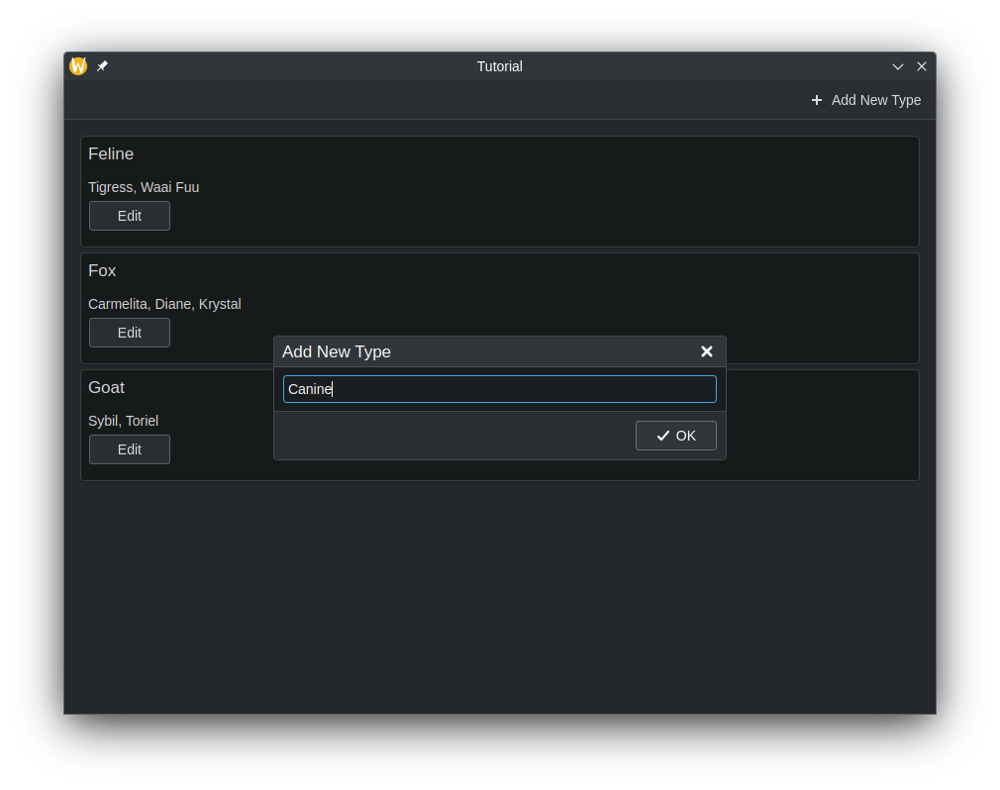
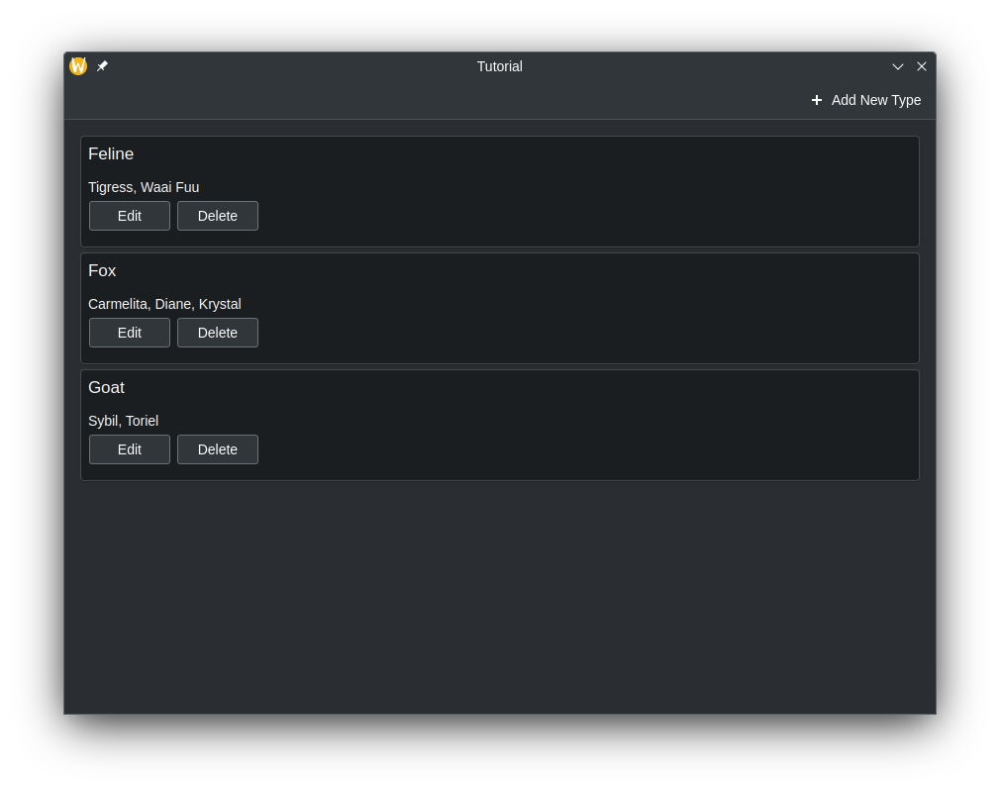

As shown from the [previous
tutorial](/docs/getting-started/kirigami/advanced-connect_backend/), you can
connect C++ code to QML by creating a class that will be treated as just
another component in QML. However, you may want to represent more complicated
data, such as data that needs to act as a custom
[ListModel](docs:qtquick;qml-qtqml-models-listmodel.html) or in some way needs
to be delegated from a [Repeater](docs:qtquick;qml-qtquick-repeater.html).

We can create our own [models](docs:qtcore;qabstractlistmodel.html) from
the C++ side, and declare how the data from that model should be represented on
the QML frontend.

## Preparing the Class

In this tutorial, we will create a class that contains a QMap, where a QString
is used as a key and QStringList objects are used as values. The frontend will
be able to read and display the keys and values and be simple to use just like a
one-dimensional array. It should look similar to a QML ListModel.

To do this, we need to declare a class that inherits from
[QAbstractListModel](docs:qtcore;qabstractlistmodel.html). Let's also add in
some add data to the QMap. These declarations will be located in
`model.h`.



If you are following along, please remember to update your `CMakeLists.txt` file!



```cpp
#pragma once

#include <QAbstractListModel>

class Model : public QAbstractListModel {
private:
    QMap<QString, QStringList> m_list = {
            {"Feline", {"Tigress",   "Waai Fuu"}},
            {"Fox",    {"Carmelita", "Diane", "Krystal"}},
            {"Goat",   {"Sybil",     "Toriel"}}
    };
};
```

Of course, we can't just display this class as is. We also need to tell QML on
how to represent this data in the class. We can do this by overriding three
virtual functions that are essential at doing this, all of which do their own
tasks.

- `rowCount()` - Think of this function as a way to tell QML how many items are
  in the model to represent.
- `roleNames()` - When delegating, there are named roles (think of them as
  properties in QML) you will want to use in QML. This function allows you to
  create what those roles are.
- `data()` - This function is called when QML wants to represent data.



The custom role names created by `roleNames()` are only usable when a model is
being delegated, and are not usable outside of it. See [Models and
Views](docs:qtquick;qtquick-modelviewsdata-modelview.html#models).





Technically, models in Qt are represented as tables, with rows and columns. So,
what overriding `rowCount()` does is tell Qt how many rows are in a model.
Since we are just dealing with a one-dimensional array in this tutorial, you
can just think of "rows" as "number of elements."



### Overriding and Implementing `rowCount()`

Let's override the function in the header file. The `rowCount()` comes with its
own parameter, but will not be used in this example and is excluded.

```cpp
class Model : public QAbstractListModel {
...
public:
    int rowCount(const QModelIndex &) const override;
};
```

Then, let's declare how many rows are in this model in `model.cpp`.

```cpp
#include "model.h"

int Model::rowCount(const QModelIndex &) const {
    return m_list.count();
}
```

### Overriding and Implementing `roleNames()`

Before we override `roleNames()`, we need to declare what the roles are in the
C++ side using an public `enum` variable. The reason for this is because these
values from the `enum` variable are passed into `data()` every time QML
accesses a corresponding role, and as such we can make `data()` return what we
want.

Let's begin with creating the `enum` variable for roles, where each value is a
role for the C++ side.

```cpp
class Model : public QAbstractListModel {
...
public:
    enum Roles {
        TypeRole = Qt::UserRole,
        WaifusRole
    };

    ...
    QHash<int, QByteArray> roleNames() const override;
};
```

Once we have that settled, we can finally create what these roles are in the
QML side using a [QHash](docs:qtcore;qhash.html) where the keys are the
enumerated values paired with [QByteArrays](docs:qtcore;qbytearray.html). The
text in the QByteArray is what's used in the actual QML code.

```cpp
QHash<int, QByteArray> Model::roleNames() const {
    QHash<int, QByteArray> map = {
            {TypeRole,   "type"},
            {WaifusRole, "waifus"}
    };
    return map;
}
```

### Overriding and Implementing `data()`

There are two parameters that are passed in `data()`: `index` and `role`.
`index` is the location of where the data is when being delegated. As
previously stated, `role` is used by QML to get specific data returned when
it's accessing a role.

In `data()`, we can use a `switch` statement to return the appropriate data and
data type depending on the role, which is possible as `data()` returns a
[QVariant](docs:qtcore;qvariant.html). We still need to make sure we get the
appropriate location of the data, though. In this example below, you can see
that a new iterator variable is being declared, which is set from the beginning
of the list plus the row of the index and the data that the iterator is
pointing to is what is being returned.

We can't just return whatever data we want though. We may be trying to bind
data to a property with an incompatible data type, such as a QStringList to a
string. You may have to do data conversion in order for the data to be
displayed properly.

```cpp
QVariant Model::data(const QModelIndex &index, int role) const {
    const auto it = m_list.begin() + index.row();
    switch (role) {
        case TypeRole:
            return it.key();
        case WaifusRole:
            return formatList(it.value());
        default:
            return {};
    }
}

QString Model::formatList(const QStringList& list) {
    QString result;
    for (const QString& waifu : list) {
        result += waifu;
        if (list.last() != waifu) {
            result += ", ";
        }
    }
    return result;
}
```

### Allow the Class to be Declared in QML

Let's not forget to make our class usable in QML.

```cpp
int main(int argc, char *argv[]) {
    ...
    qmlRegisterType<Model>("CustomModel", 1, 0, "CustomModel");
    ...
}
```

## Class Usage in QML

The QML file that is used will just contain three
[Kirigami.AbstractCard](docs:kirigami2;AbstractCard) components, where the key is the
header and the value is the content. These cards are created by delegating an
AbstractCard using a Repeater, where the custom model we created acts as the
model. The data is accessed using word `model`, followed by the roles we
declared in `roleNames()`.






```qml
import QtQuick 2.15
import QtQuick.Controls 2.15
import QtQuick.Layouts 1.15
import org.kde.kirigami 2.20 as Kirigami
import CustomModel 1.0

Kirigami.ApplicationWindow {
    id: root
    title: "Tutorial"

    CustomModel {
        id: customModel
    }

    pageStack.initialPage: Kirigami.ScrollablePage {
        ColumnLayout {
            Repeater {
                model: customModel
                delegate: Kirigami.AbstractCard {
                    header: Kirigami.Heading {
                        text: model.type
                        level: 2
                    }
                    contentItem: Label {
                        text: model.waifus
                    }
                }
            }
        }
    }
}
```










## Data Modification

### Editing Data Using `dataChanged()` and `setData()`

You may encounter a situation where you want to modify data in the model, and
have the changes reflected on the frontend side. Every time we change data in
the model, we must emit the `dataChanged()` signal which will apply those changes on
the frontend side at the specific cells specified in its arguments. In this
tutorial, we can just use the `index` argument of `setData()`.

`setData()` is a virtual function you can override so that attempting
to modify the data from the frontend side automatically reflects those
changes on the backend side. It requires three parameters:

- `index` - The location of the data.
- `value` - The contents of the new data.
- `role` - In this context, the role here is used to tell views how they
  should handle data. The role here should be `Qt::EditRole`.

Using these parameters, we can use `role` to check if the intent of calling the
function is to edit the model and return false when it isn't. Using `index`, we
can use that to determine the location of where the data should be edited with
the contents of `value`.

```cpp
bool Model::setData(const QModelIndex &index, const QVariant &value, int role) {
    if (!value.canConvert<QString>() && role != Qt::EditRole) {
        return false;
    }

    auto it = m_list.begin() + index.row();
    QString waifusUnformatted = value.toString();
    QStringList waifus = waifusUnformatted.split(", ");

    m_list[it.key()] = waifus;
    emit dataChanged(index, index);

    return true;
}
```



`setData()` does not automatically emit `dataChanged()` and that still has to
be done manually.



Let's update the QML code so that we can open up a prompt that allows us
editing the model using a button attached to the cards.

```qml
Kirigami.ApplicationWindow {
    ...

    Kirigami.OverlaySheet {
        id: editPrompt

        property var model
        property alias text: editPromptText.text

        title: "Edit Waifus"

        TextField {
            id: editPromptText
        }

        footer: DialogButtonBox {
            standardButtons: DialogButtonBox.Ok
            onAccepted: {
                const model = editPrompt.model;
                model.waifus = editPromptText.text;
                editPrompt.close();
            }
        }
    }

    pageStack.initialPage: Kirigami.ScrollablePage {
        ColumnLayout {
            Repeater {
                model: customModel
                delegate: Kirigami.AbstractCard {
                    Layout.fillHeight: true
                    header: Kirigami.Heading {
                        text: model.type
                        level: 2
                    }
                    contentItem: Item {
                        implicitWidth: delegateLayout.implicitWidth
                        implicitHeight: delegateLayout.implicitHeight
                        ColumnLayout {
                            id: delegateLayout
                            Label {
                                text: model.waifus
                            }
                            Button {
                                text: "Edit"
                                onClicked: {
                                    editPrompt.text = model.waifus;
                                    editPrompt.model = model;
                                    editPrompt.open();
                                }
                            }
                        }
                    }
                }
            }
        }
    }
}
```

And now, whenever the values of the model change here, the changes should
affect the model in the backend and have those changes automatically update on
the frontend.















### Adding Rows

We added a way to modify the data in existing keys of the QMap, and in the
front end, this is reflected as modifying the contents inside the
AbstractCards. But what if we need to add a new key entry in the QMap and have that
reflected on the QML side? Let's do this by creating a new method that is
callable on the QML side to perform this task.

To make the method visible in QML, we must use the Q_OBJECT macro in the class,
and begin the method declaration with the Q_INVOKABLE macro. This method will
also include a string parameter, which is intended to be the new key in the
QMap.

```cpp
class Model : public QAbstractListModel {
Q_OBJECT;

    ...
public:
    ...
    Q_INVOKABLE void addType(const QString &typeName);
};
```

Inside of this method, we need to tell Qt that we want to create more rows in
the model. This is done by calling `beginInsertRows()` to begin our row adding
operation, followed by inserting whatever we need, then use `endInsertRows()`
to end the operation. We still need to emit `dataChanged()` at the end,
however. This time, we are going to update all rows, from the first row to the
last one as the QMap may alphabetically reorganize itself, and we need to catch
that across all rows.

When calling `beginInsertRows()`, we need to first pass in a QModelIndex class
to specify the location of where the new rows should be added, followed by what
the new first and last row numbers are going to be. In this tutorial, the first
argument will just be `QModelIndex()` as there is no need to use the parameter
here. We can just use the current row size for the first and last row number,
as we'll just be adding one row at the end of the model.

```cpp
void Model::addType(const QString& typeName) {
    beginInsertRows(QModelIndex(), m_list.size() - 1, m_list.size() - 1);
    m_list.insert(typeName, {});
    endInsertRows();
    emit dataChanged(index(0), index(m_list.size() - 1));
}
```



The `dataChanged()` function uses QModelIndex as the data type for its
parameters. However, we can convert integers in QModelIndex data types using
the `index()` function. 



Let's update the QML code so we are given the ability to add a new key to the QMap.

```qml
Kirigami.ApplicationWindow {
    ...

    Kirigami.OverlaySheet {
        id: addPrompt

        title: "Add New Type"

        TextField {
            id: addPromptText
        }

        footer: DialogButtonBox {
            standardButtons: DialogButtonBox.Ok
            onAccepted: {
                customModel.addType(addPromptText.text);
                addPromptText.text = ""; // Clear TextField every time it's done
                addPrompt.close();
            }
        }
    }

    pageStack.initialPage: Kirigami.ScrollablePage {
        actions.main: Kirigami.Action {
            icon.name: "add"
            text: "Add New Type"
            onTriggered: {
                addPrompt.open();
            }
        }
        ...
    }
}
```

Now, we should be given a new action at the top of the app that brings up a
prompt that allows to add a new element to the model, with our own custom data.
















### Removing Rows

The way remove rows is similar to adding rows. Let's create another method that
we'll call in QML. This time, we will use an additional parameter, and that is
an integer that is the row number. The type name is used to delete the key from
the QMap, while the row number will be used to delete the row on the front end.

```cpp
class Model : public QAbstractListModel {
Q_OBJECT;

...
    public:
    ...

    Q_INVOKABLE void deleteType(const QString &typeName, const int &rowIndex);
}
```

```cpp
void Model::deleteType(const QString &typeName, const int& rowIndex) {
    beginRemoveRows(QModelIndex(), rowIndex, rowIndex);
    m_list.remove(typeName);
    endRemoveRows();
    emit dataChanged(index(0), index(m_list.size() - 1));
}
```

Now, let's update the application so a "Delete" button appears alongside the
edit button, and hook it up to our delete method.

```qml
ColumnLayout {
    Repeater {
        model: customModel
        delegate: Kirigami.AbstractCard {
            ...
            contentItem: Item {
                implicitWidth: delegateLayout.implicitWidth
                implicitHeight: delegateLayout.implicitHeight
                ColumnLayout {
                    id: delegateLayout
                    Label {
                        text: model.waifus
                    }
                    RowLayout {
                        Button {
                            text: "Edit"
                            onClicked: {
                                editPrompt.text = model.waifus;
                                editPrompt.model = model;
                                editPrompt.open();
                            }
                        }
                        Button {
                            text: "Delete"
                            onClicked: {
                                customModel.deleteType(model.type, index);
                            }
                        }
                    }
                }
            }
        }
    }
}
```
















## Full Code





## More Information

For more information, see [Using C++ Models with Qt Quick
Views](docs:qtquick;qtquick-modelviewsdata-cppmodels.html) and 
[Model/View Programming](docs:qtquick;model-view-programming.html).
