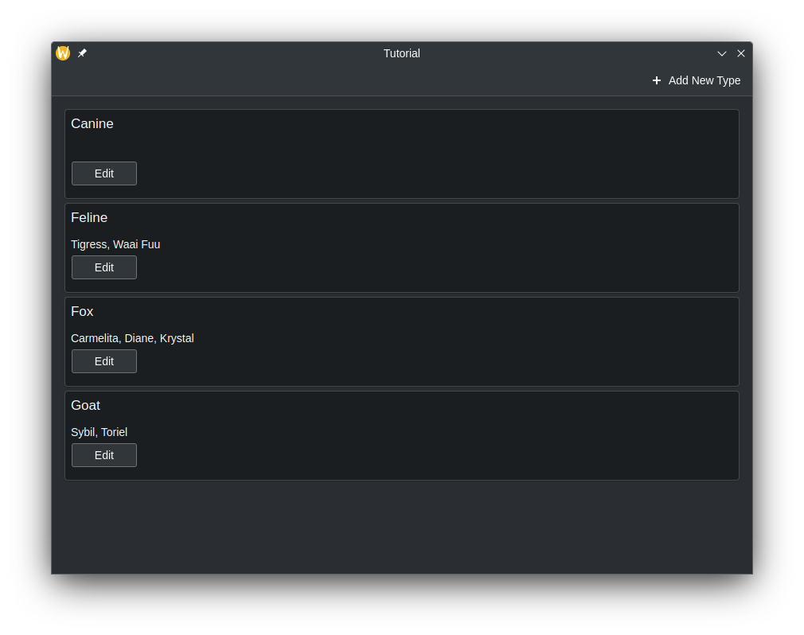

As shown in the [previous
tutorial](/docs/getting-started/kirigami/advanced-connect_backend/), you can
connect C++ code to QML by creating a class that will be treated as just
another component in QML. However, you may want to represent more complicated
data, such as data that needs to act as a custom
[ListModel](docs:qtquick;qml-qtqml-models-listmodel.html) or in some way needs
to be delegated from a [Repeater](docs:qtquick;qml-qtquick-repeater.html).

We can create our own [models](docs:qtcore;qabstractlistmodel.html) from
the C++ side, and declare how the data from that model should be represented on
the QML frontend.

It is strongly recommended that you read the [List views](/docs/getting-started/kirigami/components-listview) tutorial before this one.

The code used for this tutorial will be based on the previous page, [Connect logic to your QML user interface](/docs/getting-started/kirigami/advanced-connect_backend).

## Project structure

```
kirigami-tutorial/
├── CMakeLists.txt --------------------- # Modified for didactic purposes
├── org.kde.tutorial.desktop
└── src/
    ├── CMakeLists.txt
    ├── main.cpp
    ├── Main.qml ----------------------- # Modified
    └── components/
        ├── CMakeLists.txt ------------- # Modified
        ├── AddDialog.qml
        ├── KountdownDelegate.qml
        ├── ExposePage.qml
        ├── ModelsPage.qml ------------- # New
        ├── model.h -------------------- # New
        ├── model.cpp ------------------ # New
        ├── backend.h
        └── backend.cpp
```

## Creating a new page for the models tutorial

Before doing anything, let's add a new page to our QML code.

First, in `src/Main.qml`, add the following action to the global drawer:



Then, create a new `src/components/ModelsPage.qml` with the following contents:



And finally add it to `src/components/CMakeLists.txt`:



This will serve as the canvas for this tutorial page.

## Using raw strings

To make this tutorial easier to understand how the model is populated, we will be disabling a feature that KDE applications using extra-cmake-modules (ECM) use by default that [optimizes string code](https://doc.qt.io/qt-6/qstring.html#QT_NO_CAST_FROM_ASCII). This allows us to bypass having to write [QStringLiteral()](https://doc.qt.io/qt-6/qstring.html#QStringLiteral) every time a string is introduced in our C++ code, which will be useful for the code in the upcoming header file.

In the root `CMakeLists.txt` file, add the following:





Disabling this CMake flag is done for didactic purposes *only*. Production code should use QStringLiteral() or the [Qt string literals namespace](https://doc.qt.io/qt-6/qt-literals-stringliterals.html) instead where possible.



## Preparing the Class

We will create a class that contains a [QMap](https://doc.qt.io/qt-6/qmap.html),
where a [QString](https://doc.qt.io/qt-6/qstring.html)
is used as a key and [QStringList](https://doc.qt.io/qt-6/qstringlist.html) objects are used as values.
The frontend will be able to read and display the keys and values and be simple to use just like a
one-dimensional array. It should look similar to a QML ListModel.

To do this, we need to create a class that inherits from
[QAbstractListModel](docs:qtcore;qabstractlistmodel.html). Let's also add
some data to the QMap. These declarations will be located in
`model.h`.

Create two new files, `src/components/model.h` and `src/components/model.cpp`.

Add those two new files to `src/components/CMakeLists.txt`:



Add the following as the initial contents to `src/components/model.h`:



Of course, we can't just display this class as is. We also need to tell QML
how to represent this data in the class. We can do this by overriding three
essential virtual functions:

- [rowCount()](https://doc.qt.io/qt-6/qabstractitemmodel.html#rowCount) -
Think of this function as a way to tell QML how many items the model should present.
- [roleNames()](https://doc.qt.io/qt-6/qabstractitemmodel.html#roleNames) -
You can think of role names as property names attached to data in QML.
This function allows you to create those roles.
- [data()](https://doc.qt.io/qt-6/qabstractitemmodel.html#data) -
This function is called when you want to retrieve the data
that corresponds to the role names from the model.



The custom role names created by `roleNames()` are only usable when a model is
being delegated, and are not usable outside of it. See [Models and
Views](docs:qtquick;qtquick-modelviewsdata-modelview.html#models).





Technically, models in Qt are represented as tables, with rows and columns. So,
what overriding `rowCount()` does is tell Qt how many rows are in a model.
Since we are just dealing with a one-dimensional array in this tutorial, you
can just think of "rows" as "number of elements."



### Overriding and Implementing `rowCount()`

Let's override the function in the `src/components/model.h` header file. The [rowCount()](https://doc.qt.io/qt-6/qabstractitemmodel.html#rowCount) 
function comes with its own parameter, but it will not be used in this example and so doesn't need to be named.



Then, let's declare how many rows are in this model in `src/components/model.cpp`:



### Overriding and Implementing `roleNames()`

Before we override `roleNames()`, we need to declare what the roles are in the
C++ side using a public enum. The reason for this is because these
enum values are passed into `data()` every time QML
accesses a corresponding role, and as such we can make `data()` return what we
want.

Let's begin with creating the enum for roles in `src/components/model.h`, where each value is a
role for the C++ side.



Once we have that settled, we can finally create what these roles are in the
QML side using a [QHash](docs:qtcore;qhash.html) where the keys are the
enumerated values paired with [QByteArrays](docs:qtcore;qbytearray.html). This should go to `src/components/model.cpp`.
The text in the QByteArray is what's used in the actual QML code.



In our example model, the role "species" can be used to retrieve
the QString key "Feline", "Fox", "Goat", each in a separate delegate.
The same can be done with the QStringList values for the character
names list.

### Overriding and Implementing `data()`

There are two parameters that are passed to `data()`: `index` and `role`.
The `index` is the position of the data in the model. As
previously stated, `role` is used by QML to get specific data returned when
it's accessing a role.

In `data()`, we can use a switch statement to return the appropriate data and
data type depending on the role, which is possible as `data()` returns a
[QVariant](docs:qtcore;qvariant.html). We still need to make sure we get the
appropriate location of the data, though. In this example below, you can see
that a new iterator variable is being declared, which is set from the beginning
of the list plus the row of the index, and the data that the iterator is
pointing to is what is being returned.

We can't just return whatever data we want though. We may be trying to bind
data to a property with an incompatible data type, such as a QStringList to a
QString. You may have to do data conversion in order for the data to be
displayed properly. For this, we create a new private, static function named `formatList()`.

This results in the following code in `src/components/model.cpp`:



And the following code in `src/components/model.h`:



## Class Usage in QML

The QML file that is used will just contain three
[Kirigami.AbstractCard](docs:kirigami;org.kde.kirigami.AbstractCard) components, where the key is the
header and the value is the content. These cards are created by delegating an
AbstractCard using a Repeater, where the custom model we created acts as the
model. The data is accessed using word `model`, followed by the roles we
declared in `roleNames()`.





## Data Modification

### Editing Data Using `dataChanged()` and `setData()`

You may encounter a situation where you want to modify data in the model, and
have the changes reflected on the frontend side. Every time we change data in
the model, we must emit the `dataChanged()` signal which will apply those changes on
the frontend side at the specific cells specified in its arguments. In this
tutorial, we can just use the `index` argument of [setData()](https://doc.qt.io/qt-6/qabstractitemmodel.html#setData).

[setData()](https://doc.qt.io/qt-6/qabstractitemmodel.html#setData)
is a virtual function you can override so that modifying the data from the frontend side
automatically reflects those changes on the backend side. It requires three parameters:

- `index` - The location of the data.
- `value` - The contents of the new data.
- `role` - In this context, the role here is used to tell views how they
  should handle data. The role here should be [Qt::EditRole](https://doc.qt.io/qt-6/qt.html#ItemDataRole-enum).

The `role` parameter in this case is used to ensure `setData()` can be
edited via user input (Qt::EditRole). Using `index`, we
can use that to determine the location of where the data should be edited with
the contents of `value`.





`setData()` does not automatically emit [dataChanged()](https://doc.qt.io/qt-6/qabstractitemmodel.html#dataChanged) and that has to
be done manually.



With the corresponding addition in `src/components/model.h`:



Let's update the QML code so that we can open up a prompt that allows us
to edit the model using a [Controls.Button](https://doc.qt.io/qt-6/qml-qtquick-controls-button.html) attached to the cards.

Add the following [Kirigami.PromptDialog](https://api.kde.org/qml-org-kde-kirigami-dialogs-promptdialog.html) to the `src/components/ModelsPage.qml`, together with a new edit button:



Now, whenever the values of the model change in the frontend,
the changes should automatically update on the backend.















### Adding Rows

We added a way to modify the data in existing keys of the QMap, and in the
front end, this is reflected as modifying the contents inside the
AbstractCards. But what if we need to add a new key entry in the QMap and have that
reflected on the QML side? Let's do this by creating a new method that is
callable on the QML side to perform this task.

To make the method visible in QML, we must begin the method declaration with the [Q_INVOKABLE](https://doc.qt.io/qt-6/qobject.html#Q_INVOKABLE) macro. This method will
also include a string parameter, which is intended to be the new key in the
QMap.



Inside of this method, we need to tell Qt that we want to create more rows in
the model. This is done by calling [beginInsertRows()](https://doc.qt.io/qt-6/qabstractitemmodel.html#beginInsertRows) to begin our row adding
operation, followed by inserting whatever we need, then use [endInsertRows()](https://doc.qt.io/qt-6/qabstractitemmodel.html#endInsertRows)
to end the operation. We still need to emit [dataChanged()](https://doc.qt.io/qt-6/qabstractitemmodel.html#dataChanged) at the end,
however. This time, we are going to update all rows, from the first row to the
last one as the QMap may alphabetically reorganize itself, and we need to catch
that across all rows.

When calling `beginInsertRows()`, we need to first pass in a QModelIndex class
to specify the location of where the new rows should be added, followed by what
the new first and last row numbers are going to be. In this tutorial, the first
argument will just be `QModelIndex()` as there is no need to use the parameter
here. We can just use the current row size for the first and last row number,
as we'll just be adding one row at the end of the model.





The `dataChanged()` function uses QModelIndex as the data type for its
parameters. However, we can convert integers in QModelIndex data types using
the `index()` function. 



Let's update the QML code so we are given the ability to add a new key to the QMap.



Now, we should be given a new action at the top of the app that brings up a
prompt that allows to add a new element to the model, with our own custom data.
















### Removing Rows

The way remove rows is similar to adding rows. Let's create another method that
we'll call in QML. This time, we will use an additional parameter, and that is
an integer that is the row number. The species name is used to delete the key
from the QMap, while the row number will be used to delete the row on the front
end.

Add a new Q_INVOKABLE function named `deleteSpecies()` in `src/components/model.h`:



With a matching implementation in `src/components/model.cpp`:



Now, let's update the application so a "Delete" button appears in a RowLayout alongside the
edit button inside our AbstractCard, and hook it up to our delete method.

















## Our app so far

Existing code:

<details>
<summary>src/CMakeLists.txt</summary>



</details>

<details>
<summary>src/main.cpp</summary>



</details>

<details>
<summary>src/components/KountdownDelegate.qml</summary>



</details>

<details>
<summary>src/components/AddDialog.qml</summary>



</details>

<details>
<summary>src/components/ExposePage.qml</summary>



</details>

<details>
<summary>src/components/backend.h</summary>



</details>


<details>
<summary>src/components/backend.cpp</summary>



</details>

<br>

Code written/modified in this page:

<details>
<summary>CMakeLists.txt</summary>



</details>

<details><summary>src/Main.qml</summary>



</details>

<details><summary>src/components/CMakeLists.txt</summary>



</details>

<details><summary>src/components/ModelsPage.qml</summary>



</details>

<details><summary>src/components/model.h</summary>



</details>

<details><summary>src/components/model.cpp</summary>



</details>

## More Information

For more information, see [Using C++ Models with Qt Quick
Views](docs:qtquick;qtquick-modelviewsdata-cppmodels.html) and 
[Model/View Programming](docs:qtquick;model-view-programming.html).
