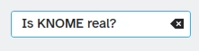
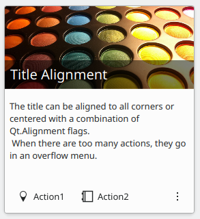

## Actions

A [Kirigami.Action](docs:kirigami2;Action) consists of a clickable action whose appearance depends on where it is added. Typically it is a button with an icon and text.

We can use these to provide our applications with easy-to-reach actions that are essential to their functionality.



Kirigami Actions inherit from [QtQuick.Controls.Action](docs:qtquickcontrols;QtQuick.Controls.Action) and
can be assigned shortcuts.



Like [QtQuick Controls Actions](docs:qtquickcontrols;QtQuick.Controls.Action), they can be assigned to menu items and toolbar buttons,
but also to multiple other Kirigami components.

```qml
import org.kde.kirigami as Kirigami

Kirigami.Action {
    id: copyAction
    text: i18n("Copy")
    icon.name: "edit-copy"
    shortcut: StandardKey.Copy
    onTriggered: {
        // ...
    }
}
```



The [icon.name](https://doc.qt.io/qt-6/qml-qtquick-controls2-action.html#icon.name-prop) property takes names for system-wide icons following the FreeDesktop specification. These icons and icon names can be viewed with KDE's CuttleFish application which comes with [plasma-sdk](https://invent.kde.org/plasma/plasma-sdk), or by visiting [FreeDesktop's icon naming specification](https://specifications.freedesktop.org/icon-naming-spec/icon-naming-spec-latest.html).



One feature offered by Kirigami Actions on top of QtQuick Actions is the possibility to nest actions.

```qml
import org.kde.kirigami as Kirigami

Kirigami.Action {
    text: "View"
    icon.name: "view-list-icons"
    Kirigami.Action {
        text: "action 1"
    }
    Kirigami.Action {
        text: "action 2"
    }
    Kirigami.Action {
        text: "action 3"
    }
}
```

Another feature of Kirigami Actions is to provide various hints to items using actions
about how they should display the action. These are primarily handled by the [displayHint](docs:kirigami2;Action::displayHint)
and [displayComponent](docs:kirigami2;Action::displayComponent) properties.

These properties will be respected by the item if possible. For example, the following
action will be displayed as a [TextField](docs:qtquickcontrols;QtQuick.Controls.TextField) with the item trying its best to keep itself
visible as long as possible.

```qml
import org.kde.kirigami as Kirigami

Kirigami.Action {
    text: "Search"
    icon.name: "search"

    displayComponent: TextField { }

    displayHint: Kirigami.DisplayHints.KeepVisible
}
```

## Using actions in other components

As mentioned in the [introduction tutorial for actions](/docs/getting-started/kirigami/introduction-actions), Kirigami Actions are [contextual](/docs/getting-started/kirigami/introduction-actions#actions-are-contextual), which means they show up in different places depending on where you put them. In addition to that, they also have different representations for desktop and mobile.

### Page

A [Kirigami.Page](docs:kirigami2;Page) shows Actions on the right of the top header in desktop mode, and on a footer in mobile mode.











### Global drawer

The [Kirigami.GlobalDrawer](docs:kirigami2;GlobalDrawer) is a menu-like sidebar that provides an action based navigation to your application. This is where nested actions are useful because it is possible to create nested navigation:

```qml
import org.kde.kirigami as Kirigami

Kirigami.ApplicationWindow {
    title: "Actions Demo"
    globalDrawer: Kirigami.GlobalDrawer {
        title: "Demo"
        titleIcon: "applications-graphics"
        actions: [
            Kirigami.Action {
                text: "View"
                icon.name: "view-list-icons"
                Kirigami.Action {
                    text: "View Action 1"
                    onTriggered: showPassiveNotification("View Action 1 clicked")
                }
                Kirigami.Action {
                    text: "View Action 2"
                    onTriggered: showPassiveNotification("View Action 2 clicked")
                }
            },
            Kirigami.Action {
                text: "Action 1"
                onTriggered: showPassiveNotification("Action 1 clicked")
            },
            Kirigami.Action {
                text: "Action 2"
                onTriggered: showPassiveNotification("Action 2 clicked")
            }
        ]
    }
    //...
}
```







You can read more about Global Drawers in the [documentation page for drawers](../components-drawers#globaldrawer).

### Context drawer

A [Kirigami.ContextDrawer](docs:kirigami2;ContextDrawer) consists of an additional set of actions that are hidden behind a three-dots menu on the top right in desktop mode or on the bottom right in mobile mode if there is no space.
It is used to display actions that are only relevant to a specific page. You can read more about them in our [Kirigami Drawers](/docs/getting-started/kirigami/components-drawers) tutorial.









### ActionTextFields

A [Kirigami.ActionTextField](docs:kirigami2;ActionTextField) is used to add some contextual
actions to a text field, for example to clear the text, or to search for the text.

```qml
Kirigami.ActionTextField {
    id: searchField
    rightActions: [
        Kirigami.Action {
            icon.name: "edit-clear"
            visible: searchField.text !== ""
            onTriggered: {
                searchField.text = ""
                searchField.accepted()
            }
        }
    ]
}
```

In this example, we are creating a "clear" button for a search field that is only visible when text is entered.





You should rarely use an ActionTextField directly. [SearchField](docs:kirigami2;SearchField) and [PasswordField](docs:kirigami2;PasswordField) both inherit from `ActionTextField` and are likely to cover your desired use-case.



### SwipeListItem

A [Kirigami.SwipeListItem](docs:kirigami2;SwipeListItem) is a delegate intended to support extra actions. When using a mouse, its actions will always be shown. On a touch device, they can be shown by dragging the item with the handle. In the following pictures, these are the icons to the right.

```qml
ListView {
    model: myModel
    delegate: SwipeListItem {
        Controls.Label {
            text: model.text
        }
        actions: [
             Action {
                 icon.name: "document-decrypt"
                 onTriggered: print("Action 1 clicked")
             },
             Action {
                 icon.name: model.action2Icon
                 onTriggered: //do something
             }
        ]
    }
}
```





###  ActionToolBar

A [Kirigami.ActionToolBar](docs:kirigami2;ActionToolBar) is a toolbar built out of a list of actions. By default, each action that will fit in the toolbar will be represented by a [ToolButton](docs:qtquickcontrols;QtQuick.Controls.ToolButton), with those that do not fit being moved into a
menu at the end of the toolbar.

Like [ActionTextField](docs:kirigami2;ActionTextField), you may not need to use [ActionToolBar](docs:kirigami2;ActionToolBar) directly as it is used by page headers and cards to provide their action display.

```qml
import org.kde.kirigami as Kirigami

Kirigami.ApplicationWindow {
    title: "Actions Demo"
    width: 350
    height: 350
    header: Kirigami.ActionToolBar {
        actions: [
            Kirigami.Action {
                text: i18n("View Action 1")
                onTriggered: showPassiveNotification(i18n("View Action 1 clicked"))
            },
            Kirigami.Action {
                text: i18n("View Action 2")
                onTriggered: showPassiveNotification(i18n("View Action 2 clicked"))
            },
            Kirigami.Action {
                text: i18n("Action 1")
                onTriggered: showPassiveNotification(i18n("Action 1 clicked"))
            },
            Kirigami.Action {
                text: i18n("Action 2")
                onTriggered: showPassiveNotification(i18n("Action 2 clicked"))
            }
        ]
    }
}
```



You can read more about [ActionToolBar](docs:kirigami2;ActionToolBar) components in their [dedicated documentation page](../components-actiontoolbar/).

### Cards

A [Kirigami.Card](docs:kirigami2;Card) is used to display a collection of information or actions together. These actions can be added to the `actions` group, similarly to previous components.





```qml
Kirigami.Card {
    actions: [
        Kirigami.Action {
            text: qsTr("Action1")
            icon.name: "add-placemark"
        },
        Kirigami.Action {
            text: qsTr("Action2")
            icon.name: "address-book-new-symbolic"
        },
        // ...
    ]
    banner {
        source: "../banner.jpg"
        title: "Title Alignment"
        titleAlignment: Qt.AlignLeft | Qt.AlignBottom
    }
    contentItem: Controls.Label {
        wrapMode: Text.WordWrap
        text: "My Text"
    }
}

```











For more information consult the [component page for Cards](../components-card/).
