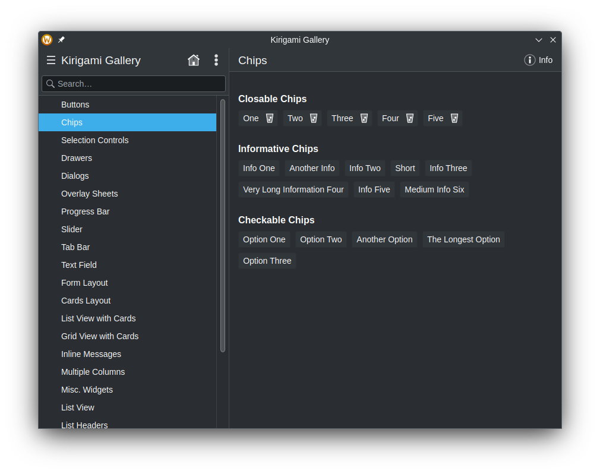
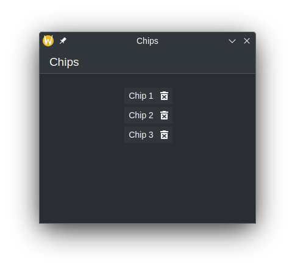

[Kirigami.Chip](docs:kirigami;org.kde.kirigami.Chip) components are small elements inherited from
[AbstractButton](https://doc.qt.io/qt-6/qml-qtquick-controls2-abstractbutton.html)
used for displaying common properties or filters of something. These are typically
text elements, which is also interactable and comes with an optional delete button.



## Quick Start

Chips can easily be added using the `Kirigami.Chip` component. By assigning a
string to its `text` field, we give chips their name.




```qml
import QtQuick
import QtQuick.Layouts
import QtQuick.Controls
import org.kde.kirigami as Kirigami

Kirigami.ApplicationWindow {
    title: "Chips"

    pageStack.initialPage: Kirigami.Page {
        title: "Chips"

        Kirigami.FormLayout {
            anchors.fill: parent
            Kirigami.Chip {
                text: "Chip 1"
            }
            Kirigami.Chip {
                text: "Chip 2"
            }
            Kirigami.Chip {
                text: "Chip 3"
            }
        }
    }
}
```









### With Repeaters (Recommended)

Since chips are meant to be used more than once, you'll likely want to use some
kind of list data structure and iterate over them to display the chips. To do
this, we need a
[ListModel](https://doc.qt.io/qt-6/qml-qtqml-models-listmodel.html) and a
[Repeater](https://doc.qt.io/qt-6/qml-qtquick-repeater.html) component.


The ListModel is used as storage for the chips. To populate the ListModel (and
therefore chips), we declare a couple of ListElement components, which contains
a field known as `text`. We can use this string assigned from here to the
`text` field for each repeated chip.

The Repeater is used for displaying the chips. First, we need to set the
`model` field of the Repeater to our ListModel, or create the ListModel inside
of repeater. Then, we declare the `Kirigami.Chip` component inside of the
Repeater, and assign its `text` field with the element's data using the
`modelData` property.

```qml
Kirigami.ApplicationWindow {
    id: root
    title: "Chips"

    ListModel {
        id: chips

        ListElement { text: "Chip 1" }
        ListElement { text: "Chip 2" }
        ListElement { text: "Chip 3" }
    }

    pageStack.initialPage: Kirigami.Page {
        title: "Chips"

        Kirigami.FormLayout {
            anchors.fill: parent
            Repeater {
                Layout.fillWidth: true
                model: chips

                Kirigami.Chip {
                id: chip
                    text: modelData
                }
            }
        }
    }
}
```



You can dynamically append and remove data from the ListModel, and the Repeater
will automatically make those changes. However, simply changing a specific item
from either the Repeater or ListModel does not affect the other, and requires
the changing of both, unless something like
[QAbstractListModel](https://doc.qt.io/qt-6/qabstractlistmodel.html) is used.
See [Example Application](#example-application) for more information.



## Example Application

The example application below showcases how chips can be used in programs such
as to-do lists.




