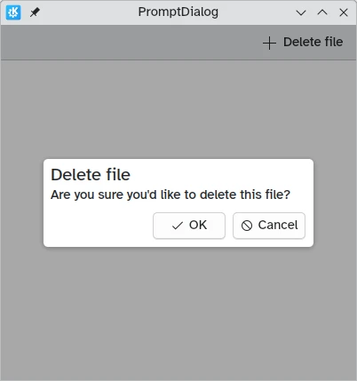

A [Kirigami.Dialog](docs:kirigami;org.kde.kirigami.dialogs.Dialog) is a simple component that you can use to supplement the content being displayed on an application's page. It can display non-interactive content (only text) and interactive content (forms, listviews and buttons).

They can be dismissed by clicking or tapping outside of their area or by clicking the close button on the header.

### Dialog

A standard [Kirigami.Dialog](https://api.kde.org/qml-org-kde-kirigami-dialogs-dialog.html) is used to create custom dialogs. They are very easy to extend:





```qml
import QtQuick
import QtQuick.Controls as Controls
import org.kde.kirigami as Kirigami

Kirigami.ApplicationWindow {
    title: "Dialog"
    width: 400
    height: 400
    pageStack.initialPage: Kirigami.Page {
        id: page
        actions: Kirigami.Action {
            icon.name: "list-add"
            text: "Show dialog"
            onTriggered: dialog.open()
        }

        Kirigami.Dialog {
            id: dialog
            title: "A simple dialog"
            padding: Kirigami.Units.largeSpacing
            showCloseButton: false
            standardButtons: Kirigami.Dialog.NoButton
            flatFooterButtons: false
            Controls.Label {
                text: "A generic, easy to make dialog!"
            }
            customFooterActions: Kirigami.Action {
                text: "Copy"
                icon.name: "clipboard"
            }
        }
    }
}
```





<br>






As shown in the [introduction tutorial about dialogs](/docs/getting-started/kirigami/introduction-dialogs), it is also possible to capture a `standardButton(button)` to assign some behavior to it, like a binding to enable it only under certain conditions.

This type of dialog is generic and applies to most use cases, and it works well with complex interactive content (especially views):





```qml
import QtQuick
import QtQuick.Controls as Controls
import org.kde.kirigami as Kirigami

Kirigami.ApplicationWindow {
    title: "Scrollable Dialog"
    width: 600
    height: 600
    pageStack.initialPage: Kirigami.Page {
        id: page
        actions: Kirigami.Action {
            icon.name: "list-add"
            text: scrollableDialog.title
            onTriggered: scrollableDialog.open()
        }

        Kirigami.Dialog {
            id: scrollableDialog
            title: i18n("Select Number")

            ListView {
                id: listView
                // hints for the dialog dimensions
                implicitWidth: Kirigami.Units.gridUnit * 16
                implicitHeight: Kirigami.Units.gridUnit * 16

                model: 20
                delegate: Controls.RadioDelegate {
                    topPadding: Kirigami.Units.smallSpacing * 2
                    bottomPadding: Kirigami.Units.smallSpacing * 2
                    implicitWidth: listView.width
                    text: modelData
                }
            }
        }

    }
}
```





<br>






In most cases however you will likely want to use one of its derived dialog types, [Kirigami.PromptDialog](docs:kirigami;org.kde.kirigami.dialogs.PromptDialog) or [Kirigami.MenuDialog](docs:kirigami;org.kde.kirigami.dialogs.MenuDialog).

### PromptDialog

A [Kirigami.PromptDialog](docs:kirigami;org.kde.kirigami.dialogs.PromptDialog) is essentially a dialog with a built-in label and default [contentPadding](https://api.kde.org/qml-org-kde-kirigami-dialogs-promptdialog.html#contentPadding-prop) that is used to prompt the user for some information. This type of dialog is supposed to be used only for simple yes/no prompts or brief requests for user input.

Its main property is [Kirigami.Dialog.subtitle](https://api.kde.org/qml-org-kde-kirigami-dialogs-promptdialog.html#subtitle-prop), to which you would add text. If any QML component is added as a child of the prompt dialog, that component will take the place of the subtitle instead.






```qml
import QtQuick
import QtQuick.Controls as Controls
import org.kde.kirigami as Kirigami

Kirigami.ApplicationWindow {
    title: "PromptDialog"
    width: 400
    height: 400
    pageStack.initialPage: Kirigami.Page {
        id: page
        actions: Kirigami.Action {
            icon.name: "list-add"
            text: promptDialog.title
            onTriggered: promptDialog.open()
        }

        Kirigami.PromptDialog {
            id: promptDialog
            title: i18n("Delete file")
            subtitle: i18n("Are you sure you'd like to delete this file?")

            standardButtons: Kirigami.Dialog.Ok | Kirigami.Dialog.Cancel
            onAccepted: console.info("File deleted")
        }
    }
}
```





<br>











```qml
import QtQuick
import QtQuick.Layouts
import QtQuick.Controls as Controls
import org.kde.kirigami as Kirigami

Kirigami.ApplicationWindow {
    title: "PromptDialog with a textfield"
    width: 600
    height: 600
    pageStack.initialPage: Kirigami.Page {
        id: page
        actions: Kirigami.Action {
            icon.name: "list-add"
            text: textPromptDialog.title
            onTriggered: textPromptDialog.open()
        }

        Kirigami.PromptDialog {
            id: textPromptDialog
            title: "New Folder"

            standardButtons: Kirigami.Dialog.NoButton
            customFooterActions: [
                Kirigami.Action {
                    text: "Create Folder"
                    icon.name: "dialog-ok"
                    onTriggered: {
                        showPassiveNotification("Created");
                        textPromptDialog.close();
                    }
                },
                Kirigami.Action {
                    text: "Cancel"
                    icon.name: "dialog-cancel"
                    onTriggered: {
                        textPromptDialog.close();
                    }
                }
            ]
            ColumnLayout {
                Controls.TextField {
                    Layout.fillWidth: true
                    placeholderText: "Folder name…"
                }
            }
        }
    }
}
```





<br>






### MenuDialog

The [Kirigami.MenuDialog](docs:kirigami;org.kde.kirigami.dialogs.MenuDialog) is a specialized dialog that is used to list a selection of clickable options for the user using its [actions](https://api.kde.org/qml-org-kde-kirigami-dialogs-menudialog.html#actions-prop) property.





```qml
import QtQuick
import QtQuick.Controls as Controls
import org.kde.kirigami as Kirigami

Kirigami.ApplicationWindow {
    title: "MenuDialog"
    width: 400
    height: 600
    pageStack.initialPage: Kirigami.Page {
        id: page
        actions: Kirigami.Action {
            icon.name: "list-add"
            text: menuDialog.title
            onTriggered: menuDialog.open()
        }

        Kirigami.MenuDialog {
            id: menuDialog
            title: i18n("Track options")
            showCloseButton: false

            actions: [
                Kirigami.Action {
                    icon.name: "media-playback-start"
                    text: i18n("Play")
                    tooltip: i18n("Start playback of the selected track")
                },
                Kirigami.Action {
                    enabled: false
                    icon.name: "document-open-folder"
                    text: i18n("Show in folder")
                    tooltip: i18n("Show the file for this song in the file manager")
                },
                Kirigami.Action {
                    icon.name: "documentinfo"
                    text: i18n("View details")
                    tooltip: i18n("Show track metadata")
                },
                Kirigami.Action {
                    icon.name: "list-add"
                    text: i18n("Play next")
                    tooltip: i18n("Add the track to the queue, right after the current track")
                },
                Kirigami.Action {
                    icon.name: "list-add"
                    text: i18n("Add to queue")
                    tooltip: i18n("Enqueue current track")
                }
            ]
        }
    }
}
```





<br>





