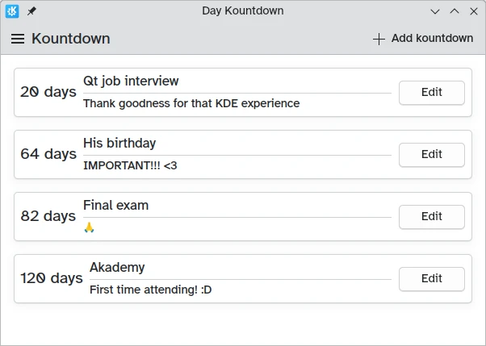

## Making our app useful

We have a window, we have cards, and we have actions. Yet, we still need to find some way of inputting a name, description, and date of our choice.

One way we could do this is by creating a new page where we place the required input elements. However, a whole page dedicated to providing a name, description, and date seems a bit excessive.

Instead, we'll be using a dialog.


## Opening the dialog

```qml
pageStack.initialPage: Kirigami.ScrollablePage {
    // ...
    actions: [
        Kirigami.Action {
            id: addAction
            icon.name: "list-add"
            text: i18nc("@action:button", "Add kountdown")
            onTriggered: addDialog.open()
        }
    ]
}
```

First we edit the action from the previous tutorial: just a [Kirigami.Action](docs:kirigami2;Action) that triggers the dialog's [open()](docs:qtquickcontrols;QtQuick.Controls.Popup::open) function.

## Countdown-adding dialogs

The new component we add is a [Kirigami.Dialog](docs:kirigami2;Dialog). Dialogs appear at the center of the window and can be used to provide extra information relevant to the current content. They can't be moved, but they adapt their own size to the window.

```qml
Kirigami.ApplicationWindow {
    // ...
    Kirigami.Dialog {
        id: addDialog
        title: i18nc("@title:window", "Add kountdown")
        standardButtons: Kirigami.Dialog.Ok | Kirigami.Dialog.Cancel
        padding: Kirigami.Units.largeSpacing
        preferredWidth: Kirigami.Units.gridUnit * 20

        // Form layouts help align and structure a layout with several inputs
        Kirigami.FormLayout {
            // Textfields let you input text in a thin textbox
            Controls.TextField {
                id: nameField
                // Provides a label attached to the textfield
                Kirigami.FormData.label: i18nc("@label:textbox", "Name*:")
                // What to do after input is accepted (i.e. pressed Enter)
                // In this case, it moves the focus to the next field
                onAccepted: descriptionField.forceActiveFocus()
            }
            Controls.TextField {
                id: descriptionField
                Kirigami.FormData.label: i18nc("@label:textbox", "Description:")
                placeholderText: i18n("Optional")
                // Again, it moves the focus to the next field
                onAccepted: dateField.forceActiveFocus()
            }
            Controls.TextField {
                id: dateField
                Kirigami.FormData.label: i18nc("@label:textbox", "ISO Date*:")
                // D means a required number between 1-9,
                // 9 means a required number between 0-9
                inputMask: "D999-99-99"
                // Here we confirm the operation just like
                // clicking the OK button
                onAccepted: addDialog.onAccepted()
            }
            Controls.Label {
                text: "* = required fields"
            }
        }
        // The dialog logic goes here
    }
    // ...
}
```

Dialogs by default have a [header](https://doc.qt.io/qt-6/qml-qtquick-controls-dialog.html#header-prop) and a [footer](https://doc.qt.io/qt-6/qml-qtquick-controls-dialog.html#footer-prop), both inherited from [Controls.Dialog](docs:qtquickcontrols;QtQuick.Controls.Dialog).

The header by default includes a [title](https://doc.qt.io/qt-6/qml-qtquick-controls-dialog.html#title-prop) and a close button that can be disabled with [showCloseButton](docs:kirigami2;Dialog::showCloseButton). The footer by default includes a close button, and it can be overridden with [standardButtons](https://doc.qt.io/qt-6/qml-qtquick-controls-dialog.html#standardButtons-prop).

We first set it to show an "Ok" button and a "Cancel" button, add some padding, and add a reasonable [preferredWidth](docs:kirigami2;Dialog::preferredWidth). The preferred width is the default expected size of the dialog, which can increase if needed. We can use standard [Kirigami.Units](docs:kirigami2;Kirigami::Platform::Units) that we will revisit later on.

Then we come to a [Kirigami.FormLayout](docs:kirigami2;FormLayout). Unlike a [ColumnLayout](https://doc.qt.io/qt-6/qml-qtquick-layouts-columnlayout.html), the layout of its child components is automatic and centered, with optional labels. As the name implies, it is used to create input forms.

These form layouts are designed to work with a variety of different input types, though we're sticking to simple [Controls.Textfield](docs:qtquickcontrols;QtQuick.Controls.TextField) inputs that give us simple text boxes to write things in.

We have created Textfield elements that act as:

1. Input for the name of our countdown
2. Input for the description of our countdown
3. Input for the date we are counting down towards, which must be provided in a `YYYY-MM-DD` format

Within each of these [Controls.Textfield](docs:qtquickcontrols;QtQuick.Controls.TextField) elements, we are setting a [Kirigami.FormData.label](docs:kirigami2;FormLayoutAttached::label) property that lets us define labels for them. The form will present the correct labels to the left of each of these text input fields.

Finally, we are also setting the [onAccepted](https://doc.qt.io/qt-6/qml-qtquick-textinput.html#accepted-signal) property to trigger the [forceActiveFocus()](https://doc.qt.io/qt-6/qml-qtquick-item.html#forceActiveFocus-method) method of the following field; this will switch the active field once the user hits the ENTER key, improving the usability of the form.

We have also set a property called [inputMask](https://doc.qt.io/qt-6/qml-qtquick-textinput.html#inputMask-prop) on the text field for our date. Setting this to `D999-99-99` prevents users from entering something that might break the functionality of the application (such as text), restricting them to only entering digits which we can then try to parse into a date object.

Once the user interface for the dialog is done, we need to change how it behaves. For this we need three things:

1. Show the Ok button only when the required fields are filled
2. Add the input information to the model
3. Clear the input form

```qml
Kirigami.Dialog {
    // ...
    // Once the Kirigami.Dialog is initialized,
    // we want to create a custom binding to only
    // make the Ok button visible if the required
    // text fields are filled.
    // For this we use Kirigami.Dialog.standardButton(button):
    Component.onCompleted: {
        const button = standardButton(Kirigami.Dialog.Ok);
        // () => is a JavaScript arrow function
        button.enabled = Qt.binding( () => requiredFieldsFilled() );
    }
    onAccepted: {
        // The binding is created, but we still need to make it
        // unclickable unless the fields are filled
        if (!addDialog.requiredFieldsFilled()) return;
        appendDataToModel();
        clearFieldsAndClose();
    }
}
```

The first thing that needs to be done is create a binding between the OK button's [enabled](https://doc.qt.io/qt-6/qml-qtquick-controls-popup.html#enabled-prop) property and a check on whether the fields are filled, which in this case needs to be done with [Qt.binding()](https://doc.qt.io/qt-6/qtqml-syntax-propertybinding.html#creating-property-bindings-from-javascript) in JavaScript. In effect, the line:

```qml
button.enabled = Qt.binding( () => requiredFieldsFilled() );
```

is similar to the QML bindings we have seen so far, like in the following pseudo-code:

```qml
enabled: requiredFieldsFilled()
```

The signal handler that triggers the Ok button is [onAccepted](https://doc.qt.io/qt-6/qml-qtquick-controls-dialog.html#accepted-signal). It remains empty and without doing anything if the required fields are filled; otherwise, it will add the input to the model and clear the dialog for the next time it is opened.

```qml
Kirigami.Dialog {
    // ...
    // We check that the nameField is not empty and that the
    // dateField (which has an inputMask) is completely filled
    function requiredFieldsFilled() {
        return (nameField.text !== "" && dateField.acceptableInput);
    }
    function appendDataToModel() {
        kountdownModel.append({
            name: nameField.text,
            description: descriptionField.text,
            date: new Date(dateField.text)
        });
    }
    function clearFieldsAndClose() {
        nameField.text = ""
        descriptionField.text = ""
        dateField.text = ""
        addDialog.close();
    }
}
```

For our required name field, all we need to do is to check whether the field text is an empty string. For the date field, because it has an input mask, we need to use [acceptableInput](https://doc.qt.io/qt-6/qml-qtquick-textinput.html#acceptableInput-prop) instead, which only becomes true once the whole field is filled and contains only acceptable characters.

Then, the [append()](https://doc.qt.io/qt-6/qml-qtqml-models-listmodel.html#append-method) method of our `kountdownModel` list model adds a JavaScript object including the properties we have provided.

Lastly, we make sure to clear the text fields by setting their [text](https://doc.qt.io/qt-6/qml-qtquick-textinput.html#text-prop) properties to an empty string, then [close()](docs:qtquickcontrols;QtQuick.Controls.Popup::close) it.

Once we save our files and build our program, we'll be able to add our own custom countdowns! We can make one last touch to improve the interface, namely remove the dummy countdown we had in the previous lessons:



Secondly now that we have an actual date to play around with, we can calculate the time until said date:



And thirdly increase the window size so that we have more room for our new cards:



Much nicer.

## Our app so far

<details>
<summary><b>Main.qml:</b></summary>



</details>


