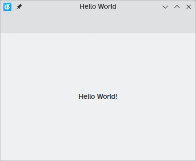

## Installing Kirigami

Before getting started, we will need to install Kirigami on our machine. There are three ways to do so:

* [Installing Kirigami from the repositories in your Linux distribution](#linux)
* [Building Kirigami with kdesrc-build](#kdesrc-build)
* [Installing Kirigami with Craft](#craft)

### Installing Kirigami from the repositories in your Linux distribution {#linux}

We need a C++ compiler, Qt development packages, and Kirigami. Open a terminal application and run one of the following, depending on which Linux distribution you are using:

{{< installpackage
  arch="base-devel extra-cmake-modules cmake qt6-base qt6-declarative kirigami ki18n kcoreaddons breeze qqc2-desktop-style"
  opensuse="cmake kf6-extra-cmake-modules kf6-kirigami-devel kf6-ki18n-devel kf6-kcoreaddons-devel qt6-base-devel qt6-declarative-devel qt6-quickcontrols2-devel qqc2-desktop-style"
  fedoraCommand=`sudo dnf groupinstall "Development Tools" "Development Libraries"
sudo dnf install cmake extra-cmake-modules kf6-kirigami2-devel kf6-ki18n-devel kf6-kcoreaddons-devel qt6-qtbase-devel qt6-qtdeclarative-devel qt6-qtquickcontrols2-devel qqc2-desktop-style` >}}

Further information for other distributions can be found [here](/docs/getting-started/building/help-dependencies).

If you wish to build Kirigami with Qt6, this is currently not possible with only distribution packages on Linux. You will need to resort to [kdesrc-build](#kdesrc-build) instead.

### Building Kirigami with kdesrc-build {#kdesrc-build}

KDE has a custom tool to easily build all of its libraries and programs: **kdesrc-build**. It can be used to build Kirigami on Linux and FreeBSD.

For this tutorial, you will need to follow the [setup instructions for kdesrc-build](/docs/getting-started/building/kdesrc-build-setup).

After that, you may simply run the following on a terminal:

```bash
kde-builder kirigami kcoreaddons ki18n breeze plasma-integration qqc2-desktop-style
```

### Installing Kirigami with Craft {#craft}

KDE has a custom tool to easily install most of its libraries and programs: **Craft**. It can be used to install Kirigami on [Linux](https://community.kde.org/Craft/Linux), [FreeBSD](https://community.kde.org/Guidelines_and_HOWTOs/Build_from_source/FreeBSD), [Windows](https://community.kde.org/Guidelines_and_HOWTOs/Build_from_source/Windows), [Android](https://community.kde.org/Craft/Android) and [macOS](https://community.kde.org/Guidelines_and_HOWTOs/Build_from_source/Mac).

You will need to follow the [setup instructions for Craft](https://community.kde.org/Craft). By the end of the setup, you should have run an environment setup file (`craftenv.ps1` or `craftenv.sh`), which will give you a terminal shell where you will be compiling your Kirigami application.

After that, you may simply run the following on a terminal:

```bash
craft kirigami kcoreaddons ki18n breeze kiconthemes qqc2-desktop-style
```



<details>
<summary>Click here to read more</summary>

When building the application after installing dependencies with Craft, just installing KIconThemes and Breeze ensures the application will be able to use Breeze icons on platforms like Windows, linking is not necessary. [qqc2-desktop-style](https://invent.kde.org/frameworks/qqc2-desktop-style) on the other hand is responsible for the nice looking style we want to enforce on those platforms.
</details>



If you close your terminal, you can simply run the environment setup file again to compile your app.

## Project structure

While there are tools that can easily set up our files, we are going to create them manually. This will let us better understand the pieces that are going to make up our new application.

First we create our project folder (you can use the commands below). We are going to call ours `kirigami-tutorial/`.

```
kirigami-tutorial/
├── CMakeLists.txt
├── org.kde.tutorial.desktop
└── src/
    ├── CMakeLists.txt
    ├── main.cpp
    └── Main.qml
```

Within this folder we are going to create a `src/` folder and `CMakeLists.txt`. It is generally considered good practice to place all our main C++ code files in a `src/` folder. We also put the `Main.qml` file in it since it will be run together with the executable.



You can quickly create this file structure with:

```bash
mkdir -p kirigami-tutorial/src
touch kirigami-tutorial/{CMakeLists.txt,org.kde.tutorial.desktop}
touch kirigami-tutorial/src/{CMakeLists.txt,main.cpp,Main.qml}
```





In case you want to automatically build the project with kde-builder/kdesrc-build, custom module name should be the same as the project root folder (in our case it will be "kirigami-tutorial"), otherwise you would need to customize the `source-dir` or `dest-dir` for the module. We will assume the path to your `main.cpp` will be `~/kde/src/kirigami-tutorial/src/main.cpp`.



### Main.qml



Here's where we will be handling our application's frontend.

If you know some Javascript, then much of QML will seem familiar to you (though it does have its own peculiarities). [Qt's documentation](https://doc.qt.io/qt-6/qtqml-index.html) has an extensive amount of material on this language if you feel like trying something on your own. Over the course of these tutorials we will be focusing much of our attention on our QML code, where we can use Kirigami to get the most out of it.

For now, let's focus on `Main.qml`. First we [import](https://doc.qt.io/qt-6/qtqml-syntax-imports.html) a number of important modules:

- [QtQuick](https://doc.qt.io/qt-6/qtquick-index.html), the standard library used in QML applications.
- [QtQuick Controls](https://doc.qt.io/qt-6/qtquickcontrols-index.html), which provides a number of standard controls we can use to make our applications interactive.
- [QtQuick Layouts](https://doc.qt.io/qt-6/qtquicklayouts-index.html), which provides tools for placing components within the application window.
- [Kirigami](docs:kirigami2), which provides a number of components suited for creating applications that work across devices of different shapes and sizes.



Putting the QtQuick Controls and Kirigami imports into separate namespaces using the `as` keyword is a best practice that ensures no components with the same name can conflict. You might see different names for QtQuick Controls in the wild, such as "QQC" or "QQC2". We will be using "Controls" in this tutorial for clarity.



We then come to our base element, [Kirigami.ApplicationWindow](docs:kirigami2;ApplicationWindow), which provides some basic features needed for all Kirigami applications. This is the window that will contain each of our pages, the main sections of our UI.

We then set the window's `id` property to "root". IDs are useful because they let us uniquely reference a component, even if we have several of the same type.

We also set the window `title` property to "Hello World". You'll notice that we have wrapped our "Hello World" string in a function called `i18nc()`, where we detail the context of the string as well as the string itself.



[i18n()](https://techbase.kde.org/Development/Tutorials/Localization/i18n#Translatable_Code_Using_i18n()) functions make your app more easily translatable, as they return a version of the provided string in the user's language (as long as your app has been localised for that language). While an English user might see our window title as "Hello World", a Spanish user would see "Hola Mundo".

[i18nc()](https://techbase.kde.org/Development/Tutorials/Localization/i18n#Adding_Context_with_i18nc()) builds on the `i18n()` function by allowing developers to provide some context to translators working on the app. Here we clarify that the UI component is the title of the application window, so we have included the string "@title:window" before "Hello World". See the [Ki18n Programmer's guide](https://api.kde.org/frameworks/ki18n/html/prg_guide.html#good_ctxt) for more details.



We then set the first page of our page stack. Most Kirigami applications are organised as a stack of pages, each page containing related components suited to a specific task. For now, we are keeping it simple, and sticking to a single page. [pageStack](docs:kirigami2;AbstractApplicationWindow::pageStack) is an initially empty stack of pages provided by [Kirigami.ApplicationWindow](docs:kirigami2;ApplicationWindow), and with `pageStack.initialPage: Kirigami.Page {...}` we set the first page presented upon loading the application to a [Kirigami.Page](docs:kirigami2;Page). This page will contain all our content.

Finally, we include in our page a [Controls.Label](docs:qtquickcontrols;QtQuick.Controls.Label) that lets us place text on our page. We use `anchors.centerIn: parent` to center our label horizontally and vertically within our parent element. In this case, the parent component of our label is [Kirigami.Page](docs:kirigami2;Page). The last thing we need to do is set its text: `text: i18n("Hello World!")`.

### org.kde.tutorial.desktop

The primary purpose of [Desktop Entry files](https://specifications.freedesktop.org/desktop-entry-spec/latest/) is to show your app on the application launcher on Linux. Another reason to have them is to have window icons on Wayland, as they are required to tell the compositor "this window goes with this icon".

It must follow a [reverse-DNS naming scheme](https://en.wikipedia.org/wiki/Reverse_domain_name_notation) followed by the `.desktop` extension such as `org.kde.tutorial.desktop`:



### CMakeLists.txt

`CMakeLists.txt` files are needed to use KDE's build system of choice, [CMake](https://cmake.org/). Our `kirigami-tutorial/CMakeLists.txt` file is going to specify some of our application's characteristics. It also includes some of the dependencies we need in order to compile our project.



The `CMakeLists.txt` defines how to build your projects. Most of the content here is just to bootstrap your project. You can read a line-by-line, in-depth explanation of what this CMakeLists file does [here](/docs/getting-started/kirigami/advanced-understanding_cmakelists/).

The most important thing to keep in mind is that the C++ build dependencies of Qt and KDE Frameworks are managed with [find_package()](https://cmake.org/cmake/help/latest/command/find_package.html) and QML runtime dependencies are managed with [ecm_find_qml_module()](https://api.kde.org/ecm/module/ECMFindQmlModule.html). You will have to modify these lines and include any additional components that you decide to use during the development of your application.

The line with `add_subdirectory(src)` points CMake to the `kirigami-tutorial/src/` directory, where our source code is located.

The line with `install()` tells CMake where to install the desktop file.

Let's delve into the `kirigami-tutorial/src/CMakeLists.txt` file in there.



This file consists of five steps:

1. create an executable
2. change the executable into a QML module that accepts QML files
3. add C++ and QML files to the executable
4. link the libraries necessary for the executable to run
5. install the executable to the right place

Next time you need to add more QML files, add them to the existing `ecm_target_qml_sources()` call. C++ files that use the [QML_ELEMENT](https://doc.qt.io/qt-6/qtqml-cppintegration-definetypes.html) keyword which we will see later in the tutorial can be added using `target_sources()`.

Now that CMake has been taken care of, let's look at the files we are going to spend the majority of our time working with.

### main.cpp

The file `kirigami-tutorial/src/main.cpp` handles the "business logic" of our application. C++ is handy because it is flexible and fast, even if it is more involved than other programming languages.

It also functions as the entrypoint to our application. The two parts of our project, the backend and the user interface, are both set up and started here.



For now, we don't need to go into too much detail regarding what our `main.cpp` code does, but its role will grow significantly more important once we decide to add more complex functionality to our application in the future.

If you want to get ahead, you can read more about how this `main.cpp` works in [Figuring out main.cpp](/docs/getting-started/kirigami/advanced-maincpp).

If you want to see a few ways on how the C++ code can be improved, like using [KAboutData](docs:kcoreaddons;KAboutData) for translatable application metadata, be sure to check our [KXmlGui tutorial](/docs/getting-started/kxmlgui).

For now, the part that interests us is this line:

```qml
engine.loadFromModule("org.kde.tutorial", "Main");
```

The first argument is the URI set in `kirigami-tutorial/src/CMakeLists.txt`, and the second argument is the name of the QML module we want to use (`Main`, coming from the name of our `Main.qml` file, which needs to start with an uppercase letter).



<details>
<summary>You might encounter this alternative way to load QML files in real code!</summary>
<br>

The old method of loading QML files had some disadvantages and after Qt6 it became excessively verbose:

```cpp
engine.load(QUrl(QStringLiteral("qrc:/qt/qml/org/kde/tutorial/qml/Main.qml")));
```

This [Qt resource URI](https://doc.qt.io/qt-6/resources.html) above follows the pattern `<resource_prefix><import_URI><optional_QML_dir><file>`. In this case:

* resource prefix = default / in Qt5, /qt/qml in Qt6
* import URI = /org/kde/tutorial, which matches the URI org.kde.tutorial
* optional QML dir = /qml, necessary if the QML files are stored in a directory called qml/
* file = the QML file

</details>



## Compiling and installing the application {#build}

We are almost at the finish line. The last thing we need to do is build and run our application. Doing so will depend on which platform you are on.

### Linux or FreeBSD

If you want kde-builder to handle building and installation of your project, you need to specify a custom module in your `~/.config/kdesrc-buildrc`:

```
...
module kirigami-tutorial
    no-src
end module
```

Then you can build and install it with the command:

```bash
kde-builder kirigami-tutorial
```

In case you want to handle building and installation manually without kdesrc-build, you will need to specify the place where the program will be installed. To do that, we need to change directories to our `kirigami-tutorial/` folder in our terminal application of choice and run the following commands:

```bash
cmake -B build/ -DCMAKE_INSTALL_PREFIX="~/.local"
cmake --build build/
cmake --install build/
```

The program will be installed to `~/.local/bin` and its desktop entry to `~/.local/share/applications`.

### Windows

If you are compiling your project with [Craft](#craft) on Windows, you might need to specify a CMake Generator for the first step, depending on whether you are using Visual Studio 2019 (msvc) or MinGW (make) to compile your projects.

If Visual Studio:

```bash
cmake -B build/ -G "Visual Studio 16 2019"`
cmake --build build/
cmake --install build/
```

If MinGW:

```bash
cmake -B build/ -G "MinGW Makefiles"
cmake --build build/
cmake --install build/
```

In both cases, the program will be installed to `C:\CraftRoot\bin`.

## Running the application

You can then run the `kirigami-hello` program with:

```bash
kirigami-hello # On Linux, manually
kde-builder --run kirigami-hello # On Linux, with kde-builder
kdesrc-build --run --exec kirigami-hello kirigami-tutorial # On Linux, with kdesrc-build
kirigami-hello.exe # On Windows
```

Voilà! Now you will see your very first Kirigami app appear before your very own eyes.



To run the new QML application in mobile mode, you can use `QT_QUICK_CONTROLS_MOBILE=1`:

```bash
QT_QUICK_CONTROLS_MOBILE=1 kirigami-hello
```

If you ever need to uninstall your application from your system, you can run:

```bash
cmake --build build --target uninstall
```



Next time you want to create the files and folders needed, you can use [KAppTemplate](https://apps.kde.org/kapptemplate) or [KDevelop](https://apps.kde.org/kdevelop/) to automatically generate a suitable project to start from. They are available from each major distribution's repositories. These applications will also generate files containing [AppStream](https://www.freedesktop.org/software/appstream/docs/sect-Metadata-Application.html) metadata and a `.desktop` file that contains information about how the application should be displayed in a linux application launcher.

Thanks to the magic of CMakeLists, you can also use IDEs such as KDevelop or [QtCreator](https://www.qt.io/product/development-tools) to develop this application within a comfortable environment with minimal effort.


