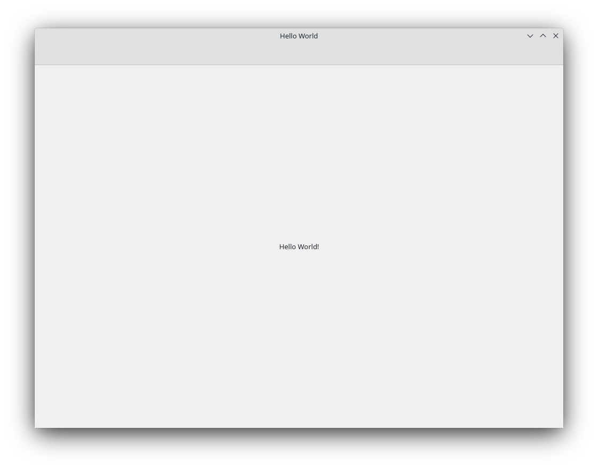

## Installing Kirigami

Before getting started, we will need to install Kirigami on our machine. There are three ways to do so:

* [Installing Kirigami from the repositories in your Linux distribution]()
* [Building Kirigami with kdesrc-build]()
* [Installing Kirigami with Craft]()

### Installing Kirigami from the repositories in your Linux distribution {#linux}

We need a C++ compiler, Qt development packages, and Kirigami. Open a terminal application and run one of the following, depending on which Linux distribution you are using:

{{< installpackage
  ubuntu="build-essential cmake extra-cmake-modules qtbase5-dev qtdeclarative5-dev qtquickcontrols2-5-dev kirigami2-dev libkf5i18n-dev gettext libkf5coreaddons-dev"
  arch="base-devel extra-cmake-modules cmake qt5-base qt5-declarative qt5-quickcontrols2 kirigami2 ki18n kcoreaddons breeze"
  opensuseCommand=`sudo zypper install --type pattern devel_C_C++
sudo zypper install cmake extra-cmake-modules libQt5Core-devel libqt5-qtdeclarative-devel libQt5QuickControls2-devel kirigami2-devel ki18n-devel kcoreaddons-devel qqc2-breeze-style`
  fedoraCommand=`sudo dnf groupinstall "Development Tools" "Development Libraries"
sudo dnf install cmake extra-cmake-modules qt5-qtbase-devel qt5-qtdeclarative-devel qt5-qtquickcontrols2-devel kf5-kirigami2-devel kf5-ki18n-devel kf5-kcoreaddons-devel qqc2-breeze-style` >}}

Further information for other distributions can be found [here](https://community.kde.org/Guidelines_and_HOWTOs/Build_from_source/Install_the_dependencies).

If you wish to build Kirigami with Qt6, this is currently not possible with only distribution packages on Linux. You will need to resort to [kdesrc-build]() instead.

### Building Kirigami with kdesrc-build {#kdesrc-build}

KDE has a custom tool to easily build all of its libraries and programs: **kdesrc-build**. It can be used to build Kirigami on Linux and FreeBSD.

You will need to follow the [setup instructions for kdesrc-build](https://community.kde.org/Get_Involved/development/Set_up_a_development_environment) first, then copy the sample KF5 file to your home:

```bash
cp ~/kde/src/kdesrc-build/kdesrc-buildrc-kf5-sample ~/.config/kdesrc-buildrc
```

After that, you may simply run the following on a terminal:

```bash
kdesrc-build kirigami kconfig kcoreaddons ki18n
source ~/kde5/build/kirigami/prefix.sh
```

And then you may compile your Kirigami projects on the same terminal shell you used to source the prefix file. If you close your terminal, you can simply source the file again to compile your app.

### Installing Kirigami with Craft {#craft}

KDE has a custom tool to easily install most of its libraries and programs: **Craft**. It can be used to install Kirigami on [Linux](https://community.kde.org/Craft/Linux), [FreeBSD](https://community.kde.org/Guidelines_and_HOWTOs/Build_from_source/FreeBSD), [Windows](https://community.kde.org/Guidelines_and_HOWTOs/Build_from_source/Windows), [Android](https://community.kde.org/Craft/Android) and [macOS](https://community.kde.org/Guidelines_and_HOWTOs/Build_from_source/Mac).

You will need to follow the [setup instructions for Craft](https://community.kde.org/Craft). By the end of the setup, you should have run an environment setup file (`craftenv.ps1` or `craftenv.sh`), which will give you a terminal shell where you will be compiling your Kirigami application.

After that, you may simply run the following on a terminal:

```bash
craft kirigami kconfig kcoreaddons ki18n
```

If you close your terminal, you can simply run the environment setup file again to compile your app.

## Project structure

While there are tools that can easily set up our files, we are going to create them manually. This will let us better understand the pieces that are going to make up our new application.

First we create our project folder. We are going to call ours "helloworld".

```
helloworld/
├── CMakeLists.txt
└── src/
    ├── CMakeLists.txt
    ├── main.cpp
    ├── resources.qrc
    └── contents/
        └── ui/
            └── main.qml
```

Within this folder we are going to create a `src/` folder and `CMakeLists.txt`. It is generally considered good practice to place all our main code files in a `src/` folder. Our `src/` folder in turn will contain a folder named `contents/`, which itself contains a folder called `ui/`. Here is where we will create our QML files.



You can quickly create this file structure with:
```bash
mkdir -p helloworld/src/contents/ui
touch helloworld/CMakeLists.txt
touch helloworld/src/{CMakeLists.txt,main.cpp,resources.qrc}
touch helloworld/src/contents/ui/main.qml
```

Alternatively, you may want to use the standard Kirigami template provided by [KDevelop](https://apps.kde.org/kdevelop/), KDE's main IDE for coding in C++ and QML. [KAppTemplate](https://apps.kde.org/kapptemplate/) is also available if you only need a quick template to start coding in your favorite IDE or text editor.



This is a KDE convention, but not all KDE projects use this structure. You are free to set things up differently, but you will have to take this into account when creating your `CMakeLists.txt` and `resources.qrc` files.

### main.qml



Here's where we will be handling our application's frontend.

If you know some Javascript, then much of QML will seem familiar to you (though it does have its own peculiarities). [Qt's documentation](https://doc.qt.io/qt-5/qtqml-index.html) has an extensive amount of material on this language if you feel like trying something on your own. Over the course of these tutorials we will be focusing much of our attention on our QML code, where we can use Kirigami to get the most out of it.

For now, let's focus on `main.qml`. First we [import](https://doc.qt.io/qt-6/qtqml-syntax-imports.html) a number of important modules:

- [QtQuick](https://doc.qt.io/qt-6/qtquick-index.html), the standard library used in QML applications.
- [QtQuick Controls](https://doc.qt.io/qt-6/qtquickcontrols-index.html), which provides a number of standard controls we can use to make our applications interactive.
- [QtQuick Layouts](https://doc.qt.io/qt-6/qtquicklayouts-index.html), which provides tools for placing components within the application window.
- [Kirigami](docs:kirigami2), which provides a number of components suited for creating applications that work across devices of different shapes and sizes.



Putting the QtQuick Controls and Kirigami imports into separate namespaces using the `as` keyword is a best practice that ensures no components with the same name can conflict. You might see different names for QtQuick Controls in the wild, such as "QQC" or "QQC2". We will be using "Controls" in this tutorial for clarity.



We then come to our base element, [Kirigami.ApplicationWindow](docs:kirigami2;ApplicationWindow), which provides some basic features needed for all Kirigami applications. This is the window that will contain each of our pages, the main sections of our UI.

We then set the window's `id` property to "root". IDs are useful because they let us uniquely reference a component, even if we have several of the same type.

We also set the window `title` property to "Hello World". You'll notice that we have wrapped our "Hello World" string in a function called `i18nc()`, where we detail the context of the string as well as the string itself.



[i18n()](https://techbase.kde.org/Development/Tutorials/Localization/i18n#Translatable_Code_Using_i18n()) functions make your app more easily translatable, as they return a version of the provided string in the user's language (as long as your app has been localised for that language). While an English user might see our window title as "Hello World", a Spanish user would see "Hola Mundo".

[i18nc()](https://techbase.kde.org/Development/Tutorials/Localization/i18n#Adding_Context_with_i18nc()) builds on the `i18n()` function by allowing developers to provide some context to translators working on the app. Here we clarify that the UI component is the title of the application window, so we have included the string "@title:window" before "Hello World". See the [Ki18n Programmer's guide](https://api.kde.org/frameworks/ki18n/html/prg_guide.html#good_ctxt) for more details.



We then set the first page of our page stack. Most Kirigami applications are organised as a stack of pages, each page containing related components suited to a specific task. For now, we are keeping it simple, and sticking to a single page. [pageStack](docs:kirigami2;AbstractApplicationWindow::pageStack) is an initially empty stack of pages provided by [Kirigami.ApplicationWindow](docs:kirigami2;ApplicationWindow), and with `pageStack.initialPage: Kirigami.Page {...}` we set the first page presented upon loading the application to a [Kirigami.Page](docs:kirigami2;Page). This page will contain all our content.

Finally, we include in our page a [Controls.Label](docs:qtquickcontrols;QtQuick.Controls.Label) that lets us place text on our page. We use `anchors.centerIn: parent` to center our label horizontally and vertically within our parent element. In this case, the parent component of our label is [Kirigami.Page](docs:kirigami2;Page). The last thing we need to do is set its text: `text: i18n("Hello World!")`.

### main.cpp

`main.cpp` handles the "business logic" of our application. C++ is handy because it is flexible and fast, even if it is more involved than other programming languages.

`main.cpp` is also the entrypoint to our application. The two parts of our project, the backend and the user interface, are both set up and started here.



For now, we don't need to go into too much detail regarding what our `main.cpp` code does, but its role will grow significantly more important once we decide to add more complex functionality to our application in the future. If you want to get ahead, you can read more about how this `main.cpp` works in [this page](/docs/getting-started/kirigami/advanced-maincpp).

### resources.qrc

Our `resources.qrc` is a [Qt Resource file](https://doc.qt.io/qt-5/resources.html). It contains the list of all QML files as well as other files (like custom icons) that will be included in the binary.



Notice the line `<file alias="main.qml">contents/ui/main.qml</file>`. It details which QML files are going to be included in the compilation process. In our case we are only using `main.qml`, but if we were to add more QML files to our code, we'd need to make sure we include it in `resources.qrc` file by adding another line like this one.

This resource file lets us use the "qrc:" + "/main.qml" path in our `main.cpp`, instead of needing to specify the whole "contents/ui/main.qml" path.

### CMakeLists.txt

`CMakeLists.txt` files are needed to use KDE's build system of choice, [CMake](https://cmake.org/). The `CMakeLists.txt` file in our top-level folder is going to specify some of our application's characteristics. It also includes some of the dependencies we need in order to compile our project.



The `CMakeLists.txt` defines how to build your projects. Most of the content here is just to bootstrap your project. You can read a line-by-line, in-depth explanation of what this CMakeLists file does [here](/docs/getting-started/kirigami/advanced-understanding_cmakelists/).

The most important thing to keep in mind is that the Qt and KDE Frameworks dependencies are managed with [find_package()](https://cmake.org/cmake/help/latest/command/find_package.html). You will have to modify these lines and include any additional components that you decide to use during the development of your application.

The final line, `add_subdirectory(src)`, points CMake to the `helloworld/src/` directory, where our source code is located. Let's delve into the `helloworld/src/CMakeLists.txt` file in there.



This one's a lot shorter! Let's go through what it does:

- [add_executable()](https://cmake.org/cmake/help/latest/command/add_executable.html) creates an executable from the given source files.
- [target_link_libraries()](https://cmake.org/cmake/help/latest/command/target_link_libraries.html) links the libraries used in our code to our executable.



Note that these libraries should match the components that we included in our previous `CMakeLists.txt` file—otherwise these components will not be included and our application won't compile.



Now that CMake has been taken care of, let's look at the files we are going to spend the majority of our time working with.

## Compiling and running the application

We are almost at the finish line. The last thing we need to do is build and compile our application. To do that, we need to enter our `helloworld/` folder in our terminal application of choice and run the following commands:

```bash
cmake -B build/
cmake --build build/
```

If you are compiling your project with [Craft]() on Windows, you might need to specify a CMake Generator for the first step, depending on whether you are using Visual Studio 2019 (msvc) or MinGW (make) to compile your projects.

* If Visual Studio: `cmake -B build/ -G "Visual Studio 16 2019"`
* If MinGW: `cmake -B build/ -G "MinGW Makefiles"`

And launch it with:

```bash
./build/bin/helloworld
```

Voilà! Now you will see your very first Kirigami app appear before your very own eyes.





Next time you want to create the files and folders needed, you can use [KAppTemplate](https://apps.kde.org/kapptemplate) or [KDevelop](https://apps.kde.org/kdevelop/) to automatically generate a suitable project to start from. They are available from each major distribution's repositories. These applications will also generate files containing [AppStream](https://www.freedesktop.org/software/appstream/docs/sect-Metadata-Application.html) metadata and a `.desktop` file that contains information about how the application should be displayed in a linux application launcher.

Thanks to the magic of CMakeLists, you can also use IDEs such as KDevelop or [QtCreator](https://www.qt.io/product/development-tools) to develop this application within a comfortable environment with minimal effort.


