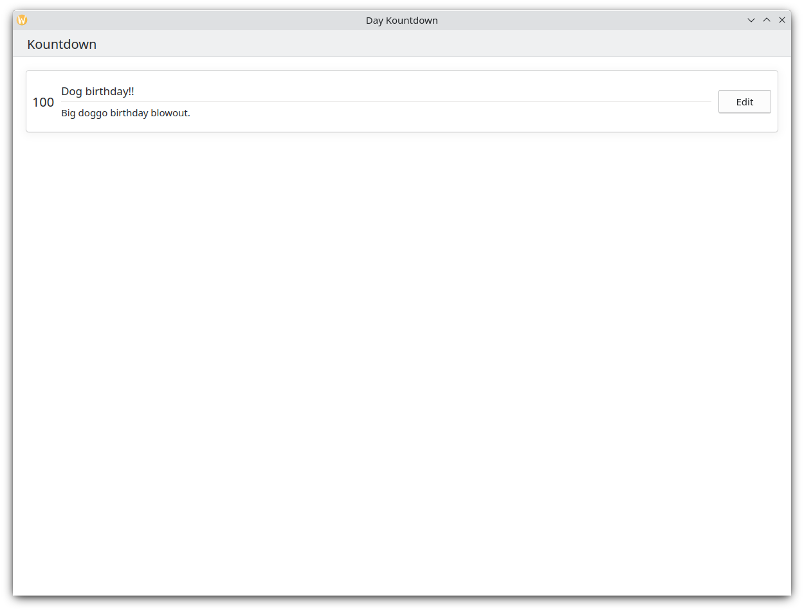



# Laying out your content

Now that we understand how pages work, it is time to add stuff to them. We will be going through a number of important layout components and elements that will be useful when designing our app.

By the end of this section you'll have a neat-looking app.

## ListViews

If you've ever used [Discover](https://apps.kde.org/discover/), [NeoChat](https://apps.kde.org/neochat/), or Plasma's System Settings, you will have come across a [ListView](https://doc.qt.io/qt-6/qml-qtquick-listview.html). Quite simply, it lets you display data on a list.

```qml
pageStack.initialPage: Kirigami.ScrollablePage {
    // ...
    Kirigami.CardsListView {
       id: cardsView
        model: kountdownModel
        delegate: kountdownDelegate
    }
}
```

That seems cryptic, but don't worry. Let's start from the beginning.

We add this component inside our [Kirigami.ScrollablePage](docs:kirigami2;ScrollablePage) from the last tutorial.

We're using [Kirigami.CardsListView](docs:kirigami2;CardsListView), which is a [ListView](https://doc.qt.io/qt-6/qml-qtquick-listview.html) that allows us to easily display cards in a list. However, ListViews are made to show data taken from a model - to automatically populate itself from a set of data that we point it to. That's where the `model` property comes in: in this example, it's pointing to `kountdownModel`.

### Model

```qml
Kirigami.ApplicationWindow {
    // ...
    ListModel {
        id: kountdownModel
        // Each ListElement is an element on the list, containing information
        ListElement {
            name: "Dog birthday!!"
            description: "Big doggo birthday blowout."
            date: 100
        }
    }
    // ...
}
```

We add our `kountdownModel` inside the [Kirigami.ApplicationWindow](docs:kirigami2;ApplicationWindow) from the last tutorial.

A model defines the way that a data entry is structured. Our `kountdownModel` will consist of only one element for now. By looking at our [ListElement](https://doc.qt.io/qt-6/qml-qtqml-models-listelement.html) above, we can see how the data of our `kountdownModel` are structured: it contains a name, a description, and a date. This isn't set in stone, and you may have different sorts of data in your model. The first two are just strings, and the third is a number we're using as a placeholder.



Since QML is built on top of JavaScript, many of this language's features are available for use in QML files. However, QML variables have to be prefixed with `property`, unless it is inside a JS code block. You can read more about it in [this page](https://doc.qt.io/qt-6/qtqml-javascript-topic.html).



Models are also useful in how they can be modified through the use of several methods. Some important ones are:
- [ListModel.append(yourobject: jsobject)](https://doc.qt.io/qt-6/qml-qtqml-models-listmodel.html#append-method) adds a JavaScript object (JSObject) `yourobject` to the ListModel and places it after the last item in the model. For this to happen correctly, you must provide a JSObject with the correct properties and corresponding datatypes.
- [ListModel.get(index: int)](https://doc.qt.io/qt-6/qml-qtqml-models-listmodel.html#get-method) returns the JSObject at the index location you provide.
- [ListModel.remove(index: int, count: int)](https://doc.qt.io/qt-6/qml-qtqml-models-listmodel.html#remove-method) removes the JSObject at the provided `index` location, and as many after that index location as you put in `count` (1 includes only the JSObject at the provided index)
- [ListModel.set(index: int, yourobject: jsobject)](https://doc.qt.io/qt-6/qml-qtqml-models-listmodel.html#set-method) changes the item at the provided `index` location with the values provided in `yourobject`. Same rules as with `append()`.

### Delegates

While our `kountdownModel` contains the data that will be displayed, our `kountdownDelegate` will handle how the data will be displayed in the [ListView](https://doc.qt.io/qt-6/qml-qtquick-listview.html). For that we use a [Kirigami.CardsListView](docs:kirigami2;CardsListView) designed to display card-type delegates, and those delegates will be visually represented by means of a [Kirigami.AbstractCard](docs:kirigami2;AbstractCard).

Delegates automatically receive the properties of the [ListElements](https://doc.qt.io/qt-6/qml-qtqml-models-listelement.html) that we have specified in our model. We can therefore just refer to their `name`, `description`, and `date` properties as if they were conventional variables within our delegate.

### Building the delegate card

The [Component](docs:qtqml;QtQml.Component) that will represent our delegate can be added inside our [Kirigami.ApplicationWindow](docs:kirigami2;ApplicationWindow). We will then check what each part of our delegate component does.

```qml
Kirigami.ApplicationWindow {
    // ...
    Component {
        id: kountdownDelegate
        Kirigami.AbstractCard {
            contentItem: Item {
                // implicitWidth/Height define the natural width/height
                // of an item if no width or height is specified.
                // The setting below defines a component's preferred size based on its content
                implicitWidth: delegateLayout.implicitWidth
                implicitHeight: delegateLayout.implicitHeight
                GridLayout {
                    id: delegateLayout
                    anchors {
                        left: parent.left
                        top: parent.top
                        right: parent.right
                    }
                    rowSpacing: Kirigami.Units.largeSpacing
                    columnSpacing: Kirigami.Units.largeSpacing
                    columns: root.wideScreen ? 4 : 2

                    Kirigami.Heading {
                        level: 1
                        text: date
                    }

                    ColumnLayout {
                        Kirigami.Heading {
                            Layout.fillWidth: true
                            level: 2
                            text: name
                        }
                        Kirigami.Separator {
                            Layout.fillWidth: true
                            visible: description.length > 0
                        }
                        Controls.Label {
                            Layout.fillWidth: true
                            wrapMode: Text.WordWrap
                            text: description
                            visible: description.length > 0
                        }
                    }
                    Controls.Button {
                        Layout.alignment: Qt.AlignRight
                        Layout.columnSpan: 2
                        text: i18n("Edit")
                        // onClicked: to be done... soon!
                    }
                }
            }
        }
    }
    // ...
}
```

#### implicitWidth and implicitHeight

The first part we will take a look at is how to manage the width and height of our component:

```qml
Kirigami.AbstractCard {
    contentItem: Item {
        implicitWidth: delegateLayout.implicitWidth
        implicitHeight: delegateLayout.implicitHeight
        GridLayout {
            id: delegateLayout
            // ...
        }
    }
}
```

Looking at our [Kirigami.AbstractCard](docs:kirigami2;AbstractCard), the first properties we set are [implicitWidth](https://doc.qt.io/qt-6/qml-qtquick-item.html#implicitWidth-prop) and [implicitHeight](https://doc.qt.io/qt-6/qml-qtquick-item.html#implicitHeight-prop). We have set these to the `delegateLayout.implicitWidth` and `delegateLayout.implicitHeight`, i.e. the `implicitWidth` and `implicitHeight` of the `GridLayout` element.

Implicit widths and heights are properties available in any [Item](docs:qtquick;QtQuick.Item) that function as hints and are set as a default, or as a fallback, if there is no explicit width or height set for these components. These values default to 0x0, so it is very important that you define those in raw Item components as done above.

Here we have set the `implicitWidth` and `implicitHeight` of our [Kirigami.AbstractCard](docs:kirigami2;AbstractCard) to that of the [GridLayout](https://doc.qt.io/qt-6/qml-qtquick-layouts-gridlayout.html) below to ensure it does not spill out of the card. This way, the card takes as much space is necessary for its contents.

#### Layouts

The [GridLayout](https://doc.qt.io/qt-6/qml-qtquick-layouts-gridlayout.html) is inside the [Item](https://doc.qt.io/qt-6/qml-qtquick-item.html) component we have provided for the property [contentItem](https://doc.qt.io/qt-6/qml-qtquick-controls2-control.html#contentItem-prop). This is the [Item](https://doc.qt.io/qt-6/qml-qtquick-item.html) that contains what will be displayed in your card.

We also need to choose a [layout](https://doc.qt.io/qt-6/qtquicklayouts-index.html) for our components so that they don't just pile on top of each other. There are three main types that we can choose from:
- [ColumnLayout](https://doc.qt.io/qt-6/qml-qtquick-layouts-columnlayout.html) lays out your components vertically, in a single column
- [RowLayout](https://doc.qt.io/qt-6/qml-qtquick-layouts-rowlayout.html) lays out your components horizontally, in a single row
- [GridLayout](https://doc.qt.io/qt-6/qml-qtquick-layouts-gridlayout.html) lays out your components in a grid with a composition of your choosing

With [ColumnLayout](https://doc.qt.io/qt-6/qml-qtquick-layouts-columnlayout.html) and [RowLayout](https://doc.qt.io/qt-6/qml-qtquick-layouts-rowlayout.html), all we have to do is write our components inside the Layout component. As you can see, we went with a [GridLayout](https://doc.qt.io/qt-6/qml-qtquick-layouts-gridlayout.html), which entails a bit more handiwork.


```qml
GridLayout {
    id: delegateLayout
    anchors {
        left: parent.left
        top: parent.top
        right: parent.right
    }
    rowSpacing: Kirigami.Units.largeSpacing
    columnSpacing: Kirigami.Units.largeSpacing
    columns: root.wideScreen ? 4 : 2
    // ...
}

```

The first thing you see is our `anchors`. [QtQuick's anchoring system](https://doc.qt.io/qt-6/qtquick-positioning-anchors.html) provides a useful way of making sure your components are positioned in certain parts of a parent component. We have anchored our [GridLayout](https://doc.qt.io/qt-6/qml-qtquick-layouts-gridlayout.html) to the left, top, and right of the parent card, ensuring our content stretches across the whole card.

Next we specify the spacing between the rows and columns within our grid, so that our components don't bunch up. Kirigami provides a number of handy [predefined units](docs:kirigami2;Kirigami::Platform::Units) to use for this purpose:

| Kirigami Unit | Pixels |
| ------------- | ------ |
| smallSpacing  | 4px    |
| largeSpacing  | 8px    |
| gridUnit      | 18px   |



KDE's Visual Design Group (VDG) has a lot more information about the different units defined within Plasma and Kirigami on the [Human Interface Guidelines](/hig/layout/units/).



As you might remember, `root` is the id of our [Kirigami.ApplicationWindow](docs:kirigami2;ApplicationWindow). It provides the [wideScreen](docs:kirigami2;AbstractApplicationWindow::wideScreen) property, used to determine whether the current device screen is a widescreen (i.e. a computer monitor or a phone in landscape). We use a [ternary conditional](https://developer.mozilla.org/en-US/docs/Web/JavaScript/Reference/Operators/Conditional_operator) here to vary the number of columns in our grid depending on the screen we are using: if it's a widescreen, the grid will have 4 columns, else it will have 2.

#### Inner components

We could just create three labels within our delegate component and call it a day, but that wouldn't look particularly nice. We'll make use of a few more convenient components:

```qml
GridLayout {
    // ...
    Kirigami.Heading {
        Layout.fillHeight: true
        level: 1
        text: date
    }

    ColumnLayout {
        Kirigami.Heading {
            Layout.fillWidth: true
            level: 2
            text: name
        }

        Kirigami.Separator {
            Layout.fillWidth: true
            visible: description.length > 0
        }

        Controls.Label {
            Layout.fillWidth: true
            wrapMode: Text.WordWrap
            text: description
            visible: description.length > 0
        }
    }

    Controls.Button {
        Layout.alignment: Qt.AlignRight
        Layout.columnSpan: 2
        text: i18n("Edit")
    }
}
```



- Left, [Kirigami.Heading](docs:kirigami2;Heading): uses the `ListElement`'s `date` as a level 1 heading.

- Middle, [ColumnLayout](https://doc.qt.io/qt-6/qml-qtquick-layouts-columnlayout.html): has a [Kirigami.Heading](docs:kirigami2;Heading) that displays the task name; a [Kirigami.Separator](docs:kirigami2;Separator), which provides the horizontal line; and a [Controls.Label](docs:qtquickcontrols;QtQuick.Controls.Label), that displays a task's optional description. The latter two components have a [visible](https://doc.qt.io/qt-6/qml-qtquick-item.html#visible-prop) property, which checks if the description is empty or not and displays the components depending on the result of `description.length > 0`.

- Right, [Controls.Button](docs:qtquickcontrols;QtQuick.Controls.Button): a button that will do something... soon!

# Our app so far

<details>
<summary><b>Main.qml:</b></summary>



</details>



So there is our basic card!

With these steps, we have now laid the basic groundwork for adding all the functionality to our app.
