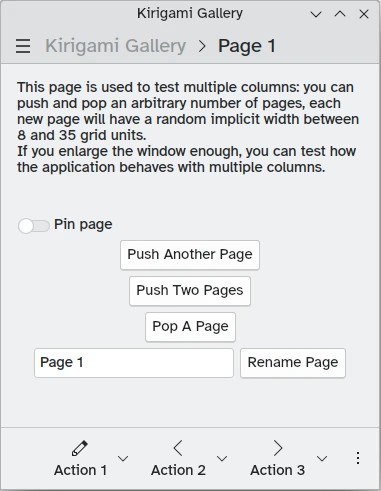
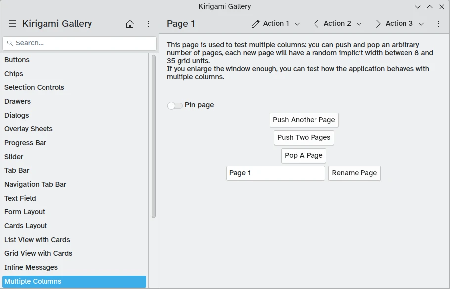

# Our app

In the previous tutorial, we managed to set up, build, and compile our first Kirigami application. With the basics in place, we can begin our journey towards creating a fully-featured application.

These tutorials will focus on creating an application that lets the user see how many days are left until an event of their choice. That doesn't mean you shouldn't deviate and try to create your own thing! Just make sure you pay close attention to how things work *first*, so that you can adjust when things are different in your own code. We also recommend you check out the [Kirigami Gallery](https://apps.kde.org/en/kirigami2.gallery), which provides a number of useful UI examples and easy access to all the code.

In this section we'll be focusing on pages, one of the key structural elements of any Kirigami application.

## Pages

Kirigami apps are typically organized in [Pages](docs:kirigami2;Page). Those are the different "screens" of an app. You will want to have a page dedicated to specific aspects of your app's interaction, and to make things easier you can create different QML files, one for each page.

Pages are organized in a [page stack](docs:qtquickcontrols;QtQuick.Controls.StackView) where they can be pushed and popped. On a phone only the top-most page is shown, whereas on a larger screen (desktop or tablet), if desired, multiple pages can be shown next to each other.







KDE has [Human Interface Guidelines (HIG)](/hig/introduction/architecture/) that go into detail about how to best design your application. The guidelines help ensure your application remains usable, consistent, and aesthetic.

A [Kirigami.Page](docs:kirigami2;Page) inherits from a [Controls.Page](docs:qtquickcontrols;QtQuick.Controls.Page), and as such you can use the latter's properties as well.



Let's go back to the `main.qml` file we created in our previous tutorial:



We make our application start to our [Kirigami.Page](docs:kirigami2;Page). All we have included in it is a label containing "Hello World", but we're going to spruce things up a little.

The idea behind our app is that we're going to be able to display a bunch of countdowns to the user. The problem with a normal [Kirigami.Page](docs:kirigami2;Page) is that it has a fixed vertical size, but don't worry: Kirigami also supports scrollable pages. [Kirigami.ScrollablePage](docs:kirigami2;ScrollablePage) is going to be our main page now.



If you've gone ahead of the tutorial, you might have noticed that there is also such a thing as a [ScrollView](docs:qtquickcontrols;QtQuick.Controls.ScrollView) that you can use to contain your components. However, do NOT put a `ScrollView` inside a `ScrollablePage` as this can cause problems. Children of a `ScrollablePage` are functionally already in a `ScrollView`.





Kirigami pages also feature neat titles placed within the toolbar, quickly indicating to the user which page they are on. All we need to do is to set a page title using the `title` property of [Kirigami.ScrollablePage](docs:kirigami2;ScrollablePage). In this case, we used one of the `i18nc()` functions we explored in our previous tutorial to this end.



You could also choose to define your page within its own QML document. To do so, you'd create the new QML file, for example "StartPage.qml", add it to your `resources.qrc` file, and set the window's first page to load it, like so:

```js
pageStack.initialPage: Qt.resolvedUrl("StartPage.qml")
```

`pageStack.initialPage` sets the initial Page of the application's page stack, and [Qt.resolvedUrl](docs:qtqml;QtQml.Qt::resolvedUrl) converts the relative URL of the QML file into an absolute one.

There is further information about alternative page structures [within our Kirigami documentation](/docs/getting-started/kirigami/components-pagerow_pagestack).


