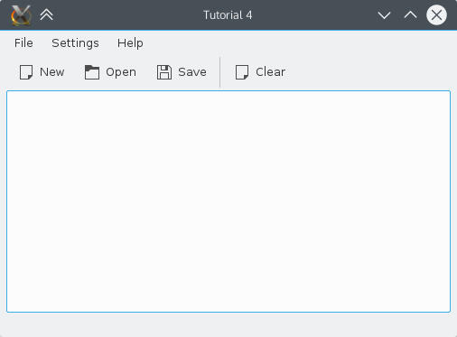

## Introduction

Now that we have a basic text editor interface, it's time to make it do something useful. At the most basic, a text editor needs to be able to load files from data storage, save files that you've created/edited, and create new files.

The KDE Frameworks provides a number of classes for working with files that make life a lot easier for developers. The KIO framework allows you to easily access files through network-transparent protocols. At the same time, Qt also provides standard file dialogs for opening and saving files.



## The Code

### main.cpp

Nothing changed here.

### mainwindow.h



Since we want to add the ability to load and save files, we must add the functions which will do the work. Since the functions will be called through [Qt's signal/slot ](http://doc.qt.io/qt-5/signalsandslots.html) mechanism we must specify that these functions are slots. Since we are using slots in this header file, we must also add the [Q_OBJECT ](http://doc.qt.io/qt-5/qobject.html#Q_OBJECT) macro. 

We also want to keep track of the filename of the currently opened file so we declare a [QString ](https://doc.qt.io/qt-5/qstring.html) `fileName`. 

### mainwindow.cpp



We'll get into the details of mainwindow.cpp in a while. 

### savingloadingui.rc

This is identical to usingactionsui.rc from the [previous tutorial](../using_actions) except the name has changed to 'savingloading'. We do not need to add any information about any of the  since the placement of those actions is handled automatically by XMLGUI system. 

## Explanation

Okay, now to implement the code that will do the loading and saving. This will all be happening in `mainwindow.cpp`.

The first thing we do is add `fileName(QString())` to the MainWindow constructor list to make sure that fileName is empty right from the beginning. 

### Adding the actions

The first thing we are going to do is provide the outward interface for the user so they can tell the application to load and save. Like with the quit action in [previous tutorial](../using_actions), we will use . We add the actions in the same way as for the quit action and, for each one, we connect it to the appropriate slot that we declared in the header file. 

### Creating a new document

The first function we create is the `newFile()` function. 

```cpp
void MainWindow::newFile()
{
  fileName.clear();
  textArea->clear();
}
```

`fileName.clear()` sets the `fileName` QString to be empty to reflect the fact that this document does not yet have a presence on storage. `textArea->clear()` then clears the central text area using the same function that we connected the clear QAction to in [previous tutorial](../using_actions).


This simple example simply clears the text area without checking if the file has been saved first. It's only meant as a demonstration of file I/O and not as an example of best programming practices.


### Saving a file


To make this tutorial simple, this example program can only save to local storage even though it can open any file from any location, even those from remote sources.


### saveFileToDisk(const QString &)

Now we get onto our first file handling code. We're going to implement a function which will save the contents of the text area to the file name given as a parameter. Qt provides a class for safely saving a file called [QSaveFile ](https://doc.qt.io/qt-5/qsavefile.html).

The function's prototype is

```cpp
void MainWindow::saveFileAs(const QString &outputFileName)
```

We then create our QSaveFile object and open it with

```cpp
QSaveFile file(outputFileName);
file.open(QIODevice::WriteOnly);
```

Now that we have our file to write to, we need to format the text in the text area to a format which can be written to file. For this, we create a [QByteArray ](https://doc.qt.io/qt-5/qbytearray.html) and fill it with the plain text version of whatever is in the text area:

```cpp
QByteArray outputByteArray;
outputByteArray.append(textArea->toPlainText().toUtf8());
```

Now that we have our `QByteArray`, we use it to write to the file with `QSaveFile::write()`. If we were using a normal [QFile](https://doc.qt.io/qt-5/qfile.html), this would make the changes immediately. However, if a problem occurred partway through writing, the file would become corrupted. For this reason, `QSaveFile` works by first writing to a temporary file and then, when you call `QSaveFile::commit()` the changes are made to the actual file. `commit()` also closes the file.

```cpp
file.write(outputByteArray);
file.commit();
```

Finally, we set MainWindows's `fileName` member to point to the file name we just saved to.

```cpp
fileName = outputFileName;
```

### saveFileAs()

This is the function that the saveAs slot is connected to. It simply calls the generic saveFileAs(QString) function and passes the file name returned by [QFileDialog ](https://doc.qt.io/qt-5/qfiledialog.html)::[getSaveFileName() ](https://doc.qt.io/qt-5/qfiledialog.html#getSaveFileName).

```cpp
void MainWindow::saveFileAs()
{
    saveFileAs(QFileDialog::getSaveFileName(this, i18n("Save File As")));
}
```

[QFileDialog ](https://doc.qt.io/qt-5/qfiledialog.html#getSaveFileName) provides a number of static functions for displaying the common file dialog that is used by all KDE applications. Calling `QFileDialog::getSaveFileName()` will display a dialog where the user can select the name of the file to save to or choose a new name. The function returns the full file name, which we then pass to `saveFileAs(QString)`. 

### saveFile()

```c++
void MainWindow::saveFile()
{
    if(!fileName.isEmpty()) {
        saveFileAs(fileName);
    } else {
        saveFileAs();
    }
}
```

There's nothing exciting or new in this function, just the logic to decide whether or not to show the save dialog. If `fileName` is not empty, then the file is saved to `fileName`. But if it is, then the dialog is shown to allow the user to select a file name. 

### Loading a file

Finally, we get round to being able to load a file, from local storage or from a remote location like an FTP server. The code for this is all contained in `MainWindow::openFile()`.

First we must ask the user for the name of the file they wish to open. We do this using another one of the QFileDialog functions, this time `getOpenFileName()`: 

```c++
const QUrl fileNameFromDialog = QFileDialog::getOpenFileUrl(this, i18n("Open File"));
```

Here we use the [QUrl](https://doc.qt.io/qt-5/qurl.html) class to handle files from remote locations. 

Then we use the KIO library to retrieve our file. This allows us to open the file normally even if it's stored in a remote location like an FTP site. We make the following call to the  function with an argument for the file you wish to open or download: 

```c++
const KIO::Job *job = KIO::storedGet(fileNameFromDialog);
```

The function returns a handle to a , which we first connect to our `downloadFinished()` slot before "running" the job. 

```c++
connect(job, &KJob::result, this, &KJob::downloadFinished);
job->exec();
```

The rest of the work happens in the `downloadFinished()` slot. First, the job is checked for errors. If it failed, we display a message box giving the error. We also make sure to clear the fileName, since the file wasn't opened successfully: 

```c++
KMessageBox::error(this, job->errorString());
fileName.clear();
```

Otherwise, we continue with opening the file.

The data that `storedGet()` successfully downloaded, in this case the contents of our text file, is stored in the data member of a  class. But in order to display the contents of the file at text, we must use a [QTextStream](https://doc.qt.io/qt-5/qtextstream.html). We create one by passing the the data of the `StoredTransferJob` to its constructor and then call its `readAll()` function to get the text from the file. This is then passed to the `setPlainText()` function of our text area. 



Again, for simplicity's sake, this tutorial only saves text files to local disk. When you open a remote file for viewing and try to save it, the program will behave as if you were calling Save As on a completely new file.


## Make, Install, and Run

### CMakeLists.txt



Since we are now using the KIO library, we must tell CMake to link against it. We do this by passing `KIO` to the `find_package()` function and `KF5::KIOCore` to `target_link_libraries()` function. 

With this file, the tutorial can be built and run in the same way as the [previous tutorial](../using_actions).

```bash
mkdir build && cd build
cmake .. -DCMAKE_INSTALL_PREFIX=$HOME/.local-kde
make install
source prefix.sh # located in the build directory
savingloading
```

## Moving On


