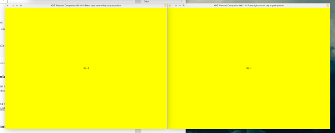

## Project Structure

Declarative effects require some particular project structure that we need to learn first before writing any code

```
└── package
    ├── contents
    │   └── ui
    │       └── main.qml
    └── metadata.json
```

The package directory is a toplevel directory, it should contain two things: a
metadata.json file and a contents directory. The metadata.json file contains
information about the name of the effect, what API it uses, the author, etc.

```json
{
    "KPackageStructure": "KWin/Effect",
    "KPlugin": {
        "Authors": [
            {
                "Email": "user@example.com",
                "Name": "Name"
            }
        ],
        "Category": "Appearance",
        "Description": "Yo",
        "EnabledByDefault": false,
        "Id": "hello-world",
        "License": "MIT",
        "Name": "Hello World"
    },
    "X-KDE-Ordering": 60,
    "X-Plasma-API": "declarativescript"
}
```

The contents directory contains the rest of QML code, config files, assets,
etc. Keep in mind that `ui/main.qml` is a “magical” file, it acts as an entry
point, every effect must have it.

In order to install the effect and make it visible in Desktop Effects settings,
you will need to run the following command

```bash
kpackagetool6 --type KWin/Effect --install package/
```

This is quite a lot to memorize. That’s why kwin provides an example qtquick
effect that you can grab, tweak some metadata and you’re good to go. You can
find the example project in the [KWin repository](https://invent.kde.org/plasma/kwin/-/tree/master/examples/quick-effect?ref_type=heads).
Note that the example project also contains a `CMakeLists.txt` file, which
provides an alternative way to install the effect by the means of cmake, i.e.
`make install or cmake --install builddir`.

## Hello World

Let’s start with an effect that simply shows a hello world message on the screen:

```qml
import QtQuick
import org.kde.kwin

SceneEffect {
    id: effect

    delegate: Rectangle {
        color: "blue"

        Text {
            anchors.centerIn: parent
            color: "white"
            text: "Hello world!"
        }
    }

    ScreenEdgeHandler {
        enabled: true
        edge: ScreenEdgeHandler.TopEdge
        onActivated: effect.visible = !effect.visible
    }

    ShortcutHandler {
        name: "Toggle Hello World Effect"
        text: "Toggle Hello World Effect"
        sequence: "Meta+H"
        onActivated: effect.visible = !effect.visible
    }

    PinchGestureHandler {
        direction: PinchGestureHandler.Direction.Contracting
        fingerCount: 3
        onActivated: effect.visible = !effect.visible
    }
}
```

`import QtQuick` is needed to use basic QtQuick components such as Rectangle.
`import org.kde.kwin` imports kwin specific components.

The `SceneEffect` is a special type that every declarative effect must use. Its
delegate property specifies the content for every screen. In this case, it’s a
blue rectangle with a “Hello World!” label in the center.

The `ShortcutHandler` is a helper that’s used to register global shortcuts.
`ShortcutHandler.name` is the key of the global shortcut, it’s going to be used
to store the shortcut in the config and other similar purposes.
ShortcutHandler.text is a human readable description of the global shortcut,
it’s going to be visible in the Shortcuts settings.

The ScreenEdgeHandler allows to reserve a screen edge. When the pointer hits
that screen edge, some code can be executed by listening to the activated
signal.

The `PinchGestureHandler` and `SwipeGestureHandler` allow to execute some code when
the user makes a pinch or a swipe gesture, respectively.

effect.visible = !effect.visible toggles the visibility of the effect. When
effect.visible is true, the effect is active and visible on the screen;
otherwise it’s hidden. You need to set effect.visible to true in order to show
the effect.

If you press <kbd>Meta</kbd> + <kbd>H</kbd> or make a pinch gesture or move the
pointer to the top screen edge, you’re going to see something like this


Note that there are no windows visible anymore, it is the responsibility of the
effect to decide what should be displayed on the screen now.

## Displaying Windows

Being able to display text is great, but it’s not useful. Usually, effects need
to display some windows, so let’s display the active window

```qml
    delegate: Rectangle {
        color: "blue"

        WindowThumbnail {
            anchors.centerIn: parent
            client: Workspace.activeWindow
        }
    }
```

The change is quite simple. Instead of displaying a `Text` component, there’s a
`WindowThumbnail` component now. The `WindowThumbnail` type is provided by the
`org.kde.kwin` module. `WindowThumbnail.client` indicates what window the thumbnail
item should display.


## Input

Input processing contains no kwin specific APIs. `TapHandler`, `MouseArea`, `Keys`
and other stuff available in QtQuick should just work. For example, let’s
implement an effect that arranges windows in a grid and if somebody middle
clicks a window, it will be closed.

```qml
    delegate: Rectangle {
        color: "pink"

        GridView {
            id: grid
            anchors.fill: parent
            cellWidth: 300
            cellHeight: 300

            model: WindowModel {}
            delegate: WindowThumbnail {
                client: model.window
                width: grid.cellWidth
                height: grid.cellHeight

                TapHandler {
                    acceptedButtons: Qt.MiddleButton
                    onTapped: client.closeWindow()
                }
            }
        }
    }
```

The code looks pretty straightforward except maybe the model of the `GridView`.
`WindowModel` is a helper provided by `org.kde.kwin` module that lists all the
windows. It can be passed to various views, `Repeater`, and so on.

The result can be seen here:

<div class="embed-responsive embed-responsive-21by9">
  <video controls src="effect.webm" class="embed-responsive-item"></video>
</div>

## Delegates are Per Screen

One thing to keep in mind is that the delegates are instantiated per screen. For example,

```qml
    delegate: Rectangle {
        color: "yellow"

        Text {
            anchors.centerIn: parent
            color: "black"
            text: SceneView.screen.name
        }
    }
```

When you activate the effect on a setup with several outputs, each output will be filled with yellow color and the output name in the center



Usually, the output is irrelevant, but if you need to know what output
particular delegate is displayed on, you could use the `SceneView.screen`
attached property.

## Configuration

As your effect grows, you will probably face the need to provide an option or
two. Let’s say that we want the background color in our hello world effect to
be configurable. How do we achieve that? The first step, is to add a `main.xml`
file in `package/contents/config` directory, i.e.

```
package/
├── contents
│   ├── config
│   │   └── main.xml
│   └── ui
│       └── main.qml
└── metadata.json
```

The `main.xml` file lists all options

```xml
<?xml version="1.0" encoding="UTF-8"?>
<kcfg xmlns="http://www.kde.org/standards/kcfg/1.0"
      xmlns:xsi="http://www.w3.org/2001/XMLSchema-instance"
      xsi:schemaLocation="http://www.kde.org/standards/kcfg/1.0
                          http://www.kde.org/standards/kcfg/1.0/kcfg.xsd" >
    <kcfgfile name=""/>
    <group name="">
        <entry name="BackgroundColor" type="Color">
            <default>#ff00ff</default>
        </entry>
    </group>
</kcfg>
```

In our case, only one option is needed: BackgroundColor, which has `Color` type
and `#ff00ff` default value. You can refer to the KConfigXT documentation to
learn more what other entry types are supported.

The next step is to actually use the `BackgroundColor` option.

```qml
    delegate: Rectangle {
        color: effect.configuration.BackgroundColor

        Text {
            anchors.centerIn: parent
            color: "white"
            text: "Hello world!"
        }
    }
```

`effect.configuration` is a map object that contains all the options listed in the main.xml.

Now, if you toggle the hello world effect, you’re going to see:


There are a few more thing left to do though. If you navigate to Desktop
Effects settings, you’re not going a configure button next to the hello world
effect.


Besides providing a `main.xml` file, the effect also needs to provide a
`config.ui` file containing a configuration ui.

```
package/
├── contents
│   ├── config
│   │   └── main.xml
│   └── ui
│       ├── config.ui
│       └── main.qml
└── metadata.json
```

The config.ui file is a regular Qt Designer UI file. The only special thing
about it is that the controls that represent options should have special name
format: `kcfg_ + OptionName`. For example, `kcfg_BackgroundColor`:

```xml
<?xml version="1.0" encoding="UTF-8"?>
<ui version="4.0">
 <class>QuickEffectConfig</class>
 <widget class="QWidget" name="QuickEffectConfig">
  <property name="geometry">
   <rect>
    <x>0</x>
    <y>0</y>
    <width>455</width>
    <height>177</height>
   </rect>
  </property>
  <layout class="QFormLayout" name="formLayout">
   <item row="0" column="0">
    <widget class="QLabel" name="label">
     <property name="text">
      <string>Background color:</string>
     </property>
    </widget>
   </item>
   <item row="0" column="1">
    <widget class="KColorButton" name="kcfg_BackgroundColor">
     <property name="flat">
      <bool>false</bool>
     </property>
    </widget>
   </item>
  </layout>
 </widget>
 <customwidgets>
  <customwidget>
   <class>KColorButton</class>
   <extends>QPushButton</extends>
   <header>kcolorbutton.h</header>
  </customwidget>
 </customwidgets>
 <resources/>
 <connections/>
</ui>
```

The last final piece in order to expose the configuration ui is to add the following line in the `metadata.json` file

```ini
"X-KDE-ConfigModule": "kcm_kwin4_genericscripted"
```

With all of that, the effect is finally displayed as configurable in the system settings and the background color can be changed

## Sharing Your Effect With Other People

The preferred method to distribute third party extensions is via the KDE Store.
Both JS and QML effects can be uploaded to the same “KWin Effects” category.

## Documentation and Other Useful Resources

* [KWin scripting API documentation](https://develop.kde.org/docs/plasma/kwin/api/)

Besides the link above, it’s worth having a look at the [examples in kwin git repository](https://invent.kde.org/plasma/kwin/-/tree/master/examples?ref_type=heads).

## Window Heap

If you need to pack or arrange windows like how the overview effect does, you could use the `WindowHeap` component from `org.kde.kwin.private.effects module`. BUT you need to keep in mind that that helper is private and has no stable API yet, so use it on your own risk (or copy paste the relevant code in kwin). Eventually, the WindowHeap will be stabilized once we are confident about its API.

The WindowHeap source code can be found in [the KWin repository](https://invent.kde.org/plasma/kwin/-/tree/2a13a330404c8d8a95f6264512aa06b0a560f55b/src/plugins/private).

## More Examples

If you need more examples, I suggest to have a look at the desktop cube effect in kdeplasma-addons. It’s implemented using the same QML effect API in kwin + QtQuick3D. The source code can be found in [kdeplasma-addons repositoriy](https://invent.kde.org/plasma/kdeplasma-addons/-/tree/master/kwin/effects/cube?ref_type=heads).

