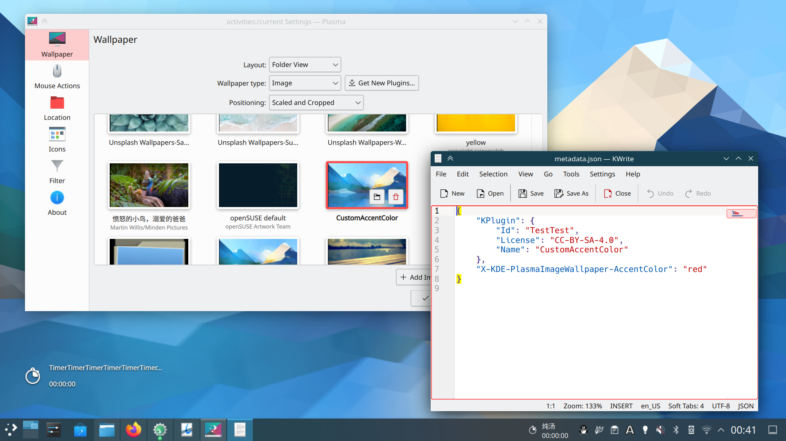

Plasma has the ability to automatically select an accent color based on the colors of the currently applied wallpaper, however, you also have the option to specify a specific accent color for more artistic control.

## Setting a custom accent color for Plasma wallpapers

You can add the `"X-KDE-PlasmaImageWallpaper-AccentColor"` property in your wallpaper's `metadata.json` file to specify the accent color that will be applied to the Plasma Desktop when the user enables the "Accent color from wallpaper" option. Below, we will set the accent color as red using the metadata file:


{
    "KPlugin": {
        "Id": "TestTest",
        "License": "CC-BY-SA-4.0",
        "Name": "CustomAccentColor"
    },
    "X-KDE-PlasmaImageWallpaper-AccentColor": "red"
}


As expected, our newly defined accent color gets applied to the desktop whenever the user selects the associated wallpaper:

You can also use hex color codes instead of color names. For instance, you could replace red with #FF0000 or any other color you want:


{
    "KPlugin": {
        "Id": "TestTest",
        "License": "CC-BY-SA-4.0",
        "Name": "CustomAccentColor"
    },
    "X-KDE-PlasmaImageWallpaper-AccentColor": "#FF0000"
}


## Light versus Dark

Sometimes the same accent color does not look right with both light and dark themes, that's why you can also select a specific color for each one. Just use `"Light"` or `"Dark"` under `"X-KDE-PlasmaImageWallpaper-AccentColor"` to set a different color for each kind of theme:


{
    "KPlugin": {
        "Id": "TestTest",
        "License": "CC-BY-SA-4.0",
        "Name": "CustomAccentColor"
    },
    "X-KDE-PlasmaImageWallpaper-AccentColor": {
        "Light": "red",
        "Dark": "cyan"
    }
}


## Example wallpaper

You can download an example wallpaper and metadata file with a custom accent color set using the X-KDE-PlasmaImageWallpaper-AccentColor property below:

[Example wallpaper](Altai.tar.gz)
