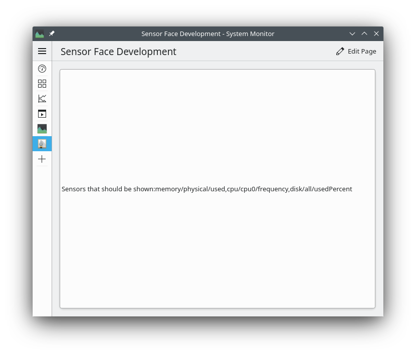
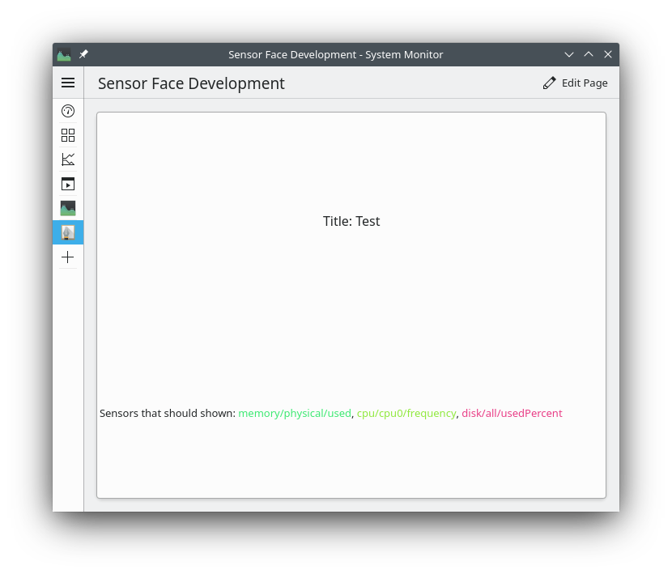
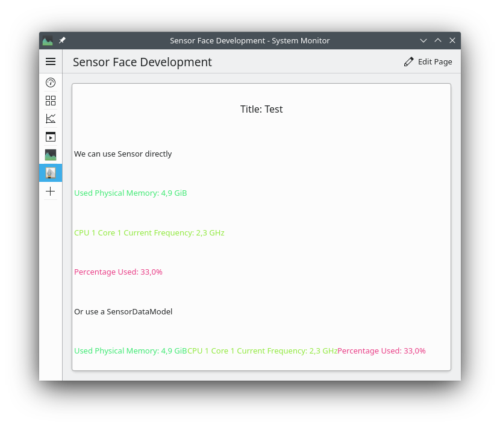
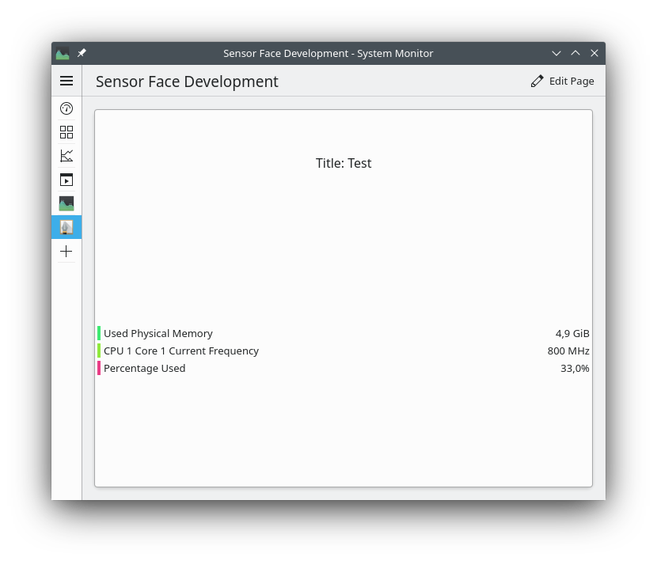
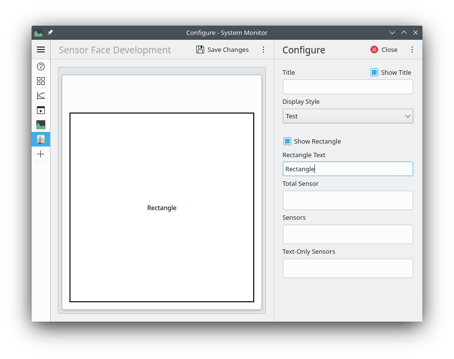

## Folder structure
A sensor face consists of multiple parts of which some are required and others are optional. The 
folder structure looks like this and is similar to the one of Plasma widgets:

 ```
rootdir
├── contents
│   ├── ui
│   │   ├── FullRepresentation.qml (required)
│   │   ├── CompactRepresenation.qml (required)
│   │   └── Config.qml (optional)
│   └── config
│       └── main.xml (optional)
├── metadata.desktop (required)
└── faceproperties (required)
```


The most interesting files are `FullRepresentation.qml` and `CompactRepresenation.qml`. They contain
the elements that are used  to display the data of the different Sensors. `Config.qml` represents
a user interface to configure the face specific settings which are described in the `main.xml` file
in [KConfig XT syntax](). The
`faceproperties` describe which features your face supports and `metadata.desktop` describes the
face and tells the system about it.


## The visual representations
Both representations follow the same schema but are used in different contexts. The full representation
is the one that is normally used and contains additional elements like for example a legend or a title.
The compact representation on the other hand is used when something that takes much less space is required.
One instance of this is when the systemmonitor widget is added to a panel in Plasma.

The root item of both representations has to be [SensorFace](docs:libksysguard;KSysGuard::SensorFace). Assign the
root of your custom visualization to its `contentItem` property. `SensorFace` also allows to access
the face controller via the `controller` property. It tells the face which sensors to display and in
which way this should be done. The most important property of it is
[highPrioritySensorIds](docs:libksysguard;KSysGuard::SensorFaceController::highPrioritySensorIds), the UI refers to
it just as "Sensors". The data of these sensors should always be displayed by the face.
The following
very basic face displays just the ids of the sensors that should be shown:





```qml
import QtQuick.Controls 2.14
import org.kde.ksysguard.faces 1.0

SensorFace {
    contentItem: Label {
        text: "Sensors that should be shown:" 
            +  controller.highPrioritySensorIds.join(",")
    }
}
```




Other interesting properties of the face controller are:<a name="controllerProps" />
- `sensorColors`

    Maps sensor ids to colors. Use this if you need a sensor specific color for some element
    relating to a sensor.

- `lowPrioritySensorIds`

    A list of sensor Ids that are of lower importance than the normal sensors. Exposed as
    "Text-Only Sensors" because most faces display them just as text in the legend.

- `totalSensors`

    A list of sensors whose values represent totals of some sort. The pie chart face shows them
    in its center for example.

- `title`

    The title of this face instance, can be empty

- `showTitle`

    Whether the title should be displayed by the face

For a list of all available properties see [SensorFaceController](docs:libksysguard;KSysGuard::SensorFaceController).

Using some of the above properties the basic sensor face from above can be iterated upon to also show
a title and the color for each sensor:





```qml
import QtQuick 2.14
import QtQuick.Controls 2.14
import QtQuick.Layouts 1.14

import org.kde.kirigami 2.14 as Kirigami

import org.kde.ksysguard.faces 1.0 as Faces

Faces.SensorFace {
    contentItem: ColumnLayout {
        Kirigami.Heading {
            Layout.alignment: Qt.AlignHCenter
            text: "Title: " + controller.title
            visible: controller.showTitle
            level: 2
        }
        Label {
            text: "Sensors that should shown: " 
                +  controller.highPrioritySensorIds.map(id => "<font color='" + controller.sensorColors[id] + "'>" + id + "</font>").join(", ")
        }
    }
}
```



### Retrieving the data

The face controller supplies the list of sensor ids. To access more information about those sensors
and retrieving their current values, there are two options. We can instantiate a [Sensor](docs:libksysguard;KSysGuard::Sensor)
for each id and query the [formattedValue](docs:libksysguard;KSysGuard::Sensor::formattedValue) or raw
[value](docs:libksysguard;KSysGuard::Sensor::value) and [unit](docs:libksysguard;KSysGuard::Sensor::unit)
from it. It also contains the user visible [name](docs:libksysguard;KSysGuard::Sensor::name) of the sensor
and the range of possible values via [minimum](docs:libksysguard;KSysGuard::Sensor::minimum) and
[maximum](docs:libksysguard;KSysGuard::Sensor::minimum).

The second option is to pass the list of ids to a [SensorDataModel](docs:libksysguard;KSysGuard::SensorDataModel)
and query the data from there. The list of sensors will be turned into a table with each column
representing a sensor. The same properties as a [Sensor](docs:libksysguard;KSysGuard::Sensor) has are exposed as
the different [roles of the model](docs:libksysguard;KSysGuard::SensorDataModel::AdditionalRoles).

The following example shows both methods:





```qml
import QtQuick 2.14
import QtQuick.Controls 2.14
import QtQuick.Layouts 1.14

import org.kde.kirigami 2.14 as Kirigami

import org.kde.ksysguard.faces 1.0 as Faces
import org.kde.ksysguard.sensors 1.0 as Sensors

Faces.SensorFace {
    contentItem: ColumnLayout {
        Kirigami.Heading {
            Layout.alignment: Qt.AlignHCenter
            text: i18n("Title: %1, controller.title)
            visible: controller.showTitle
            level: 2
        }

        Label {
            text: i18n("We can use Sensor directly")
        }
        Repeater {
            model: controller.highPrioritySensorIds
            delegate: Label {
                text: i18n("%1: %2, sensor.name, sensor.formattedValue)
                color: controller.sensorColors[sensor.sensorId]

                Sensors.Sensor {
                    id: sensor
                    sensorId: modelData
                }
            }
        }

        Label {
            text: i18n("Or use a SensorDataModel")
        }
        Sensors.SensorDataModel {
            id: sensorModel
            sensors: controller.highPrioritySensorIds
        }
        TableView {
            id: table
            Layout.fillWidth: true
            Layout.preferredHeight: contentHeight
            contentWidth: width
            model: sensorModel
            delegate: Label {
                text: i18n("%1: %2", model.Name, model.FormattedValue)
                color: controller.sensorColors[model.SensorId]
            }
        }
    }
}
```




### Adding a Legend
A legend is generally useful since it allows matching colors to a chart and precise reading of the
current value. [ExtendedLegend](docs:libksysguard;org::kde::ksysguard::sensorfaces::ExtendedLegend) is a premade
Component that displays a legend that is a generated from a `SensorDataModel` assigned to its
[sourceModel](docs:libksysguard;org::kde::ksysguard::sensorfaces::ExtendedLegend::sourceModel) property. The
[sensorIds]() property holds the ids  ids of additional sensors that should be included in the
legend. Most sensor faces use this to display the "text only"
[lowPrioritySensorIds](docs:libksysguard;KSysGuard::SensorFaceController::lowPrioritySensorIds). A typical usage
might look like this:





```qml
import QtQuick 2.14
import QtQuick.Controls 2.14
import QtQuick.Layouts 1.14

import org.kde.kirigami 2.14 as Kirigami

import org.kde.ksysguard.faces 1.0 as Faces
import org.kde.ksysguard.sensors 1.0 as Sensors

Faces.SensorFace {
    contentItem: ColumnLayout {
        Kirigami.Heading {
            Layout.alignment: Qt.AlignHCenter
            text: "Title: " + controller.title
            visible: controller.showTitle
            level: 2
        }

        Sensors.SensorDataModel {
            id: sensorModel
            sensors: controller.highPrioritySensorIds
            sensorColors: controller.sensorColors
        }

        // Here would be the face specific visualization

       Faces.ExtendedLegend {
            sourceModel: sensorModel
            sensorIds: controller.lowPrioritySensorIds
            Layout.fillWidth: true
        }
    }
}
```


Here the [sensorColors](docs:libksysguard;KSysGuard::SensorFaceController::sensorColors) that are supplied by the
controller are injected into the `SensorDataModel` via its [sensorColors](docs:libksysguard;KSysGuard::SensorDataModel::sensorColors) property so that the legend
includes the associated color of each sensor.
## Adding configuration options
If the face contains configurable elements or display settings, can they be declared in the
`main.xml` file. A simple example could look like this:
```xml
<?xml version="1.0" encoding="UTF-8"?>
<kcfg xmlns="http://www.kde.org/standards/kcfg/1.0"
      xmlns:xsi="http://www.w3.org/2001/XMLSchema-instance"
      xsi:schemaLocation="http://www.kde.org/standards/kcfg/1.0
      http://www.kde.org/standards/kcfg/1.0/kcfg.xsd" >
    <kcfgfile name=""/>
    <group name="General">
        <entry name="showRectangle" type="Bool">
            <default>true</default>
        </entry>
        <entry name="rectangleText" type="String">
            <default>Rectangle</default>
        </entry>
    </group>
</kcfg>
```
It declares two options. A boolean option `showRectangle` that can either be `true` or `false` and
an option `rectangleText` that will hold some. By default the rectangle will
be shown and the text is "Rectangle". Options can have multitude of types like
`Int, StringList, Double, Color,...`. [The KConfigXT tutorial]()
gives a good introduction to the file format and the available data types.

The active configuration is exposed by the controller as `faceConfiguration` and the current values
of the options can be accessed as properties of it. As an example the following sensor face will
display a rectangle and the `rectangleText` on top of it if the `showRectangle` option has been set
to true:
```qml
import QtQuick 2.14
import org.kde.ksysguard.faces 1.0 as Faces

Faces.SensorFace {
    contentItem: Rectangle {
        visible: controller.faceConfiguration.showRectangle
        border.width: 2
        Text {
            text: controller.faceConfiguration.rectangleText
            anchors.centerIn: parent
        }
    }
}
```

To allow the user to change the declared options the face can provide the user interface in the
`Config.qml` file. In this simple example we would want to allow the user to configure the two options:





```qml
import QtQuick.Controls 2.14

import org.kde.kirigami 2.8 as Kirigami

Kirigami.FormLayout {

    property alias cfg_showRectangle: rectangleCheckbox.checked
    property alias cfg_rectangleText: rectangleTextEdit.text

    CheckBox {
        id: rectangleCheckbox
        text: "Show Rectangle"
    }
    TextField {
        Kirigami.FormData.label: "Rectangle Text"
        id: rectangleTextEdit
    }
}
```


Here we have a checkbox that controls if the rectangle should be shown and a TextField in that the
user can enter the text shown in the Rectangle. Properties that are named like `cfg_configOption`
are automatically bound to the stored setting if `configOption` is a declared
configuration option. It is automatically set to the currently configured value and when it is changed
the controller will be notified that the setting has been changed. Here we just declared them to be
aliases for properties of controls but it is also possible to have normal properties with more
complicated bindings here.

If the configuration is changed the relevant property of `controller.faceConfiguration` is automatically
updated. Reading, saving and updating of the configuration is taken care of by the face controller and
does not need to be handled by the face.

## Finishing it up
There are still two files that were omitted until now:
### metadata.desktop
As the name implies it contains user-visible and not user-visible metadata about the face.
```ini
[Desktop Entry]
Name=My awesome face
Icon=office-chart-line

Type=Service
X-KDE-ServiceTypes=KSysguard/SensorFace
X-KDE-ParentApp=org.kde.plasmashell
X-KDE-PluginInfo-Name=org.kde.awesomeface
X-KDE-PluginInfo-Version=1.0
X-KDE-PluginInfo-Author=
X-KDE-PluginInfo-Email=
X-KDE-PluginInfo-License=
X-KDE-PluginInfo-Website=
```
The first two entries are the user visible name and an icon that could be used for the face.
The next lines tell the system that this is a sensor face and the id and version of it. The
last four entries above that are kept empty should be self-explanatory.
### faceproperties
Not every face supports displaying of every feature that are exposed as the [properties of 
the face controller](#controllerProps). A face can indicate this with the file `faceproperties`
so that UI elements can be hidden for example when configuring the face depending on whether they
are supported or not. The file format is a first line `[Config]` followed by key-value-pairs.
Possible keys are: `SupportsSensorsColors`, `SupportsTotalSensors`, `SupportsLowPrioritySensors`,
and `MaxTotalSensors`. By default it is assumed that a face does not support these features and
that `MaxTotalSensors` is `1` when total sensors are supported.
As an example consider
```ini
[Config]
SupportsSensorsColors=false
SupportsTotalSensors=true
MaxTotalSensors=2
```
This face does not support sensor colors which is declared explicitly and also does not support
low priority sensors because the default is  `false`. It however supports display of two total sensors
### Installation
To enable applications finding a face it needs to be installed into a specific directory. This is typically
`/usr/share/ksysguard/sensorfaces/` for system installed faces or `~/.local/share/ksysguard/sensorfaces/`.
Additionally the root folder has to have the same name as the plugin id, which is the value that
`X-KDE-PluginInfo-Name` is set to in `metadata.desktop`. If the face is distributed through the kde store
and installed using the relevant tools, installation is handled automatically.

## Further topics
- When creating faces that utilize charts the [KQuickCharts](https://api.kde.org/frameworks/kquickcharts/html/index.html)
framework includes facilities to easily create charts from Qml
