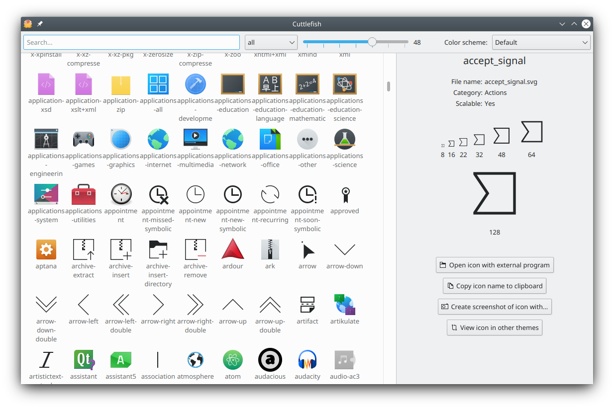

When you create your own KDE application you will probably want to have icons in it respecting your users icon theme. 

This is possible with the help of [QIcon::fromTheme](https://doc.qt.io/qt-5/qicon.html#fromTheme) for QtWidgets application or [Kirigami's Icon](docs:kirigami2;Icon) for QtQuick application. Both function take as argument, the name of the icon in the icon theme.

Plasma and all the other major Linux deskops follow the [freedesktop icon specification](http://standards.freedesktop.org/icon-theme-spec/icon-theme-spec-latest.html) and [naming specification](http://standards.freedesktop.org/icon-naming-spec/icon-naming-spec-latest.html). A fallback mechanism is also present so that if the `document-open-recent` icon is not present, the `document-open` icon will be displayed instead and if the `document-open` icon is also not present the `document` icon will be displayed.

## Finding the right icons

KDE provide an application to search for icons. This application is called cuttlefish and can generally available in the `plasma-sdk` package in your packet manager (on Linux).

Cuttlefish allows you to search for icons, by name, by category. Look at the icons using different color schemes and view a selected icon in other themes.

## Example

In a traditional QtWidget application:


QIcon undoicon = QIcon::fromTheme("edit-undo");


In a QtQuick application:


import org.kde.kirigami 2.14 as Kirigami

Kirigami.Icon {
    source: "edit-undo"
} 


## Other platforms than Linux

On other plateforms, the icon theme is not available.

### Android

On Android, you can use the [kirigami_package_breeze_icons](https://invent.kde.org/frameworks/kirigami/-/blob/master/KF5Kirigami2Macros.cmake#L5) CMake function to package the Breeze icons you are using.


if(ANDROID)
    kirigami_package_breeze_icons(ICONS
        edit-undo
        edit-redo
    )
endif()

