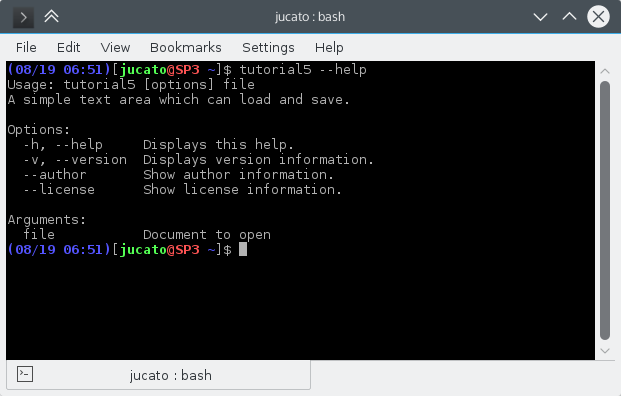

## Introduction

Now that we have a text editor that can open and save files. We will now make the editor act more like a desktop application by enabling it to open files from command line arguments or even using Open with from within Dolphin.



## Code and Explanation

### mainwindow.h

Here we have done nothing but add a new `openFile` function which takes a `QUrl`. Again, we use a `QUrl` instead of a `QString` so that we can also work with remote files as if they were local.



### mainwindow.cpp

There's no new code here, only rearranging. Everything from void `openFile()` has been moved into void `openFile(const QUrl &inputFileName)` except the call to `QFileDialog::getOpenFileUrl()`.

This way, we can call `openFile()` if we want to display a dialog, or we can call `openFile(const QUrl &)` if we know the name of the file already. Which will be the case when we feed the file name through the command line.



### main.cpp

This is where all the [QCommandLineParser ](https://doc.qt.io/qt-5/qcommandlineparser.html) magic happens. In previous examples, we only used the class to feed QApplication the necessary data for using flags like `--version` or `--author`. Now we actually get to use it to process command line arguments.

First, we tell `QCommandLineParser` that we want to add a new positional arguments. In a nutshell, these are arguments that are not options. `-h` or `--version` are options, `file` is an argument.

```c++
parser.addPositionalArgument(QStringLiteral("file"), i18n("Document to open"));
```

Later on, we start processing positional arguments, but only if there is one. Otherwise, we proceed as usual. In our case we can only open one file at a time, so only the first file is of interest to us. We call the openFile() function and feed it the URL of the file we want to open, whether it is a local file like $HOME/foo or a remote one like ftp.mydomain.com/bar. We use the overloaded form of QUrl::fromUserInput() in order to set the current path. This is needed in order to work with relative paths like "../baz".

```c++
if (parser.positionalArguments().count() > 0) {
    window->openFile(QUrl::fromUserInput(parser.positionalArguments().at(0), QDir::currentPath()));
}
```

These are the changes:


