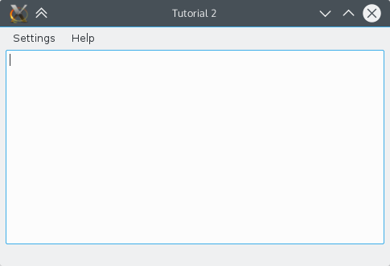

## Summary

This tutorial carries on from [First Program Tutorial](hello_world) and will introduce the  class. 

In the previous tutorial, the program caused a dialog box to pop up but we're going to take steps towards a functioning application.



## KXmlGuiWindow

 provides a full main window view with menubars, toolbars, a statusbar and a main area in the centre for a large widget. For example, the help-menu is predefined. Most KDE applications will derive from this class as it provides an easy way to define menu and toolbar layouts through XML files (this technology is called XMLGUI and is part of the KF5::XmlGui framework). While we will not be using XMLGUI in this tutorial, we will use it in the next.

In order to have a useful KXmlGuiWindow, we must subclass it. So we create two files, a `mainwindow.cpp` and a `mainwindow.h` which will contain our code.

### mainwindow.h




First we subclass KXmlGuiWindow with `class MainWindow : public KXmlGuiWindow` then we declare the constructor with `MainWindow(QWidget *parent = nullptr);`.

And finally, we declare a pointer to the object that will make up the bulk of our program. :ktextwidgetsapi:`KTextEdit` is a generic rich text editing widget with some niceties like cursor auto-hiding. 

### mainwindow.cpp



First, of course, we have to include the header file containing the class declaration. 

We initialise our text editor with an object and use KXmlGuiWindow's built-in `setCentralWidget()` function on it which tells the KXmlGuiWindow what should appear in the central section of the window. 

Finally,  is called which does a lot of behind-the-scenes stuff and creates the default menu bars (Settings, Help). 

### Back to main.cpp

In order to actually run this window, we need to add a few lines in main.cpp:




Again, we include our new header file in order to create our MainWindow object which we then display. 

## CMake

The best way to build the program is to use CMake. We add `mainwindow.cpp` to the sources list, include the XmlGui and TextWidgets (for KTextEdit) frameworks, and replace all `helloworld` text to `mainwindow`. 

### CMakeLists.txt



## Compile and run

The best way to compile, link and run it is to [set up a correct build environment ](https://community.kde.org/Get_Involved/development#One-time_setup:_your_development_environment). But for a simple tutorial like this, it's enough to just create a build directory and build from there. This command takes care of all of that in one line:

```bash
mkdir build && cd build && cmake .. && make && ./mainwindow
```

Moving On
---------

Now you can move on to [Using Actions](using_actions).
